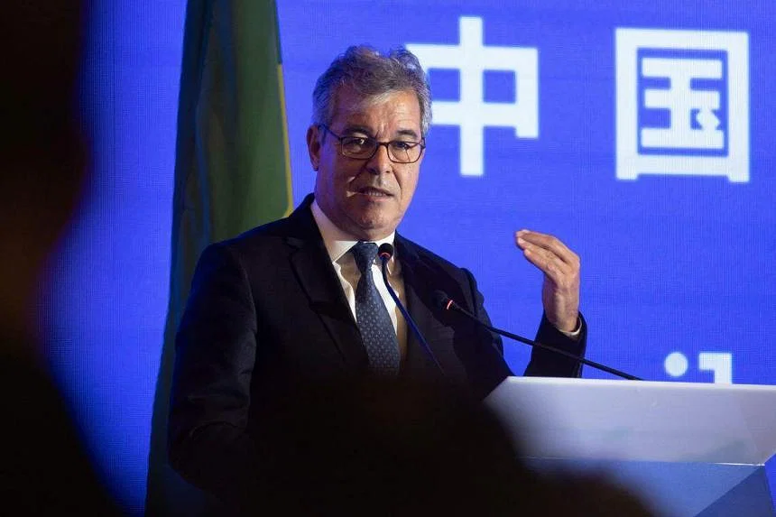

# 外媒：中巴已达成协议，使用本币而非中间货币美元开展大规模贸易

【环球网报道 记者 张晓雅】据法新社报道，巴西政府3月29日表示，中国和巴西已达成协议，不再使用美元作为中间货币，而以本币开展贸易。

法新社称，这一协议将使中国和拉丁美洲最大经济体巴西能够直接进行大规模的贸易和金融交易，用人民币兑换雷亚尔，反之亦然，而非通过美元这一中间货币进行兑换。报道说，该协议是在北京举行的中巴高层商业论坛后宣布的，今年1月，双方曾就此达成初步协议。

“预计这将降低成本……促进双边贸易和投资便利化。”巴西出口投资促进局在一份声明中表示。

_3月29日，巴西出口投资促进局局长豪尔赫・维亚纳在北京举行的商业研讨会上讲话_

法新社称，中国是巴西最大的贸易伙伴，去年双边贸易额达到创纪录的1505亿美元。

彭博社3月25日报道称，在巴西总统卢拉访华前，数百名巴西农业企业代表本周“涌入北京”，寻求增加对华出口合作，并吸引投资。路透社也称，此次访华的代表团规模庞大，包括多名内阁部长、州长、议员和240名商界领袖。巴西大部分牛肉、大豆和木浆都出口到中国。巴西外交部官员表示，巴西希望在铁矿石、大豆、豆油和肉类出口之外扩大对华贸易，并准备签署有关技术、创新和可持续发展的协议。

