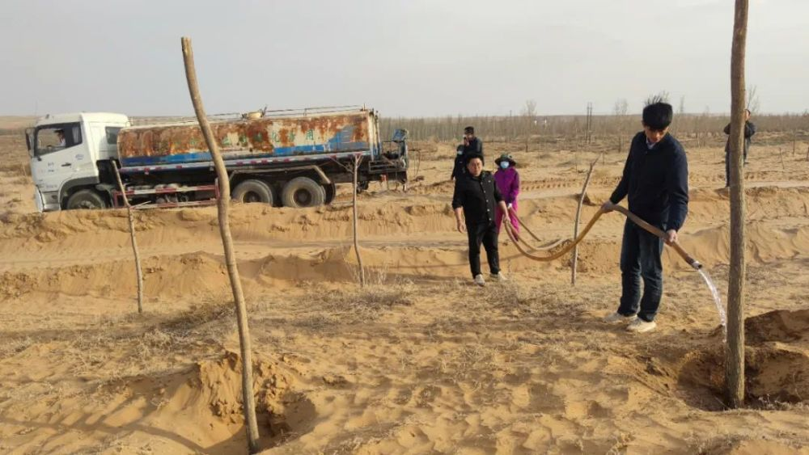
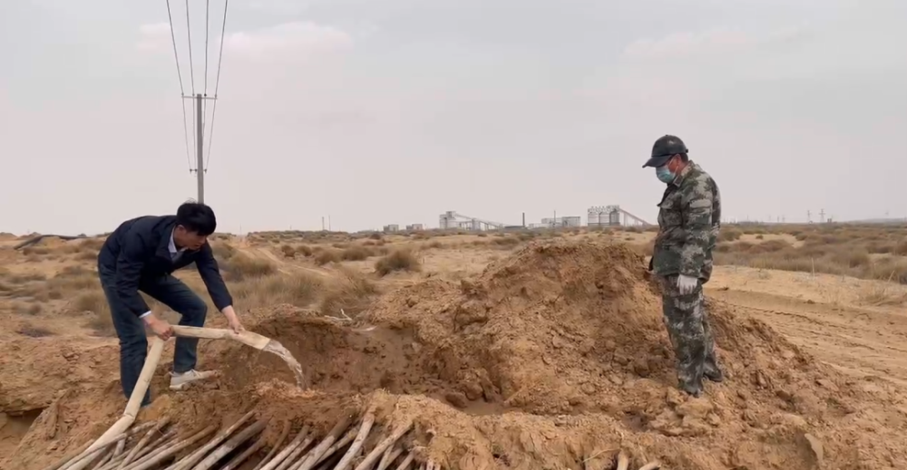

# 宁夏灵武市对国家能源集团宁夏煤业公司双马一矿与孙某供水纠纷所涉新种和拟种苗木已采取有效保护措施

灵武市委、市政府按照自治区党委、政府关于地方党委政府要主动担当的要求，对国家能源集团宁夏煤业公司双马一矿与孙某供水纠纷所涉新种和拟种苗木，已经采取有效保护措施：一是对孙某近期栽种的890棵丝棉木，马家滩镇已安排水车进行浇灌；对尚未栽种的1000余棵丝棉木，采取了有效保护措施，努力避免供水纠纷处置期间因缺水导致苗木死亡的情况。二是由自然资源部门和马家滩镇组织专业技术人员，对目前尚未栽植的沙柳橛子(沙柳树枝)采取了技术保护措施。灵武市还认真履行监管职责，防止出现污染环境等次生问题。

_（灵武市自然资源局专业技术人员指导苗木保护，马家滩镇工作人员对苗木进行浇灌）_

