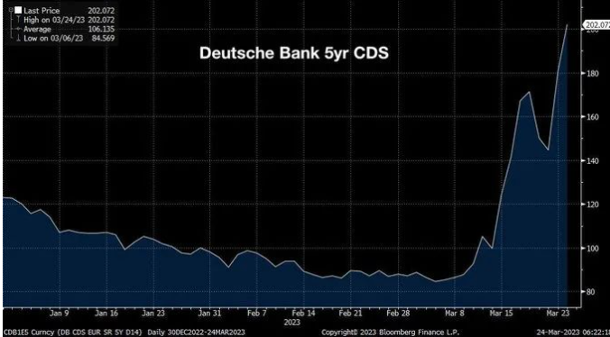

# 德意志银行暴跌真凶浮现，一笔3000多万交易，引发2200亿惨案

**划重点：**

  * _1_ 该笔价值约500万欧元(约合3735万元人民币)的交易(CDS)押注于与德银次级债相关的互换。
  * _2_ CDS是一种衍生品合约，投资者用CDS来对冲自己的投资，或用来对企业信用度的变化进行押注。CDS价格的飙升可能反映了对银行系统的普遍焦虑情绪，以及风险较大的欧洲银行债务的动荡。
  * _3_ “只要有几百万欧元，你就可以改变一家拥有万亿欧元资产的银行的CDS息差，这当然会影响股价，可能还会导致存款外流，所以这是我非常担忧的一件事情。”欧洲央行监事会主席Andrea Enria表示。

每经编辑：杜宇

受近期美国银行接连关闭影响，欧洲股市持续动荡，银行业不断承压。

当地时间24日，德国最大商业银行德意志银行股价在德国法兰克福股市大跌，盘中跌幅一度超14%，收盘跌幅达8.53%，引发市场对欧洲银行股的担忧。

德意志银行并未像硅谷银行和瑞士信贷那样羸弱不堪地倒下，不过上周五盘中所上演的动荡局面，仍令几乎所有市场参与者都被吓出了一身冷汗。

德银股价在没有太多征兆的情况下暴跌，一度令市场怀疑又将经历新一轮银行业的“生死周末”，
**一项追踪欧洲银行股的指数市值在短时间内就蒸发了超过300亿欧元** 。

德意志银行暴跌“真凶”浮现

**据财联社3月30日消息，知情人士透露，监管机构目前正将矛头指向一笔德意志银行信用违约互换(CDS)的交易，他们怀疑就是这笔交易引发了上周五的欧洲银行业全面抛售。**

据悉， **该笔价值约500万欧元(约合3735万元人民币)** 的交易押注于与德银次级债相关的互换。

知情人士称，监管机构已就这笔交易与市场参与者进行了交谈。这些合约可能缺乏流动性，因此单笔押注就可能引发重大波动。德意志银行发言人拒绝置评。

目前外界还不清楚是谁进行了相关的押注，也不清楚他们为什么会这样做。知情人士称，到目前为止，还没有证据表明这笔交易有任何不法行为。其中一位知情人士表示，一些数据表明，这一交易可能是为了对冲风险。

但正是这笔交易带来的疑似连锁反应，导致银行股重挫，欧洲国债价格大涨，CDS基点飙升，德意志银行的市值一天内减少了约16亿欧元，一项追踪欧洲银行股的指数市值也在上周五迅速蒸发了
**超过300亿欧元（约2241亿元人民币）** 。

CDS是一种衍生品合约，投资者用CDS来对冲自己的投资，或用来对企业信用度的变化进行押注。CDS价格的飙升可能反映了对银行系统的普遍焦虑情绪，以及风险较大的欧洲银行债务的动荡。

**德银的五年期CDS从两周前的不到100个基点升至了上周五的逾200个基点，原因是人们越来越担心：在三家美国区域银行倒闭和瑞信被迫接受瑞银收购后，这家德国超大型银行可能是下一家面临压力的金融机构。**

值得一提的是，在上周五CDS市场交易加剧了欧洲银行业的恐慌氛围后，欧洲最高监管官员目前也正呼吁对该市场进行更为严格的审查。

**欧洲央行监事会主席Andrea Enria就表示，“不透明”的信用违约互换(CDS)交易正在损害银行股价，并可能导致存款遭到挤兑。**

**“只要有几百万欧元，你就可以改变一家拥有万亿欧元资产的银行的CDS息差，这当然会影响股价，可能还会导致存款外流，所以这是我非常担忧的一件事情，”Enria在德国法兰克福举办的一场会议上表示。**

德意志银行：大而不能倒德国总理称“没有理由担心”

成立于1870年的德意志银行是全球银行业监管机构认定的30家全球系统重要性银行之一，这意味着德意志银行在全球范围内具有较大规模、且难以替代，是一家与其他金融机构关联程度高的重要银行。

**截至2022年底，德意志银行总资产规模超过1.3万亿欧元**
，它不仅对德国经济举足轻重，也在国际债券、衍生品和外汇交易中具有重要地位，一旦其发生危机，可能波及全球金融体系，被视为是“大到不能倒”的金融机构。

德意志银行在2019年前一度因经营不善连年发生巨额亏损。自2020年起，由于采取了一系列战略调整，德意志银行已经连续三年扭亏为盈。

财报显示，2022年德意志银行经营情况良好，净利润超50亿欧元，创2007年以来新高。法新社报道称，尽管德意志银行近年来在经营上扭亏为盈，但当前欧洲银行业的问题不仅在于自身经营状况，也与美联储持续加息导致美国银行接连关闭而引发的市场信心不足息息相关。

据央视新闻，专家称，德意志银行不会成为下一个瑞士信贷银行。尽管如此，在目前西方金融市场对美欧银行业前景普遍极度缺乏信心的形势下，任何风吹草动都可能导致储户的挤兑和投资者的恐慌出逃，而一旦发生这种情况，对任何银行来说都将是灾难性的。

德国经济专家奥利弗·罗斯表示，市场的不安正像病毒一样快速传播，并将持续很长时间。市场担忧银行系统和贷款违约的不确定性，以及银行的风险，这一情况最终或将导致欧洲整个银行系统名誉扫地，充满不确定性。

英国天空新闻网称，当前欧洲银行股动荡不断的直接原因是美国银行接连关闭引发的市场恐慌，即使一家银行经营状况良好，市场的恐慌情绪也可能导致投资者抛售股票与储户挤兑的发生。

市场人士指出，投资者对欧洲金融体系与银行稳定性日益增长的不安正在加剧欧洲股市的波动，预计短期时间内欧洲银行股仍将持续波动，美国经济问题的外溢影响还将持续向欧洲蔓延，而如果未来美联储继续加息，许多银行的处境将更为糟糕。

**德国总理奥拉夫·朔尔茨称“没有任何担心的理由”。他表示，德意志银行已经从根本上对其业务模式进行了现代化和重组，并且“利润可观”。朔尔茨强调，欧洲的银行体系非常稳定并且有韧性。**

每日经济新闻综合央视新闻、财联社

