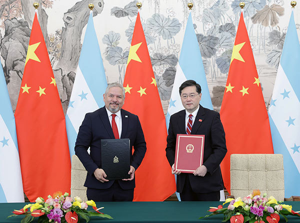

# 洪都拉斯外交部宣布：总统卡斯特罗近期将对中国进行正式访问

【文/观察者网 熊超然】北京时间3月26日，洪都拉斯外交部发表声明，正式宣布与中国台湾断绝所谓的“外交关系”。同日，中国和洪都拉斯建立外交关系。

当地时间3月29日，洪都拉斯外交部在其官方推特账号表示，该国总统希奥玛拉·卡斯特罗（Xiomara
Castro）不久后将对中国进行正式访问，以期待签署两国之间富有希望的协议。

西班牙语世界影响力最大的通讯社埃菲社（EFE）跟进报道并指出，目前卡斯特罗访华的具体日期尚不清楚，但这一消息是在中洪两国建交后的短短四天（以洪都拉斯当地时间计算）就宣布的。洪都拉斯外交部强调，卡斯特罗“将在最高级别开展两国之间的外交关系”。

在中洪建交之后，包括洪都拉斯外交部长雷纳和该国总统女儿在内的洪方代表团成员，还先后参访了中国共产党历史展览馆、人民大会堂，瞻仰了毛主席纪念堂并敬献花圈。

_洪都拉斯外交部推文截图_

3月26日，洪都拉斯外交部发表声明，正式宣布与中国台湾断绝所谓的“外交关系”。声明说，世界上只有一个中国，中华人民共和国是代表中国的唯一合法政府，台湾是中国领土不可分割的一部分。洪都拉斯自即日起断绝与台湾的“外交关系”并停止与台湾的一切接触和官方联系。

洪都拉斯宣布“断交”后，目前台当局仅剩13个所谓的“邦交国”，分别为瑙鲁、帕劳、图瓦卢、马绍尔群岛、伯利兹、圣文森特和格林纳丁斯、危地马拉、海地、巴拉圭、圣卢西亚、圣基茨和尼维斯、斯威士兰、梵蒂冈。

同日，中国同洪都拉斯签署《中华人民共和国和洪都拉斯共和国关于建立外交关系的联合公报》。两国政府决定自公报签署之日起相互承认并建立大使级外交关系。

据外交部网站消息，3月26日上午，国务委员兼外长秦刚在北京同洪都拉斯外长雷纳举行会谈后共同会见记者。

秦刚表示，中方欢迎卡斯特罗总统尽早访华，邀请洪方组织企业家代表团来华商洽贸易、旅游、投资等领域合作。雷纳表示，感谢中方对卡斯特罗总统的访华邀请，相信这一访问不仅将造福两国人民，也将造福全人类。

中洪建交之后的几天时间里，洪方代表团还在北京参访了中国共产党历史展览馆、人民大会堂，瞻仰了毛主席纪念堂并敬献花圈。

希奥玛拉·塞拉亚（Xiomara
Zelaya）此次与洪都拉斯外长雷纳一同到访北京，她是洪都拉斯国民议会国际事务委员会主席，另一个特殊身份正是现任总统卡斯特罗和前总统曼努埃尔·塞拉亚（Manuel
Zelaya）的女儿。

3月28日，塞拉亚在推特上发布了四张照片和视频，她和洪外长雷纳等代表团成员在中国共产党历史展览馆参观访问，还观看了1978年十一届三中全会的介绍和复兴号高铁的模拟视频。

_图自推特
下同_

此外，洪方代表团还访问了人民大会堂。洪都拉斯国民议会官方推特账号3月28日发布消息称，代表团在人民大会堂同全国人大外事委员会主任委员娄勤俭举行会谈，以推动两国在议会层面的合作，交流经验，推动各级别对话。

上述推特账号还发布消息称，洪方代表团还参观了天安门城楼，瞻仰了毛主席纪念堂并敬献花圈。3月28日，希奥玛拉·塞拉亚在推特上晒出一张天安门城楼的照片，并转推一名中国外交官的推文称，“这是1949年10月1日毛泽东主席宣告中华人民共和国成立和中国人民从此站起来的地方。”

3月29日凌晨，希奥玛拉·塞拉亚又发布了一张她同洪外长雷纳以及其他代表团成员一起在毛主席纪念堂的照片，并写道，“在我们首次对中国正式访问期间，雷纳外长和代表团一起在毛主席纪念堂敬献花圈。”

3月30日，希奥玛拉·塞拉亚在推特上写下带有中文和汉语拼音的推文：“谢谢中国，早日再见。”

**本文系观察者网独家稿件，未经授权，不得转载。**

