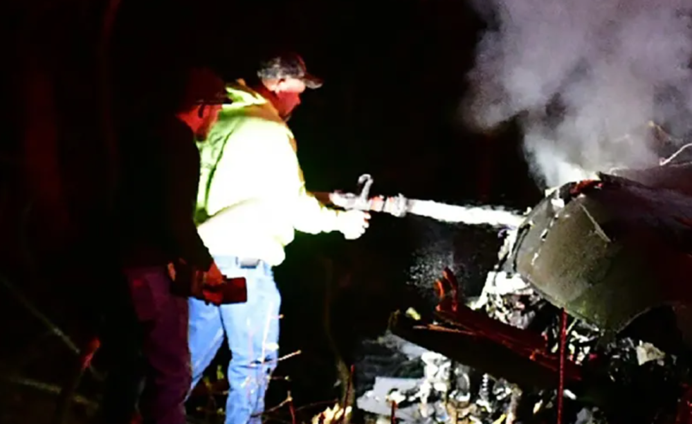
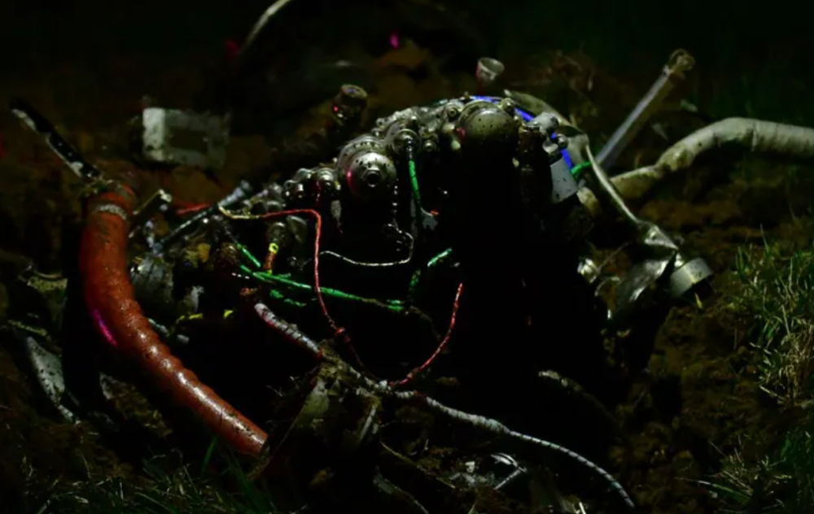

# 现场曝光！美军两架黑鹰直升机相撞坠毁 预计造成9人伤亡

_图为直升机坠毁现场（美国WKDZ广播电台）_

_图为直升机坠毁现场（美国WKDZ广播电台）_

**海外网3月30日电**
据美国《纽约时报》报道，美国陆军发言人证实，当地时间3月29日晚上10时左右，美军两架黑鹰直升机在肯塔基州区格县相撞后坠毁，预计会造成人员伤亡。

_图为直升机坠毁现场（美国WKDZ广播电台）_

发言人称，坠毁的直升机隶属美军101空降师，事发时正在进行演训，具体伤亡情况尚不清楚。事故原因正在调查之中。（海外网 刘强）

海外网版权作品，未经授权不得转载。

