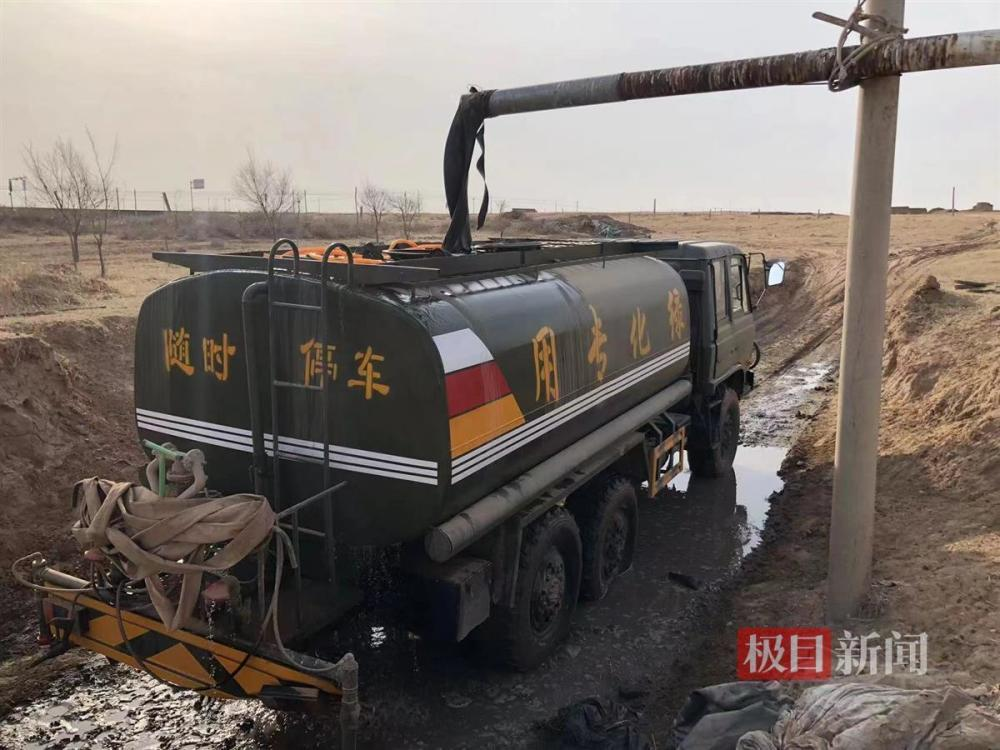

# 跪地求水当事人：一天要买十几车水浇树，但仍是杯水车薪

极目新闻记者 舒隆焕 丁伟

宁夏灵武一林场树木被煤矿“断水”面临枯死，六旬林场主跪地求救。3月30日，极目新闻记者跟随林场主孙国友买水浇树。

_车子出故障_

据孙国友介绍，断水之后，有时他要到10公里以外才能取水，一车水的费用要100元钱。现在取水的地方稍近了一些，大概有一公里的距离，如今一车水的费用为50元一车。

记者注意到，取水之路并不好走，一路颠簸，孙国友的取水车还一度出现故障无法正常行驶。

_取水_

“他们说27号给我供水，结果没有给我供，树都要干死了，只有来这里取水，现在没有办法。”孙国友说。

_取水_

极目新闻记者在现场拍摄的航拍视频显示，当地较为干旱，有大片黄土裸露，车辆行过，还会留下道道车辙。

在取水现场，孙国友介绍，装满一车水大概要20分钟的时间，这一次取水，主要是浇灌前一段时间栽种的石棉木和沙柳等。

孙国友说，一天要拉十几台车水，一车可以拉12立方米的水，通过拉水来浇灌树木简直是杯水车薪。

（来源：极目新闻）

