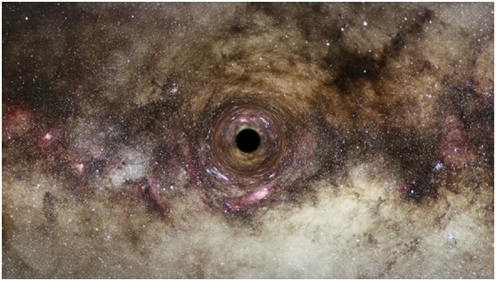

# 迄今为止最大的黑洞？英天文学家发现超大黑洞，质量是太阳的300亿倍！

英国天文学家使用新技术发现了一个超大质量黑洞，是迄今为止被发现的最大黑洞之一。

皇家天文学会发表的研究结果表明，这个黑洞的质量是太阳质量的300多亿倍。研究人员将其描述为一个“令人极度兴奋”的发现，为探测更多黑洞开辟了“诱人”的可能性。

英国杜伦大学团队使用了一种被称为引力透镜的新技术，这使科学家能够仔细研究距离地球数亿光年的遥远星系中的黑洞如何使光线弯曲。该团队在超级计算机模拟光线和NASA哈勃太空望远镜拍摄的图像的帮助下，确认了黑洞的大小。

皇家天文学会称，这是历史上第一个使用引力透镜被发现的黑洞。

_↑艺术家借助哈勃太空望远镜图像合成的超大黑洞示意图
据皇家天文学会_

研究的主要作者、杜伦大学物理系的观测宇宙学家詹姆斯▪南丁格尔表示，“我们所知道的大多数最大的黑洞都处于活跃状态，靠近黑洞的物质会升温并以光、X射线和其他辐射的形式释放能量。然而引力透镜使得研究不活跃的黑洞成为可能，这在以前是不可能的。这种方法可以让我们探测到更多超出我们邻近星系范围的黑洞，并揭示这些奇异物体是如何在更远古的宇宙时代进化成型的。”

超大质量黑洞是宇宙中质量最大的天体，它们的起源尚不清楚，有一派观点认为它们是数十亿年前星系合并形成的。每当一个星系与另一个星系合并时，恒星就会消失，黑洞的质量就会增加，这也许是一些黑洞质量惊人的原因。

红星新闻记者 王雅林 实习生 郑直

责编 官莉 编辑 郭庄

