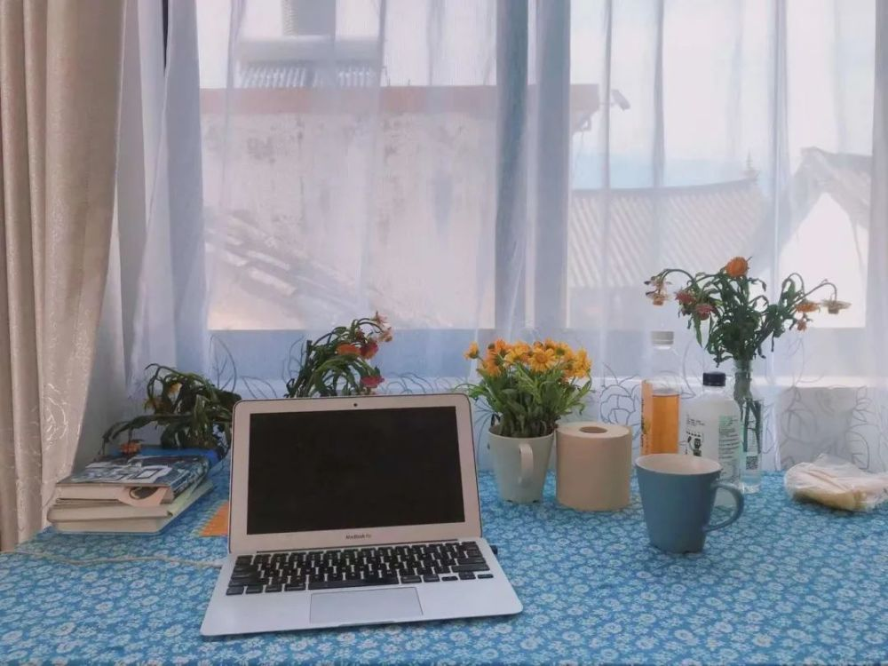
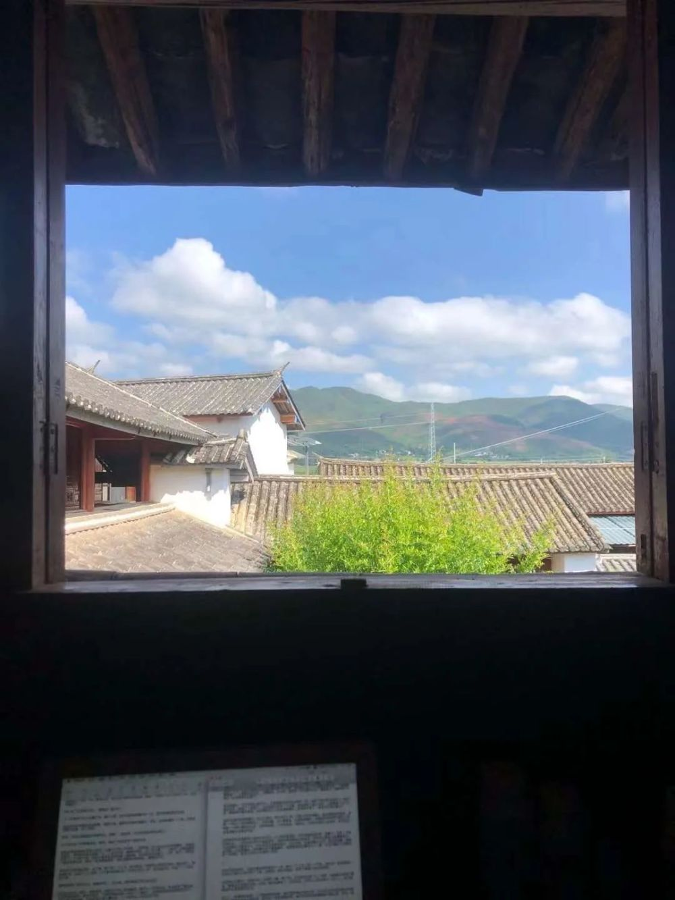
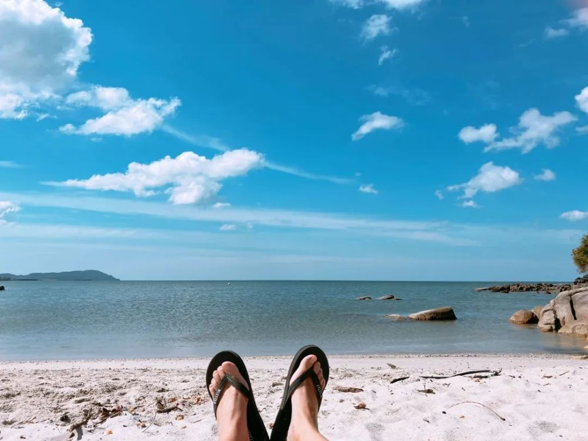

# 逃离北上广，我在泰国远程上班：拿一线城市收入，享受低生活成本

不上班的第七年

这是我不上班的第七年。

最初，像我这样的人有个统一的名称：自由职业。这两年，一个新的名词开始流行起来，也可以用来形容我的状态——数字游民。数字，可以通俗地理解为“互联网”；游民，居无定所的人；两个词连起来，也即通过互联网生存的居无定所的人。

这七年，总体说来我过着居无定所的生活。最初我离开北京，在大理生活了四年，时而去成都、杭州、上海呆一两个月，后来我又搬去成都，以为从此就会安定下来，结果那两年里，我有一半时间在路上。现在我又跑到泰国，在曼谷和清迈生活了很长一段时间。无论在哪，我的生活都保持着相似的内容与节奏。没工作时就四处晃荡、游玩，在不同城市和新老朋友见面。有工作时，在公寓或者旅馆里安稳地住上十天半个月，就和所有的上班族一样，朝九晚五，在共享办公空间或咖啡馆的桌前，面无表情地对着电脑。

_©祁十一_

我以写字为生，就像这篇《谷雨实验室》的约稿，将帮助我赚上一笔，然后就可以舒舒服服过上一段时间。大多数情况下，我打开空白文档，刷手机发呆10到20分钟，或者更久——直到瞟了一眼时间，发现时光流逝得可怕，这才会打起精神，在文档打下一个标题。

对一个没有固定工作的人来说，自律很重要，自律能够帮助人们建立秩序感。我每天早上自然醒，打开手机看时间，往往是“8:27”“8:35”这样的数字在屏幕上徘徊。早餐一般是麦片粥、煎鸡蛋、烤面包、煎香肠，有时也搭配一杯红茶。到了傍晚，六七点钟的时候，我会煮一碗青菜鸡蛋面，我会尽量在12点前睡觉。作息稳定，饮食规律，这是数字游民生活能够长久持续的必备技能，而作息紊乱往往意味着生活失控的开始。

_自制早餐
©祁十一_

在大理和清迈这种数字游民集中的地方，我可以毫无负担地如此生活。房租不高，一个人800块到2000块便可以租到一套舒适宽敞的一居或两居的房子；吃饭与交通的花费丰俭由人，2000块倒也足够。如此算下来，三四千块足以在这样的城市里很好地过活。而当你拥有从一线城市赚钱的技能和资源，能赚到高于此的收入，这样的生活便是可持续的。

你还可以时不时出门旅行或者短期旅居，不妨再向你描述一下它美好的一面：去年12月底，我在马来西亚的一座小岛兰卡威住了十天，在海边一座小木屋，窗户正对着海，阳光洒在海面闪烁着碎光，湛蓝海面与敞亮阳光让人感到辽阔舒畅。在这样的地方工作，当我感到疲劳的时候，就去沙滩上躺一会儿。工作完成后，我骑着摩托车穿越整座岛，在瀑布下游泳。

_兰卡威
©祁十一_

我在旅途中遇见了许多数字游民，这一群体在过去三年迅猛出现。互联网让远程办公成为可能，而疫情加速了它的发生。不少欧美国家在疫情之后延续了远程工作的常态化，国内也出现少许允许远程办公的公司。于是，一个在世界各地旅居生活的数字游民群体变得越来越庞大。去年底，由北大国发院和某招聘机构共同发布的一份2022雇佣关系趋势报告显示，76.4%的00后愿意成为“数字游民”。

他们是程序员、撰稿人、编剧、译者、平面设计师、插画作者、职业投资者、数字营销者、网红博主……职业分布千姿百态，人们的状态也不尽相同。快乐自由的人不少，焦虑孤独的人也不是没有。

利用地理套利的人

但在七年前，一切不是这样的。

当我辞掉北京的工作，来到大理成为一个“无业游民”的时候，时代的主题是“创业”和“买房”。那像是一个遍地黄金的时代，而你要做的就是赶紧低头“捡钱”——这话是一位北京的创业者说的。在他的描述中，北京就像处于一种热钱的浪潮中，而你不要胡思乱想，应投身其中，就像捡钱一样去赚钱。看上去确实如此，那时社交媒体上满是“XX公司拿到一千万A轮融资”这样的新闻。像我这样一个满脑子诗与远方的文艺青年，竟也加入创业的浪潮中，参与创办一家新媒体公司。

这种生活的另一面是：焦虑与疲劳。疲劳几乎是肉眼可见地写在人的脸上。那时我每天的生活是这样的：早上7点半一睁眼便是线上会议，白天则在不停地见人、谈合作、采访写稿、参加活动，深夜12点仍是无尽的线上会议。2017年，我已来到大理生活，国内跨年的主题词仍是“焦虑”。一位互联网名人在其备受追捧的跨年演讲中引用了《爱丽丝漫游奇境》里的一句话：“在我们这个地方，你必须不停地奔跑，才能留在原地。”

我就是在这种不堪承受的奔跑中选择退出的。

大理是国内数字游民群体比较集中的地方。我遇到过做直播的网红、美食博主、作家、导演、创业者、职业炒股人士、程序员。他们中的大部分人，具有相似的特点：不用上班，节奏舒缓，热衷于寻找和品尝美食，时不时相约去苍山上徒步爬山、洱海边骑行，去寺庙里吃斋饭。

这涉及到“数字游民”的一个核心概念：地理套利——利用城市间的经济结构与物价差异，给自己更大的生活空间与可能。某种程度上，这是我看上去懒散随意的生活得以持续的原因：拿着北京上海的稿费与项目收入，在物价更低的西南城市悠游自在地过日子。

_大理的街道
©祁十一_

这两三年，它吸引了越来越多年轻人。你很容易在大理慢下来，享受自然与生活。你可以在苍山大道上悠闲地散步，欣赏黄昏时瑰丽多姿的晚霞；可以在洱海边的草地上玩飞盘（这正是来自一线城市的数字游民们钟爱的活动）；可以参加苍山下洱海边大大小小的集市，躺在草坪上听旁边的歌手一边直播一边弹吉他唱歌；或者哪儿也不去，就躺在你所住的房子屋顶，晒太阳看云，消磨一下午时光。

某种程度上说，成为数字游民，确实需要一些技能在身。比如去年夏天聚集在大理的一些web3从业者，我所认识的程序员、博主等，多有不错的技能水准。就像L——一个以炒股为生的80后女生，阿斯伯格综合征患者——通俗来说，这是高功能自闭症的一种，患者多有社交障碍，但具有高智商等特征。

我遇见L的时候，她刚刚结束在浙江某小城的旅居，来到大理。我们住在同一间旅馆，我时而见她坐在旅馆大堂独自对着电脑、戴着厚重的红色外挂式耳机，安静无声。不用电脑时，她也常常戴着耳机四处行走。后来她告诉我，那是降噪耳机，许多自闭症患者对噪音格外敏感、无法忍受，降噪耳机可以帮助她消减一部分噪音。

L的生活是许多人所羡慕的。每周工作两到三天，工作内容是坐在电脑前看大盘走势，时而操盘资金的买入卖出，下午3点收盘后一天的工作便结束了。当然，这不是一份人人都能做的工作，L也把它形容为“在狼嘴里抢肉吃”。她在经过了不短时间的自学和实践之后，形成了一套方法，差不多可以获得20%的年收益率。

这份收入足以让她在全国各地自由旅居。她对食物有执着，这也成为旅居的线索：比如喜欢杨梅，她便会在每年杨梅出产的季节，去国内最好的杨梅产地吃新鲜的杨梅。季节与气候也影响着旅居地的选择：冬夏自然是呆在云南好，春秋在江南、湖南、四川漫游挺不错。

_大理沙溪
©祁十一_

可你不要误会，以为做数字游民是杰出人才、特殊人士的特权。当互联网发展到今天，数字游民已经成为更大众化的选择。这也是江江，一个95后女生去年春夏在大理的体会。

江江一直想成为数字游民。当她去年5月拿到上海一份可以远程办公的兼职offer后，立刻买了机票飞去大理。那份兼职的收入还行，不输于一线城市研究生毕业后的平均水平，但那只是江江在大理的多份兼职之一。本科学葡萄牙语的她，还同时在线教葡萄牙语。

“我是大理最卷的人之一。”江江告诉我。

大理的活动江江几乎都参加了一遍，“亚逼的，身心灵的，青年文化的，喝茶的，瑜伽的”，她都去瞅了瞅，混个脸熟。那场据说吸引了全中国web3从业者的“瓦猫之夏”web3大会，江江也作为工作人员参与其中。她看到一些自媒体公司把办公室迁到大理，互联网以及这里越来越丰富的人群，让他们身居五线小城，也能获得鲜活的内容来源。

“整个趋势是大家想要暂停下来。他们中的一波可能是被迫离职了，一波可能是工作了三四年，想停一停。”

江江从这段数字游民的经历中收获了很多。去年，她从大理回上海后，曾受邀作为嘉宾参加一个数字游民分享会。原本她只是“拉去凑数的”，没想到会后许多女生都对她说“很有帮助”。

“小红书上很多数字游民都非常中产、前沿，跟她们距离很远。但我很普通，让她们看到原来你赚的钱不是特别多，也有勇气去尝试。”江江说。

“Fucking off money”

在国外，清迈、巴厘岛、里斯本成为数字游民集中的地方。

2022年底，我来到泰国旅居，在清迈和曼谷，遇见了更多的数字游民。清迈是个迷人且宜居的地方，它有一个大型的数字游民社区，低物价和高品质，让它成为地理套利的绝佳之地：城市内外遍地开花的咖啡馆，一杯拿铁的均价只要60泰铢（约12元）。在任何一间桌椅高度和氛围适合办公的咖啡馆里，你都能看到许多对着电脑、戴着耳机的年轻人。

_清迈咖啡馆
©祁十一_

很多人是为了逃避工作的压力而选择这里的。一位做直播的95后女孩，决定停下工作，来清迈休息几个月，因为“压力很大”。直到看见她发的朋友圈，我才明白这压力到底有多大。她说：不直播的三个多月后例假终于正常了。

95后小王也已移居清迈半年。她曾在上海一家广告公司工作半年，彼时她最大的难解之谜是：做设计的同事，到底哪里来的时间生孩子？那间公司服务于国际知名的美妆品牌，设计部的同事没日没夜地加班，经常要加班到凌晨三点。所以当小王听说一位设计同事生了孩子后，震惊得目瞪口呆：她是如何做到的？

_清迈街景
©祁十一_

我在清迈遇见了小美，一位90后平面设计师。通过社交媒体联系上她的当天，我们就一起去吃了塔佩门附近街边的牛肉面——这也是清迈的气场，人与人之间不太有大城市的疏离，陌生人社交也可能快速破冰。那天傍晚6点，小美骑着摩托车来旅舍接我，一个刚刚加了微信3小时、总共聊了20多句话的陌生人。她留一头爆炸式短发，面容清秀，气质中性洒脱，举手投足间干净利落，穿衣打扮不刻意却相当有审美。

四个多月以前，小美还在上海的公司里加班。她很早就想辞职，但在年复一年的工作中，她习惯了每天上班打卡，下班坐一个小时地铁回家，瘫在沙发上看剧，慢慢地好像陷在这种生活里了。直到2022年上海疫情的发生，推了她一把，她才下定辞职的决心，来清迈生活一年。数字游民式的生活，是她解决困境的一种尝试。

但是收入的不稳定，是许多数字游民最大的忧虑与不安。小美在清迈呆了四个多月，以语言签证的形式在这儿一边学英语，一边做平面设计。

_小美的民宿
©小美_

她尝试过做民宿——将自己在清迈乡村果园里租的独栋房子做短租。但只做了两个月，便因离城太远、客人太少而放弃了，她也从乡村搬回了古城。她想创业，做点“自己的事情”，而不是完全依赖于接设计的活——这份工作越来越像一个工具，创造与创意的成分越来越低。ChatGPT的诞生更是带来危机——在ChatGPT发布以后，我已经听不止一个设计师说，他们的工作与收入受到了直接影响，甚至因此失业。

收入不稳定带来的焦虑，普遍存在于非雇佣状态的数字游民中。在曼谷，我和网友Abj见了面，她也在清迈生活了几个月，彼时正处于一种焦虑状态。作为二房东，她在上海租了几套房子用以出租，但今年上海的租房市场不理想，眼看着该交下一季度的房租了，但她位于市中心的房子始终租不出去。如果到这个季度结束还整租不掉，她就打算把房子退了，相当于投资失败。但在清迈的几个月，带给Abj很大的治愈，低物价，众多优质的咖啡馆、餐厅，12月很棒的阳光、好天气，缓解了她一部分焦虑感。

一切也让我想起自己七年前刚刚开始自由职业的时候。每个月收入高低起伏，时而也颗粒无收——那很大程度上是因为职业转型刚开始，以及懒散，而它会随着你的持续努力和积累而得到改善。

对于想成为数字游民的人来说，一笔“Fucking off
money”是有帮助的。它或许是你的工作积蓄，又或者是投资理财的收入，只要能让你不工作一段时间也能很好地活着，它便是你面对收入不稳定的底气。

“流动性焦虑”

一个神经细软脆弱的人是当不了数字游民的，旅途上有太多让人崩溃的意外和细节了：辗转各地的疲惫，住所的不稳定，房间里响亮的水管声，不隔音的墙壁背后人们的交谈、不可描述的声音，热带地区时常出现的不知名的小虫子。

如果给数字游民生活的障碍排序，若收入排第一，孤独大概会排第二，甚至并列第一。对孤独的不可承受，让一些数字游民选择了退出，也让想成为数字游民的人感到疑虑。

无论是在国内还是在泰国，我都遇到过因为太过孤独而重回职场的数字游民。我的一位朋友曾讲述过独自工作所带来的孤独感受。她发给我一篇《人物》对郭宇的采访文章。郭宇，28岁财富自由宣布从字节跳动退休，去了日本旅居。在那篇文章里，他去学船舶驾照。郭宇说，“……你在船上睡觉，没有人看得到你，也不会有任何船经过你。离岸几十公里之后，连手机信号都没有，你和一切失去联系。”

_在海边
©祁十一_

她说，当时看到这些话，一下就被击中了。她所感受到的，就是那种孤独，“好像全世界只剩下你一个人。”

江江在大理做了5个月数字游民后，也感受到强烈的孤独。她借用了人类学家项飙的一句话来形容这种孤独：无比想要“拥抱一个具体的人”。让她产生这种感受的，是大理数字游民群体非常大的流动性。流动性太大，就不会产生深度的交流和连接。每一次认识新的人，她都要介绍自己。到了后期，江江学会了保护自己——再遇见新来的，她会先问对方的名字，然后，“你呆多久？”如果只呆一周，那就拜拜；如果呆两三个月，就再交流一下。

后来，江江在大理交了一个男朋友。她的男朋友也是一个数字游民，流动频率非常高，时常在一个地方呆一周，便去了下一个地方。他们除了最初在大理和上海的几个月，大部分时间身处异地、见不着面，以致江江提出了分手。

在她的观察中，亲密关系是数字游民群体的普遍问题，“到了下一个地方就换一个男/女朋友”，这些事情她都见过，并且不能接受。这甚至会影响她想要继续数字游民的意愿——不过目前“大概10%到15%的影响”，还不是特别大。

而我迄今见过对一切感到满意、状态极佳的数字游民，大多处于相似的情形：有可以赚钱的技能，可以获得持续稳定且不错的收入，情侣，无孩。

“那么，你呢？你孤独吗？”这也是许多人对我提出的问题，“这么长时间不上班，独自工作，没有结婚，你孤独吗？”

_©祁十一_

我当然可以给出许多非常合理的陈述。比如我做着喜欢的工作，工作内容就是探索这个社会和千姿百态的人，时而需要与人进行深度交流。它的每一个环节，都让我与这个世界、与人建立有趣的连接。

又或者，我恰好有足够的运气，拥有很好的家人和朋友，无论我们是否一起生活、时常见面，情感的真挚、深刻的连接都真实存在。但说到底，我们都只是平凡的人类，孤独就如同恐惧、悲哀等许多情绪一样，普遍存在，无可逃脱。所以在国外旅居了四个多月的我，计划在不久后回国，回到熟悉喜欢的城市，回到家人、朋友身边。即便对自由自在四处游走的生活甘之如饴，但我也得承认，对爱、陪伴、在熟悉喜欢的城市安稳生活（哪怕一段时间），也是刻在人心底的追求。

撰文丨祁十一 编辑丨金赫 出品丨腾讯新闻 谷雨工作室

版权声明：腾讯新闻出品内容，未经授权，不得复制和转载，否则将追究法律责任。

