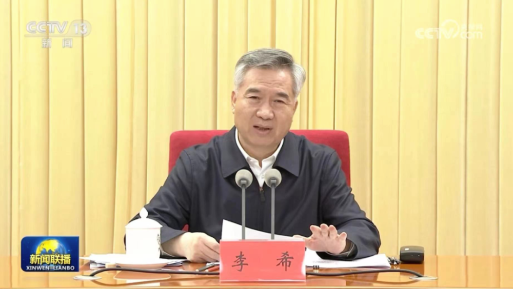
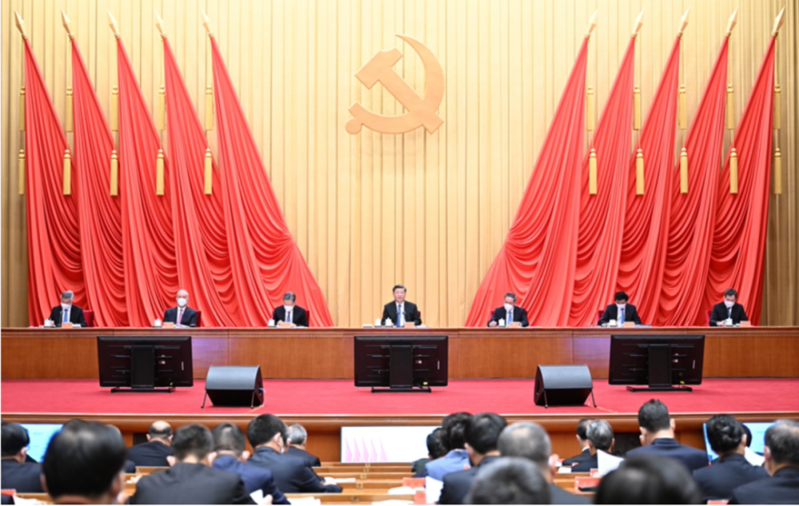
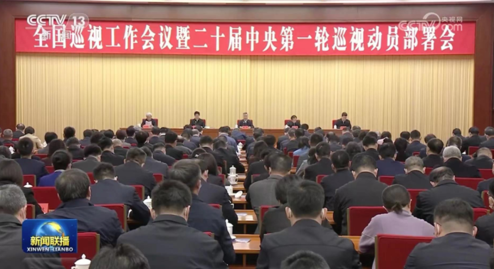

# 首创！二十届中央首轮巡视的三个特殊安排

**撰文 | 高语阳**

3月27日，全国巡视工作会议暨二十届中央第一轮巡视动员部署会召开。中共中央政治局常委、中央巡视工作领导小组组长李希出席会议并讲话。

新一届中央首轮巡视拉开帷幕。

29日、30日两天，中央纪委国家监委网站连续发文解读二十届中央第一轮巡视工作，披露了本轮巡视的三个特殊安排。

**十八大以来首次**

在27日的动员部署会议上，中共中央政治局常委、中央巡视工作领导小组组长李希出席会议并讲话。中共中央政治局委员、中央巡视工作领导小组副组长李干杰宣布二十届中央第一轮巡视组长授权任职和任务分工决定，中共中央书记处书记、中央巡视工作领导小组副组长刘金国主持会议。

这是李希、李干杰、刘金国首次以中央巡视工作领导小组领导身份出现在公开报道中。

李希在会上部署，将对中核集团、航天科技、航天科工等30家中管企业党组开展常规巡视；对中投、国家开发银行等5家中管金融企业党委开展巡视“回头看”；对国家体育总局党组开展机动巡视。

中央纪委国家监委网站发布的解读文章写道：

**在一轮中央巡视同时安排常规巡视、机动巡视和“回头看”三种组织方式，这在党的十八大以来还是首次**
，有利于增强巡视震慑力和穿透力，彰显了新一届中央巡视守正创新的实践精神。

同时， **在新一届中央首轮巡视就安排对部分金融单位开展“回头看”，充分体现了党中央对金融工作、巡视整改的高度重视**
，在开局之年就释放加强巡视整改和成果运用的鲜明信号。

如何理解这样的安排呢？

文章指出， **常规巡视是全面政治体检，通过板块轮动，有利于查找行业性、领域性问题。**

**巡视“回头看”是政治复查，既查老问题，检查整改落实情况，也注重发现新问题，对没见底的问题再了解，延伸放大震慑效果。**

**机动巡视是靶向治疗，问题导向更加鲜明，动态选定巡视任务，哪里问题反映突出就去哪里，奔着问题去，回应群众关切，便于发挥灵活性、精准性、深入性的优势。**

**组成人员四分之三为抽调的专业干部**

中央纪委国家监委网站发文中还指出本轮巡视组的特点： **此次中央巡视组的组成人员有四分之三是从财政、统计、审计、国资、信访等部门抽调的专业干部。**

**“这是进一步发挥巡视综合监督平台作用、深化巡视监督与其他监督贯通协调的具体举措，有利于推动专业力量深度参与巡视，形成监督合力，提高监督效能。”**

政知君注意到，1月9日至10日，二十届中央纪委二次全会召开，习近平在全会上发表重要讲话。他指出，要把巡视利剑磨得更光更亮，勇于亮剑，始终做到利剑高悬、震慑常在。

会上，中央纪委书记李希首次作工作报告。 **在部署2023年中央巡视工作时，李希指出，要推动巡视工作向深拓展、向专发力、向下延伸。**

**要坚持务实简约管用，优化巡视工作流程，改进方式方法，提高发现问题的能力和水平，增强巡视监督精准性和有效性。**

**首次专门召开巡视组组长集体谈话会**

中央纪委国家监委网站发表的评论文章还指出， **全国巡视工作会议后，首次专门召开中央巡视组组长集体谈话会。**

**“促进中央巡视组组长加深对自身职责使命的认识，知责明责、履责尽责，以更高的标准、更严的纪律要求自己、管理队伍，打造忠诚干净担当、敢于善于斗争的巡视铁军。”**

政知君注意到，这个安排与当下正在开展的全国纪检监察干部队伍教育整顿有关。

2月24日，全国纪检监察干部队伍教育整顿动员部署会议召开，李希出席会议并讲话。

李希指出，要以最鲜明的态度、最有力的措施、最果断的行动坚决查处“两面人”、坚决防治“灯下黑”，着力打造忠诚干净担当、敢于善于斗争的纪检监察铁军。

在全系统范围内开展纪检监察干部队伍教育整顿，尚属首次。

3月22日，全国纪检监察干部队伍教育整顿对省（区、市）督导检查动员部署会议召开。报道显示，已经成立全国纪检监察干部队伍教育整顿领导小组。

召开中央巡视组组长集体谈话会，旨在警示中央巡视组组长自身廉洁自律。

**政知君注意到，此前曾有中央巡视组领导落马。**

**2022年3月落马的中央纪委国家监委驻国家安全部纪检监察组原组长刘彦平曾于2020年担任中央第十四巡视组组长。**

今年1月，刘彦平因受贿罪一审被判死缓，且不得减刑假释。

法院认定，2001年至2022年， **刘彦平利用**
担任公安部警卫局副局长、政委、局长，公安部党委委员、部长助理、副部长，国家安全部党委委员、纪委书记、中央纪委驻国家安全部纪检组组长、中央纪委国家监委驻国家安全部纪检监察组组长，
**十九届中央第五轮巡视第十四组组长**
等职务上的便利或者职权、地位形成的便利条件，为有关单位和个人在企业经营、案件处理、工作安排、车牌办理等事项上提供帮助，
**直接或通过他人非法收受财物，共计折合人民币2.34亿余元。**

**2020年10月，中央巡视组原副部级巡视专员董宏落马。**

**董宏曾以中央巡视组副组长、组长的身份参与过多轮巡视。**
在2013年10月，中央第二巡视组进驻新华社，董宏任副组长；2014年3月，董宏任第十二巡视组组长，巡视复旦大学；同年7月，中央第十二巡视组巡视江苏，董宏任副组长；2014年11月，中央第十二巡视组对神华集团进行专项巡视，董宏担任组长；2015年3月，中央第十二巡视组对中国移动进行专项巡视，董宏任组长。

2022年1月，董宏因受贿罪被判死缓。 **法院认定其受贿时间从1999年至2020年，共非法收受财物共计折合人民币4.63亿余元。**

**2017年4月，中央巡视组原副部级巡视专员张化为落马。**

张化为处分通报中指出， **他长期利用巡视权违规干预插手被巡视单位相关工作** ；长期从事党的纪律检查工作，知纪破纪、执纪违纪，严重损害党内政治生态，
**给中央纪委机关及中央巡视组良好形象造成负面影响。**

2019年5月，张化为因受贿罪被判有期徒刑12年。

法院认定，
**2006年至2014年，被告人张化为利用担任中央纪委、中央组织部巡视组副部级巡视专员、中央巡视组副部级巡视专员、中央第一企业金融巡视组副组长等职务上的便利**
，为相关单位和个人在企业经营、房产销售、案件调查、职务提拔等事项上提供帮助，直接或者通过特定关系人收受他人给予的字画、金条、玉石、珠宝首饰等财物，
**共计折合人民币3284.93万余元。**

**资料 ｜ 中央纪委国家监委网站 央视新闻**

**【版权声明】本文著作权归政知新媒体独家所有，未经授权，不得转载。**

