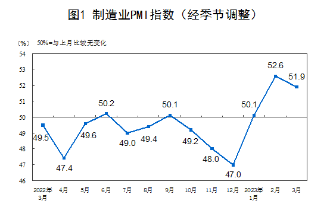
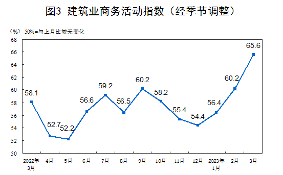
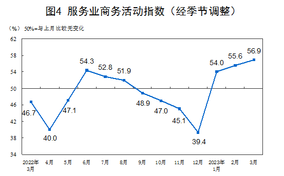

# 中国3月官方制造业PMI为51.9，比上月下降0.7个百分点

据国家统计局网站消息，国家统计局服务业调查中心、中国物流与采购联合会公布2023年3月中国采购经理指数运行情况。

**一、中国制造业采购经理指数运行情况**

3月份，制造业采购经理指数（PMI）为51.9%，比上月下降0.7个百分点，高于临界点，制造业保持扩张态势。

从企业规模看，大、中、小型企业PMI分别为53.6%、50.3%和50.4%，低于上月0.1、1.7和0.8个百分点，均高于临界点。

从分类指数看，在构成制造业PMI的5个分类指数中，生产指数、新订单指数和供应商配送时间指数均高于临界点，原材料库存指数和从业人员指数低于临界点。

生产指数为54.6%，比上月下降2.1个百分点，持续高于临界点，表明制造业生产活动继续扩张。

新订单指数为53.6%，比上月下降0.5个百分点，持续高于临界点，表明制造业市场需求继续增加。

原材料库存指数为48.3%，比上月下降1.5个百分点，表明制造业主要原材料库存量降幅有所扩大。

从业人员指数为49.7%，比上月下降0.5个百分点，表明制造业企业用工景气水平有所回落。

供应商配送时间指数为50.8%，比上月下降1.2个百分点，仍高于临界点，表明制造业原材料供应商交货时间继续加快。

**二、中国非制造业采购经理指数运行情况**

3月份，非制造业商务活动指数为58.2%，比上月上升1.9个百分点，高于临界点，非制造业恢复发展步伐加快。

分行业看，建筑业商务活动指数为65.6%，比上月上升5.4个百分点。服务业商务活动指数为56.9%，比上月上升1.3个百分点。从行业看，零售、铁路运输、道路运输、航空运输、互联网软件及信息技术服务、货币金融服务、租赁及商务服务等行业商务活动指数位于60.0%以上高位景气区间；批发、水上运输等行业商务活动指数低于临界点。

新订单指数为57.3%，比上月上升1.5个百分点，高于临界点，表明非制造业市场需求继续回升。分行业看，建筑业新订单指数为50.2%，比上月下降11.9个百分点；服务业新订单指数为58.5%，比上月上升3.8个百分点。

投入品价格指数为50.3%，比上月下降0.8个百分点，高于临界点，表明非制造业企业用于经营活动的投入品价格总体水平涨幅回落。分行业看，建筑业投入品价格指数为54.4%，比上月下降0.9个百分点；服务业投入品价格指数为49.6%，比上月下降0.8个百分点。

销售价格指数为47.8%，比上月下降3.0个百分点，低于临界点，表明非制造业销售价格总体水平有所下降。分行业看，建筑业销售价格指数为50.9%，比上月下降2.7个百分点；服务业销售价格指数为47.3%，比上月下降3.1个百分点。

从业人员指数为49.2%，比上月下降1.0个百分点，表明非制造业企业用工景气水平有所回落。分行业看，建筑业从业人员指数为51.3%，比上月下降7.3个百分点；服务业从业人员指数为48.8%，比上月上升0.1个百分点。

业务活动预期指数为63.3%，比上月下降1.6个百分点，继续位于高位景气区间，表明非制造业企业对近期市场恢复发展信心保持稳定。分行业看，建筑业业务活动预期指数为63.7%，比上月下降2.1个百分点；服务业业务活动预期指数为63.2%，比上月下降1.6个百分点。

**三、中国综合PMI产出指数运行情况**

3月份，综合PMI产出指数为57.0%，比上月上升0.6个百分点，位于较高景气区间，表明我国企业生产经营总体情况继续好转。

