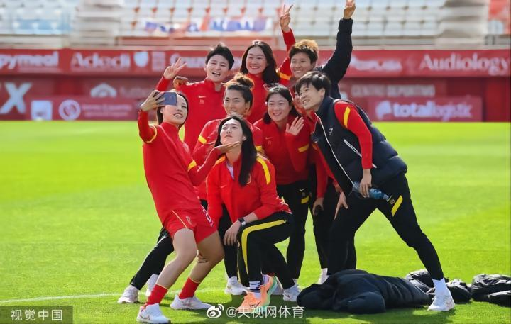
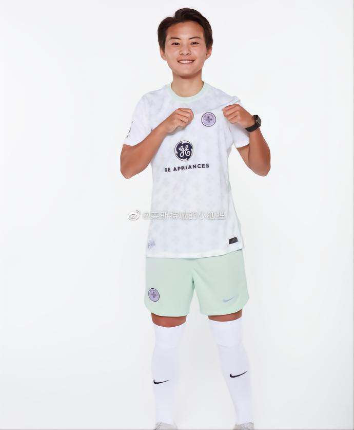
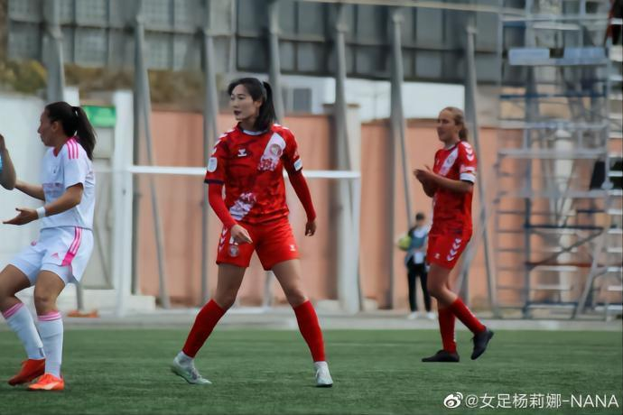
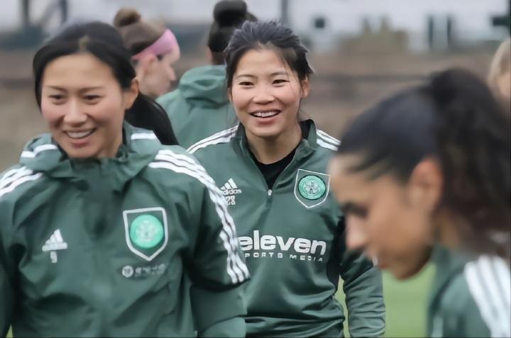
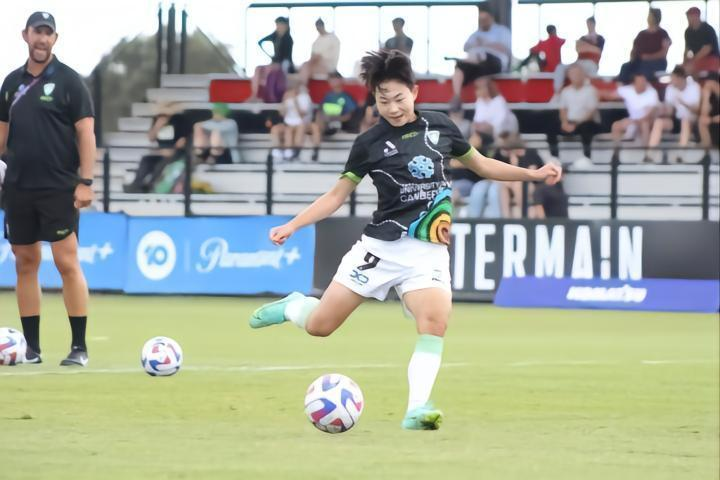

# 中国女足海外拉练完整名单：王霜领衔32人，6名海外球员入选

据中国足协消息，中国女足4月将迎来两场海外热身赛，分别对阵瑞士女足和西班牙女足。中国队参加本期集训的球员有32人，其中包括王霜等6名留洋球员。

按照计划，中国女足将于4月1日启程前往瑞士，备战4月6日与瑞士女足的热身赛，随后转战西班牙，并于4月11日与西班牙女足交手。两个对手均为今年女足世界杯参赛球队。国内26名球员已经启程前往瑞士，王霜在内的多名海外球员将在苏黎世与球队会合。

**附女足集训大名单：**

武汉车谷江大：王珊珊、张 睿、吴海燕、姚 伟、姚凌薇、刘艳秋、娄佳惠、古雅沙、李艳飞

上海农商银行：张 馨、朱 钰、汪琳琳、唐佳丽、肖裕仪、杨 倩、方 洁

江苏无锡：徐 欢、欧懿垚、金 坤、窦加星

北京：潘红艳、麦迪乃·沙地克

长春大众卓越：高 晨、高静遥、乌日古木拉

广东：陈巧珠

路易斯维尔竞赛：王霜

莱万特拉斯普拉纳斯：杨莉娜

凯尔特人：沈梦露

草蜢：张琳艳

堪培拉联：吴澄舒

巴黎圣日尔曼：李梦雯

