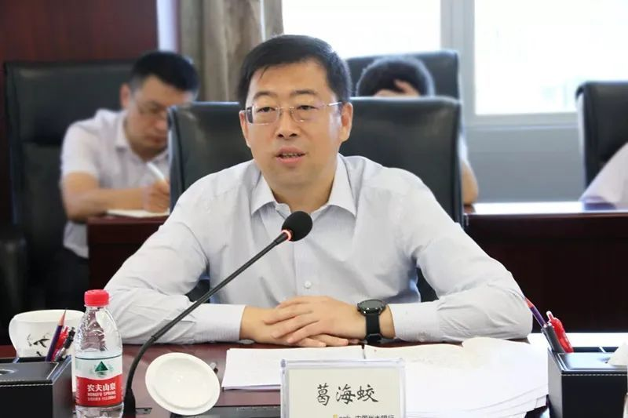

# 中国银行原党委书记、董事长刘连舸被查

据中央纪委国家监委网站31日消息，中国银行原党委书记、董事长刘连舸涉嫌严重违纪违法，目前正接受中央纪委国家监委纪律审查和监察调查。

_刘连舸
资料图_

公开资料显示，刘连舸出生于‍‍‍‍‍‍‍1961年5月，吉林永吉人，早年在中国人民银行工作，2007年任中国进出口银行副行长，2015年任中国进出口银行党委副书记、副董事长、行长，2018年任中国银行行长、党委副书记、副董事长，2019年任中国银行党委书记、董事长。

今年2月17日，中国银行召开党委扩大会议，宣布中央决定：免去刘连舸的中国银行党委书记职务。3月19日，中国银行公告，董事会收到刘连舸的辞呈，他辞去中行董事长、执行董事等职务。

_葛海蛟
资料图_

今日，中行迎来了新任党委书记。据中行官网消息，3月31日下午，中国银行召开干部会议。中央组织部有关负责同志宣布了中央决定：葛海蛟同志任中国银行党委书记。

葛海蛟此前为河北省委常委、常务副省长。

