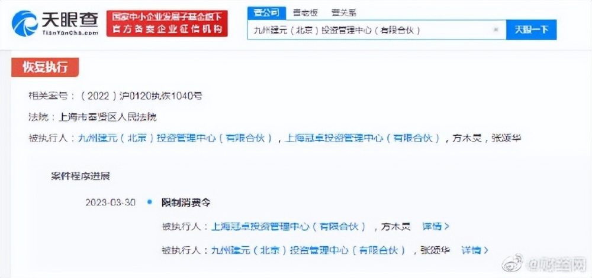
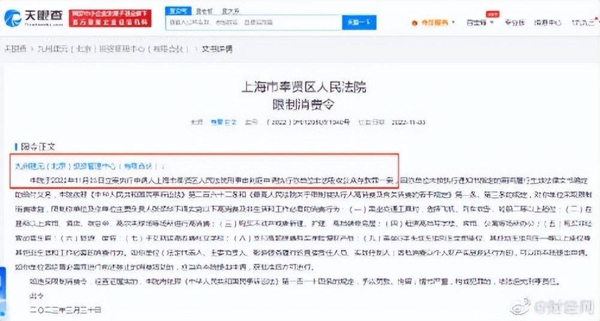
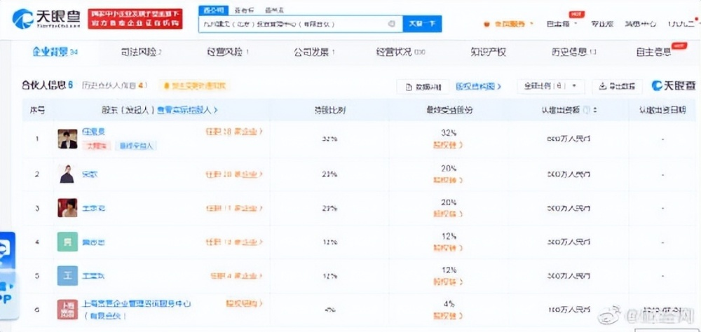

# 任泉王京花企业涉非法吸收公众存款案 ，曾因8500万标的被限消

天眼查App显示，近日，九州建元（北京）投资管理中心（有限合伙）及其主要负责人张颂华新增一则限制消费令，涉及非法吸收公众存款罪案件，申请人为上海市奉贤区人民法院刑事审判庭，一同被限制消费的还有上海冠卓投资管理中心（有限合伙）及其执行事务合伙人方木灵。案件流程显示，去年11月，两企业因该案被恢复执行8500万。

九州建元（北京）投资管理中心（有限合伙）成立于2008年8月，经营范围含投资管理、投资咨询、资产管理等。合伙人信息显示，该企业第一大股东为任振泉（任泉），持股32%，王京花持股20%。

**【来源：天眼查APP】**

