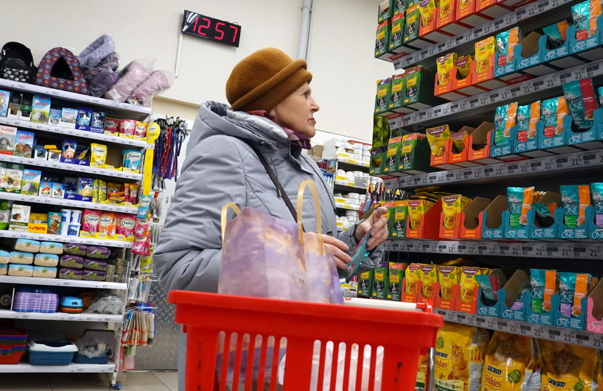

# 俄乌冲突一年后的莫斯科，生活变了多少？

【环球时报赴俄罗斯特派记者
白云怡】俄罗斯和乌克兰在乌东地区的胶着战事充斥着国际媒体，这让人们对这两个国家现状的关注反倒显得有限。随着俄乌冲突进入第二个年头，这场战争对两国的影响也日益凸显。乌克兰经济遭遇断崖式下跌，国家重建的话题却因西方国家不愿意看到让俄乌停火而迟迟无法提上日程。尽管战争没有发生在俄罗斯本土，但《环球时报》记者近日赴莫斯科采访期间，还是能感受到特殊的“战时”印记。对比5年前记者去俄罗斯，这次近距离观察还是可以发现与邻国的冲突和来自西方的制裁对一个国家经济和民生造成的影响。自克里米亚危机以来，俄罗斯对外展示出“独特韧性”，对内确保政经平稳，但长期的冲突和制裁到底会给这个大国的前途命运带来什么样的影响，记者接触到的当地普通民众无法给出答案。

**物价平稳、货源充足，普通人生活如旧**

3月下旬的莫斯科还带着些许寒意，但街头来来往往的俄罗斯人有不少已脱去厚重的冬装。《环球时报》记者在大多数人下班的时候，来到位于莫斯科郊区的Globus超市，没有看到任何缺货或抢购的迹象。在这家德国品牌的连锁超市里，货架上的商品琳琅满目，许多顾客推着装得满满当当的购物车。当地人告诉记者，去年西方制裁猛烈袭来时，俄罗斯市场上的一些商品确实出现涨价现象，不少人也急于用现金抢购商品，生怕接下来出现剧烈的通货膨胀。不过现在，至少在莫斯科，物价和商品供应都已十分平稳。

据了解，去年2月俄乌冲突升级后，Globus超市因继续在俄罗斯运营而遭到西方的指责。面对压力，该超市德国总部的负责人表示，“出于财务原因考虑，我们希望继续在俄开展业务”。记者在这家莫斯科超市里观察到，很多基本生活用品的价格和北京、上海差不多，如30个鸡蛋约合25元人民币，1升装的牛奶约合7.5元人民币，1斤虾约合22元人民币，1斤牛肉约合37元人民币。除土豆、胡萝卜外，莫斯科的不少蔬菜和水果要比北京、上海贵不少，但当地人认为“这和战争与制裁关系并不大，主要还是有些果蔬俄罗斯产量少”。

谈到物价的话题，一个名叫列昂尼德的莫斯科市民告诉《环球时报》记者，自己平时喝的伏特加、抽的烟，还有日常消费的食品在过去一年多中价格涨了一点，“不过幅度不大，可以承受”，但汽车等一些“大件”涨价厉害。在他看来，过去几年，生活还是受到西方制裁和新冠疫情的一些影响。一些俄罗斯人还向记者表示：“一年多来，我们的生活变得简单了，甚至没有了高消费。”

卡塔尔半岛电视台近日报道说：“西方国家对俄罗斯银行和公司实施多项制裁的确对该国经济造成重大影响，但一些人想要看到的俄罗斯经济崩溃并没有到来。”英国《经济学人》也刊文表示，俄罗斯政府精心构建的“俄罗斯堡垒”，让该国经济并未出现崩盘的情况。对此，一些俄罗斯民众表示“确实如此”，西方的制裁目前还没有削弱俄罗斯的经济潜力，甚至也并未导致克里姆林宫失去为其在乌克兰继续“特别军事行动”提供资金的能力。俄官方2月发布的2022年GDP数据显示，俄罗斯经济发展显著好于预期——俄去年GDP下降2.1%，而非西方预估的“衰退10个百分点至20个百分点”。

经济上的基本平稳成为俄罗斯截至目前仍保持社会平稳的基础。在莫斯科的街头、学校、地铁、广场，普通人的生活照常如旧，仿佛什么都没有发生一样：街头的花店依然人来人往；地铁里的艺人仍旧在演奏音乐，行人或驻足观看，或上前留下小费；博物馆的展览继续开放；露天画摊的老板也继续忙着招揽客人……与此同时，《环球时报》记者看到，在莫斯科街头官方展示的有关顿巴斯地区的宣传栏前，也有人在仔细观看。这似乎提醒着人们，战争仍在继续。

《环球时报》记者这次来俄罗斯采访前，香港中文大学（深圳）前海国际事务研究院院长郑永年谈了一些他的看法。他认为，战争是一次很大的经济消耗，俄罗斯方面目前能扛住压力，背后的原因是俄高层预判俄罗斯会遭遇到西方更严厉制裁，并采取对策避免了俄罗斯经济的崩溃。

**平行进口、投资国内，企业家责任更多**

尽管战争与制裁对莫斯科民众的生活似乎没有形成巨大冲击，但如果仔细观察，西方“封锁”的痕迹处处可见。《环球时报》记者在航班落地莫斯科谢列梅捷沃国际机场的那一刻就感受到了这一点。与5年前记者来莫斯科采访时看到的情景不同，机场人群中少了欧美面孔，国际旅客基本来自中亚国家和中国。去年以来，俄罗斯与欧美多国互相关闭领空，此前大量来往于欧洲和俄罗斯之间的航班停飞，这无疑给西方与俄罗斯间的人员交往带来严重影响。《环球时报》记者的一位同事从意大利飞赴俄罗斯报道，竟要先绕道飞土耳其，然后转机到莫斯科，回程时则要先飞迪拜，然后再找航班回罗马。

俄罗斯海关的检查也比5年前更加严格，每个入境旅客的资料都会被查看很长时间。有莫斯科同行告诉记者，就在前一段时间，莫斯科海关的工作人员看到记者身份的人员入境，还经常会问及他们对俄乌战争的看法。

在街头，西方企业的撤离也很容易被感知到。比如，在谢列梅捷沃国际机场通往莫斯科市中心的快速路旁，原本有一排欧美汽车品牌的4S店，但现在它们均已“改头换面”，被中国汽车品牌的4S店所取代。据了解，哈弗、奇瑞和吉利等中国品牌今年年初已占俄罗斯新车销量的40%，远高于去年同期的约10%。这与西方竞争对手撤出俄罗斯市场有直接关系。俄全国汽车联盟预测，2023年中国汽车在俄罗斯的销售份额可能占60%。不过，俄《消息报》近日也援引俄汽车领域专家维克托·康德拉辛的话说，“中国制造商的扩张将迅速满足俄民众对汽车的需求，但从长远来看，这也可能会阻碍俄国内汽车工业的发展。”还有俄汽车行业消息人士表示，除了“红旗”外，俄罗斯人对中国高端汽车品牌的了解还很有限，因此，眼下是中国车企在俄罗斯市场提高品牌知名度的一个重要阶段。

俄乌冲突爆发后，许多跨国品牌迅速宣布退出俄罗斯。时隔一年，今天在莫斯科的商场里，仍能看到许多关闭的门店，如彪马、Zara、锐步、宜家等。《环球时报》记者在莫斯科城郊的奥特莱斯购物村看到，这里数百平米的阿迪达斯门店紧闭大门，店内黑乎乎的，隐约可见不少存货还齐齐整整地码放在衣架和货柜上，不知是店主撤离时太匆忙，还是在随时等待重开。

有意思的是，一些“撤出”的西方品牌，在去年短暂地关闭后，现在又以“套牌”的形式重新回到俄罗斯市场。在这家奥特莱斯购物村，《环球时报》记者看到一家名为“NSP”的门店，乍看以为是个本土品牌，但走进去就发现，这里售卖的全部都是耐克（Nike）的衣服与鞋子，耐克（Nike）的Logo也大大方方地展示着。记者问前来购物的俄罗斯人：“像耐克这样的商品，是如何在西方制裁下得以进入俄罗斯的呢？”他们的回答是“平行进口”。

所谓平行进口，是指零售商在未经商标所有者许可的情况下从国外进口产品。去年6月28日，俄罗斯总统普京签署法令，规定平行进口商品进入俄罗斯合法。据了解，现在俄罗斯市场上大部分耐克等西方品牌的商品，就是由商人从哈萨克斯坦等与俄关系较为友好的国家通过平行进口的方式引进。当然，这意味着这些商品的成本和价格会有所增加。

俄工业和贸易部近日还扩大了平行进口的商品清单，其中包括孩之宝、美泰等北美玩具巨头的产品、外国品牌的发动机油、化妆品以及家用和农业机械等。《环球时报》记者查到数据显示，截至去年12月，俄进口外国商品的总额超过200亿美元。俄专家不排除2023年这一数字可能翻一番。在俄罗斯的杂货店或超市，记者仍能看到可口可乐、雪碧等饮料，而在莫斯科社会上也有传闻，瑞典品牌宜家的产品在今年晚些时候也可能会以平行进口的方式重返俄罗斯市场。

俄罗斯总统普京16日在俄工业家和企业家联盟年会上发表讲话时，谈到本国经济的积极变化，并要求商人增加在国内的投资。有与会的俄专家表示，俄罗斯经济开始按照新模式发展，现在主要的驱动力应是技术领域的积极进口替代。记者接触到的一些俄罗斯企业家也谈到，“现阶段对社会要承担更多责任和更加爱国”。

**心态变化、选项替代，俄罗斯应对挑战**

很明显，战争与制裁对俄罗斯社会经济最明显的影响还是体现在金融上。俄罗斯被西方国家逐出SWIFT（环球银行间金融通信协会）系统后，Visa、Mastercard等国际信用卡在莫斯科均已不能使用，中国国内签发的银联卡在交易时也会被银行系统拒绝，只有在俄罗斯本地申办的银联卡（UnionPay）才能使用。这意味着许多进入俄罗斯境内的外国人在日常生活中必须依赖现金。

《环球时报》记者抵达莫斯科时正值晚上，由于国际信用卡无法使用，只能连夜在街头找了家换汇店，用美元兑换了13万卢布（当日美元兑卢布的汇率是1∶76.5），然后用这些大额现金支付酒店房费和其他费用。可想而知，俄罗斯公民到其他国家也会遇到类似的不便。

随着俄罗斯被迫退出以美元为主导的国际金融体系，俄罗斯对人民币的依赖日益增强。去年10月，俄罗斯成为人民币第四大离岸交易中心。这样的变化也是一个必然的结果。郑永年告诉《环球时报》记者，在2014年乌克兰危机后，俄罗斯就开始推动去美元化进程，减少美元在俄外汇储备中的权重，增加欧元、人民币等货币以及黄金的储备量。记者回想起5年前在俄罗斯采访时的情况，尽管中俄两国当时已在推动双边贸易本币结算，但一些俄罗斯商人还是表示，“对人民币信心不足，倾向于使用美元结算”。今天，俄罗斯人的心态已迥然不同，人民币成为俄罗斯跨境结算的重要选项。人民币被俄罗斯普通人用于跨境转账，一些人甚至用人民币为其在美国券商的账户充值。

“莫斯科方面已抛开对中国过多拥有对俄罗斯经济影响力的担忧，张开双臂欢迎一个迅速发展的替代选项：人民币。”美国《华尔街日报》在3月的一篇报道中这样描述，俄能源出口商收到的货款越来越多地以人民币结算，俄罗斯的主权财富基金正使用人民币来储存本国的石油相关财富，众多俄罗斯公司正以人民币举债，而一些家庭也开始以人民币储蓄。

说起这些变化，俄罗斯著名中国问题研究专家尤里·塔夫罗夫斯基在接受《环球时报》记者采访时表示，俄罗斯期待且有必要同中国进一步探讨，可以采取哪些措施，在美国金融制裁的大环境下保持俄中两国的经贸往来。他解释说，10多年前，在俄罗斯的精英和民众中尚有不少期待，即认为“俄可以和西方发展良好的关系”，那时西方对俄罗斯的敌意还没有像今天这么强，而现在形势自然让俄罗斯民众的心态产生变化，“90%的俄罗斯民众对中国都有温暖的好感”。塔夫罗夫斯基说，面对美国的战略打压，“很难想象，没有中俄的油气合作，俄罗斯今天会面临多么艰难的处境。”

俄乌冲突已持续一年多，接受《环球时报》记者采访的莫斯科年轻人更多关注的是战局变化，以及俄罗斯如何应对与乌克兰、美国之间的复杂关系。聊到俄罗斯的前途命运和大国关系，塔夫罗夫斯基感慨道：“美国总统似乎只为选举存在，而在苏联解体后的许多年里，俄罗斯不再有目标，不再考虑未来，只为了生存而苦苦挣扎。我们不知道目标在哪里，但其实我们应该知道，世界也应该知道，中国已经给出了这个问题的答案，这非常重要。”

