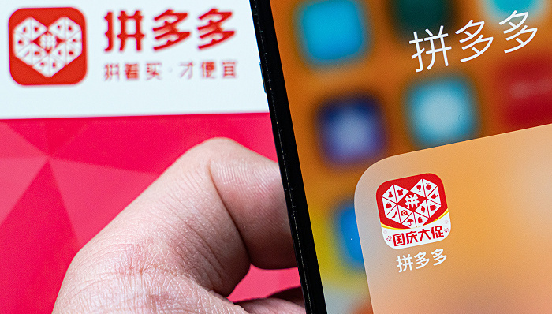

# 拼多多“狂飙”全球后遗症：速度与无序

几乎整个三月，拼多多Temu业务都笼罩在爆仓的阴云之下。

“快件到达收方仓库，正排队验货签收，请耐心等待。”“从3月2号收货到现在，产品都还没有入库。”“爆款早已卖断货了。”

3月14日起，招商经理们在不同类目群里陆续发的通知，为“狂飙”的Temu业务按下了暂停键：“为提升仓库发货能力，这几天仓库会优先安排货品发送，暂时停止收货，所有首单停止审批，补货单停止审批；暂时关闭JIT（注：一种无需提前备货的预售模式）；下午没发货的备货单，全部都会作废，具体恢复时间，请商家留意买手通知。”

两周过去了，商家们没有等来开仓，反而等来了库存的消耗殆尽，销量暴跌。与此同时Temu的员工则在积极寻找仓库、劳务资源，处理积压的爆仓快递。有招商经理直接在朋友圈招工：“求介绍劳务公司，坐标广东，日均一线劳务需求一万人+。”

界面新闻记者从商家分享的照片中看到，位于广东肇庆、清远等地的Temu仓库，快递堆成山，目之所及的范围内全是包裹，晚上这里也灯火通明，工作人员日夜处理包裹。

对于爆仓的原因，一位Temu的内部人士告诉界面新闻，“业务发展得太快，用户单量暴涨，仓库能力跟不上。”

过去半个月里，Temu全力整理仓库，甚至前台的营销、活动刻意有所减少，上述人士说某些部门例如用户增长甚至被要求放假一周，压低单量以给仓库喘息的空间，“也是好事，终于可以好好休息了。”

这一轮爆仓始于2月中旬Temu在美国收视率最高的超级碗播出了一条“像亿万富翁一样购物”的电视广告，当天Temu在谷歌的搜索量上就首次超过了SHEIN。有报道称这条30秒的广告，预估花费超过1500万美元，但为Temu带来了App下载量45%的激增，日活跃用户增长也有约20%。

显然，Temu并未准备好平台流量迎来暴增。再加上全球版图中加拿大、澳大利亚、新西兰新站点的陆续开放，快速增长也为平台带来了一些后遗症。

“拼多多”式速度

Temu的步子迈得有多快？

从去年9月上线以来，Temu仅仅用了48天就冲上了美国苹果应用商店购物板块的榜首位置；成功拓荒美国5个月后，Temu就将相同的经验复制到加拿大；在这个3月，澳大利亚、新西兰新区域已经同步上线，其版图继续向欧洲扩张。

星星之火有燎原之势，Temu沿用中国移动互联网的速度，将用户的盘子迅速铺开。据数据分析公司YipitData的消息，仅在2023年1月，Temu的销售额就接近2亿美元。

Temu快速增长，背后则是拼多多式创业的极致效率。

“他们主要是团队执行力强，老带新，压力巨大，干活仿佛不要命。其他的平台招商一般都要求有跨境经验，但拼多多的招商风格是管他三七二十一，有供应链能力直接上。”曾多次帮助Temu开招商会的“老马电商圈”创始人马凯跃表示。

拼多多的风格堪称国内互联网“卷王”，截止到2021年底拼多多员工共计9762人，一个一万人左右量级的公司，撑起了月活超过7亿的拼多多APP、日活破1.5亿的多多视频、海外版Temu、多多买菜、快团团等数个业务。

在最初高举进攻北美市场时，拼多多复制SHEIN的成功经验，学习后者的“寄售模式”，和几乎相同的跨境小包物流。

Temu的首批招商商家，定向针对的就是有跨境平台经验特别是SHEIN的供应链，并优先给予资源倾斜。业务推进过程中，Temu也不断挖人，此前SHEIN的一位产品经理曾告诉界面新闻：“业务侧基本人均收到拼多多HR的好友申请，Temu不断以2-3倍的薪资大手笔定向挖角。”

但在短短几个月后Temu就跑出了自己的道路。Temu没有采用SHEIN“小单快返”的供应模式，而是直接大规模压低成本，并用前期的投入补贴、类“砍一刀”的社交玩法，覆盖全品类。

虽说Temu是自营风格，但其大部分能力都是通过合作伙伴实现，Temu不承担压货风险，也没有在海外建仓，只负责国内仓发货、营销推广以及售后服务，一如当初国内主站崛起时，借助了微信支付以及社会物流能力实现弯道超车。

Temu还发挥了拼多多能吃苦的创业团队精神，地毯式的招商节奏、残酷的供应商筛选制度，带来诸多怨言的同时，也将效率发挥到了极致。

今年2月，Temu爆出内部KPI：截至2023年9月1日，其北美GMV（总成交额）至少有一天要超过SHEIN。不过上述Temu的内部人士对界面新闻表示，短期内Temu还在看竞争对手SHEIN，制定业务超越的目标，但作为全品类平台，Temu全球扩张的最终目标其实还是亚马逊。一个看似“胃口巨大”的野心。

此前“晚点LatePost”报道称Temu的业务优先级已经高于国内主站，并由拼多多核心高管COO
顾娉娉（花名：阿布）默认牵头带队。海外市场意味着全新增量，这是拼多多的又一个战略级项目。

有商家看到，过去一段时间几乎身边所有的工厂都在讲出海。而从3月起，Temu团队也喊出口号将深入广东、福建、浙江、江苏、山东、河北、安徽、陕西、四川、湖北等国内100个产业带地区，招募卖家以丰富Temu供应链。

三月的爆仓，在拼多多招商经理们的对外口径中是好消息，这意味着平台生意涨得足够快。

也有更多商家记得，这已经是Temu的第二次爆仓了，去年Temu全渠道买量并通过补贴等方式，将流量推向高峰后，爆仓等待了13天有余。这一次，平台后端的仓库速度依旧跟不上业务进展。

据界面新闻记者了解，目前Temu共有7个仓库，分布在广东肇庆、清远等地，且数量仍在不断增加。

“前端还在开新站点，疯狂招商，催备货，后备力量跟不上宏伟蓝图。有限的人手服务不了这么多商家，还有很多人在听到要停止备货消息的前夕，一股脑把所有的货全都发了出去，进一步加重仓库负担。”一位Temu商家告诉界面新闻，目前招商经理的口径是预计等到本周日（4月2日）左右才能全面开仓，恢复发货。

“低价无底洞”

拼多多的“卷王”式创业，看起来为Temu积累起了足够势能，但硬币的另一面是商家的无限内卷，他们前赴后继掉进低价的“无底洞”。

就在爆仓的同一时间段，Temu卖家后台中心收到一则竞价管理的通知。平台称是为了建立对商家上款的保护机制，减少不必要的同款站内竞争，系统会自动识别同款的货品进行竞价。

简单来说，就是所有同款中出价最低就算竞价成功。网页Banner上用橙色字体显眼地标注着：“竞价成功，百里挑一，同款商品流量独享”，而竞价一旦失败，则会被平台限制下单与上架售卖。

在商家的理解中，供应链同款已经足够多了，接下来同一类目就要拼价格，“别无选择，只能被迫参与撕杀。”

诚然，价格是Temu在海外开疆拓土最直接的“杀器”。

除了拼多多的早期人才团队，Temu后期招聘的买手大多是跨境采购出身，他们深谙成本分析，能将商家报价一压再压，界面新闻也曾报道，Temu买手会要求产品核价要低于市场批发价，低于1688同款最低价。

商家管理体系下，“动销机制”也足够严苛：只要15天卖不动，或者30天动销低于30件/90美金的商品，就会成为滞销产品，后果只能是降价或者退仓下架。

这种轮动的市场选择淘汰，让Temu上的商品自然形成竞争机制，多数商家不愿意被裹挟，但为了流量，他们也没有更多选择权。马凯跃认为，平台成长过程中，会有40%的商家都会被筛选出去。

更早之前，1月过年期间，Temu平台就曾在不提前告知，并未经商家同意，自动下调部分商品的供货价格，24小时内商家无处理回复就会被视为自动同意。这样的硬性操作让不少商家对平台的态度急转直下，甚至出走。

“过年期间所有人都放假了，结果我们超过一半的产品都直接被打了8折，Temu本来就是利润很低的分销渠道，加上运费我们直接亏损。”一位经历了硬性降价的商家晓冰（化名）告诉界面新闻，“当时我就直接找到小二，说不用降价了，退货吧。”

晓冰浸淫外贸多年，在亚马逊、速卖通等多平台均有开店，但是与Temu的合作过程让她觉得平台不够规范，同时也做不到“沉淀”。

她口里的沉淀，指的是商品链接。在其他的跨境电商平台，商品链接相当于商家资产，前期通过亏损降价去推量，等积攒了一定的好评后，可以适当涨回价格，商家也能有利可图。

“暂时不赚钱的生意我们愿意去做，但在拼多多的机制里，不仅没有沉淀，还要落入被动的境地。降价之前不沟通，硬性降价之后也不可能调回来。”最终，晓冰关掉了Temu平台上的四家店铺。

KPI导向

对于拼多多来说，他们不会因为失去这1个客户和4个店铺，就改变自己的速度与风格。

有商家表示，在Temu内部KPI竞争也很激烈，甚至不同类目之间都存在相互竞争，平台买手们要看到的是业绩，有流量，降价就会直接转为销售。

“平台不断招商，商家们每天像流水一样不断进来，小的流失算什么，会有新人补充。其实我也理解这种行为，实际上是出于一种KPI的驱动方式。”晓冰说。

在这种KPI导向下，很多行为就不难理解了，商家们看中Temu的平台流量，在这个过程中被筛选、被淘汰。最终，有独家或定制供应链实力的商家会受到机制青睐。

时至今日，Temu仍在延续调价策略，每天商家都在和买手上演不同的拉锯战。

目前，Temu已经发布了KA商家（Key
Account，即重点商家）的招募条件，甚至成立了一个单独的业务部门，来对接国内的知名品牌以及在亚马逊上注册的品牌及独立站，有小二点对点对接。

先白牌、再品牌，延续了拼多多国内主站业务先下沉、再上升的发展路径，如今Temu的已入驻品牌墙上，已经有包括小米、联想、安克创新、德力、品胜、牧高笛等品牌。

过去拼多多也走过低价营销路线，但最终的赚钱本质在于规模效应，当用户和GMV积攒到一定量级的时候，就有机会把物流成本打下来，并在B端商家品牌收取费用，实现盈利。海外Temu大概率也会复制相同的路径。

在界面新闻的采访中，多数行业人士都表达了对Temu发展前景的看好。不过，当前Temu的供应链仍处于早期阶段，特别是仓储物流段，还有很大的提升空间。例如多数商家现在所担心的，Temu能否接住重新开仓后的货品流量。

3月23日晚间TikTok首席执行官周受资在美国国会上，面对持续了五个多小时的听证会质询，更是生动地展示了，未来复制中国互联网模式出海或将面临的“水土不服”。特别是在税收问题、数据安全层面，Temu会遇到多少难题，还未可知。

据雷锋网报道，近日拼多多的组织架构发生调整，除了广州与商品、商家有关的B端团队，其余团队都在做IM区隔；其中也包括Temu的部分团队。同时，Temu在2022年将总部设立在美国波士顿，通过这家公司经营海外业务。

上述拼多多内部人士证实了这一说法：“作为独立事业部，Temu在组织架构上比多多买菜更独立，参考字节跳动对TikTok的调整拆分，特别是数据层面的管理，主要是为了Temu未来的合规做进一步准备。”

界面新闻记者 | 程璐

界面新闻编辑 | 肖芳 文姝琪

