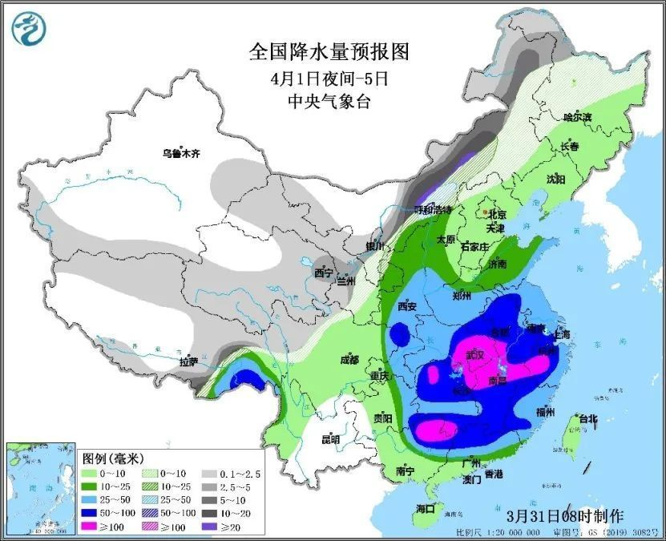

# 波及30省份！今年来最大范围强雨雪开启 2日至4日为本轮降水核心时段

中国天气网 | 作者 马黑阳

受较强冷空气影响，今天（3月31日）开始至4月5日，我国将出现今年以来最大范围的强雨雪过程，或波及约30个省区市。其中，北方雨雪混杂，内蒙古局地可能遭遇极端降雪，南方将现区域性暴雨，并伴有强对流天气。中国天气网推出重点城市雨雪进程表，看你家最强雨雪时段何时到来。

“这场大范围强雨雪过程具有降水范围广、强度大、雨雪相态复杂等特点。”中国天气网气象分析师王伟跃介绍，在这股冷空气影响下，今天新疆沿天山地区已经出现了中到大雪，明天起雨雪范围将继续向东向南扩展，4月2日至4日为本轮降水的核心时段。

4月2日白天开始，内蒙古中东部等地会率先进入到降水核心时段，同时甘肃东部、宁夏等地也将陆续出现雨雪天气的转换；随后雨雪逐渐向东发展波及河北北部等地，上述地区普遍将出现中到大雪或雨夹雪，其中内蒙古中东部等地局部可达暴雪或大暴雪量级，个别地方降水量甚至可能打破历史极值。

从中国天气网推出的重点城市雨雪进程图中可以看出，北方城市中，呼和浩特的降雨核心时段集中在2日下午到3日凌晨，3日傍晚至夜间随着气温下降，还可能出现雨夹雪天气；太原、郑州、北京、沈阳等地也以降雨为主，其中太原的核心降雨时段在3日的凌晨到午后，郑州的核心降雨时段在3日早晨到傍晚，量级普遍可达中雨。

王伟跃提醒，由于前期持续晴暖天气导致北方大部较为干燥，此次大范围强雨雪天气的到来对缓和干燥较为有利，山东等地的持续干旱状况也将得到缓解。但内蒙古中部局地可能遭遇同期罕见的暴雪甚至大暴雪，有致灾可能性，公众需密切留意气象部门发布的预警信息，防范积雪给交通出行、设施农业、果木生长等带来的不利影响。

随着冷空气东移南下，南方的强降雨过程也将在4月2日至4日陆续展开，其中湖北、湖南北部、江西西北部等地在2日将迎来中到大雨，湖北中部、湖南北部等部分地区可能出现暴雨、局地大暴雨；3日降水中心集中在黄淮南部、江淮、江南北部等地，长江中下游沿线一带可能会出现中到大雨，部分地区暴雨，局地大暴雨；4日降水中心有所南压，主要集中在江南到华南北部一带，大部地区可能有大到暴雨，江西东部和中南部的局地可能有大暴雨现身。

南方城市中，长沙、武汉、南京、上海等地都将在3日至4日迎来降雨的核心时段，在清明节前提前感受到“清明时节雨纷纷”，其中武汉3日会出现大雨，过程累计降雨量将超100毫米。

在南方此次强降雨过程中，既有强冷空气南下叠加强盛暖湿气流输送带来的锋面降水，也有江淮气旋生成发展带来的降水，因此黄淮、江淮、长江中下游到江南等地在降雨的同时，部分地区也会伴有频繁的强对流活动。上述地区公众外出需注意防范雷电、短时强降水、冰雹等强对流天气给交通出行带来的不利影响。

