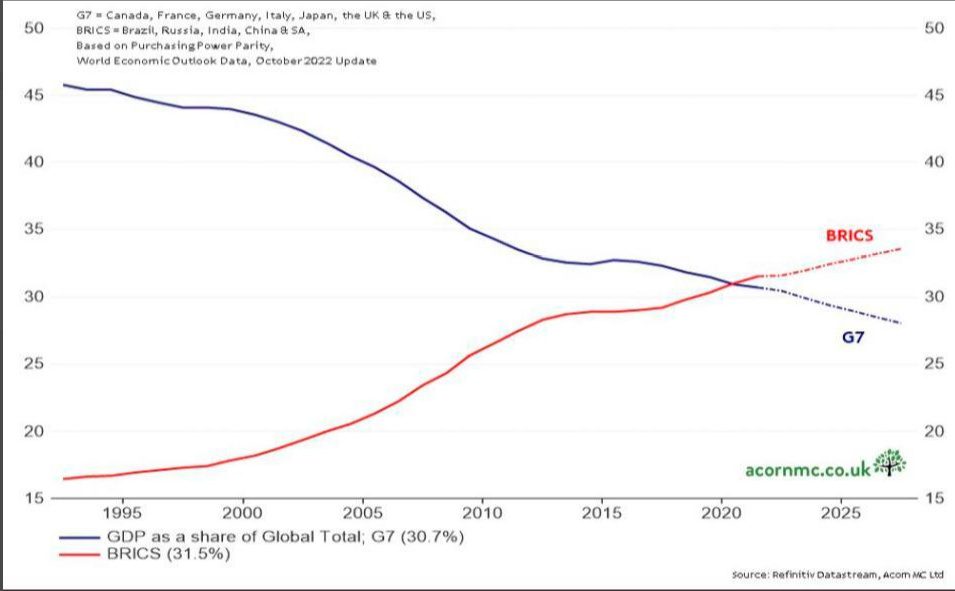

# 短短72小时，全球“去美元化”战线悄然形成？

**财联社3月31日讯（编辑 潇湘）**
自第二次世界大战结束以来，美元对全球金融市场的“统治”已经持续了近八十年的时间。在此期间，人们对“去美元化”的讨论一直都不是什么新鲜事——当上世纪70年代布雷顿森林体系瓦解时、当欧洲各国政府于1999年推出欧元时、当雷曼兄弟倒闭引发2008年全球金融危机，很多人都曾对美元的主导地位提出过质疑。

但是 **也许从来没有哪一刻，在世界上的大多数角落，“去美元化”的春潮像当前这样：以迅雷不及掩耳之势迅速席卷！**

**事实上，当业内人士在回顾本周的全球金融市场动向时，很轻松地就能罗列出在周二至周四的不到72个小时里，发生的一系列如今看来可能危及“美元霸权”的事件，**
以金砖国家和其他新兴市场为代表的全球加速去美元化趋势，突然之间就开始“遍地开花”：

**事件①中法石油巨头完成首单LNG跨境人民币结算交易：**
本周二(3月28日)，中海油与道达尔能源通过上海石油天然气交易中心平台，完成了中国国内首单以人民币结算的进口液化天然气（LNG）采购交易，成交量约合6.5万吨，LNG资源来自阿联酋。随着国际市场对人民币接受程度提高，买卖双方尝试直接采用人民币结算的条件开始日益成熟。

**事件②沙特内阁批准加入上海合作组织的决定：**
沙特阿拉伯内阁周三(3月29日)批准了加入上海合作组织的决定。上合组织成立21年来，始终保持健康稳定发展势头，成功探索出一条新型区域组织的合作与发展道路。中沙两国间愈发紧密的外交关系，令外界不断对石油人民币的光明前景抱有期待。日前中国进出口银行已经与沙特阿拉伯国家银行成功达成的首笔人民币贷款合作。

**事件③巴西重磅宣布与中国直接进行本币结算：**
巴西政府周三表示，巴西已与中国达成协议，不再使用美元作为中间货币，而是以本币进行贸易结算。近日，中国人民银行与巴西中央银行签署了在巴西建立人民币清算安排的合作备忘录。多家外媒表示，这项协议让中国和拉丁美洲最大经济体的巴西可以直接进行大规模的贸易和金融交易，这是人民币对美元“最新一次奇袭”。

**事件④东盟财长及央行行长会议讨论“金融自主自立”：**
东盟十国财政部长和央行行长周四在印尼召开会议，首要议程就是讨论如何减少对美元、欧元、日元和英镑等主要货币的依赖，转而使用本地货币来进行贸易结算，而这也是之前东南亚本地货币结算（LCS）计划的延伸，该计划已经开始在东盟成员国之间实施。印尼总统维多多特别强调：“远离西方支付系统，对于保护交易免受‘可能的地缘政治影响’是必要的。”

**不难罗列出的是，上述一系列“去美元化”事件的参与者中，有欧洲的能源巨头、有欧佩克的“老大哥”、有不甘被视作美国后花园的南美资源大国、也有希望打造区域合作发展典范的东南亚群雄。**

**而与此同时，在这些国家以外，我们同样不能忘了许多此前已经决心与美元作出切割，或正在尝试走出一条去美元化道路的经济体，它们的名字有：**

**俄罗斯：**
自从去年俄乌冲突爆发以来，全球显然没有哪个国家，剥离美元的决心像俄罗斯这样强烈。在过去一年的时间里，以美国为首的西方国家对俄罗斯实施前所未有的金融制裁浪潮，其中包括了冻结俄罗斯近一半(3000亿美元)的外汇储备，以及将俄罗斯主要银行从环球同业银行金融电讯协会系统(SWIFT)中移除。而自那以来，以美元、欧元和英镑为代表的西方国家货币，也已经被俄罗斯官方视为了“不友好国家货币”乃至是“有毒货币”……

**印度：**
在俄乌危机后与俄罗斯的能源贸易中，印度其实就一直丝毫不加掩盖地想要将卢比推向全球。2022年3月俄罗斯与印度为绕开美元结算而采用的卢比卢布兑换机制，如今已经实行了一年。近期，阿联酋和印度也正在谈判使用卢比交易非石油商品，从而取代原本的美元支付。今年初，印度炼厂已经开始使用阿联酋迪拉姆，而不是美元，支付通过迪拜贸易商购买的大部分俄罗斯石油。印度央行上周还批准了包括坦桑尼亚、肯尼亚和乌干达在内的18个国家/地区的央行开设特殊的Vostro卢比账户(SVRA)，这将允许他们以印度卢比结算付款，作为大规模贸易去美元化的行动。

**南非：**
今年1月，南非外长潘多尔公开表示，他们正在研究金砖国家如何帮助他们建立一个更公平的货币交易体系，从而摆脱美元的控制。潘多尔指出，金砖国家在2014年成立金砖国家新开发银行（NDB），其原因之一就是针对以美元为基础的支付架构，寻找一种替代方案。她解释称，“我们正在研究如何通过金砖国家新开发银行和其他机构，帮助我们建立一个更公平的货币交易体系。”

……

**如果我们把这些有意落实或推行去美元化进程的经济体都算上，那么显然不难发现，从亚洲到非洲再到南美洲，一条全球“去美元化”的战线正在悄然形成，而其中，金砖国家——中国、俄罗斯、印度、巴西和南美显然正成为这一演变进程的核心，中东、东南亚的众多新兴经济体也在这其中扮演了关键的角色。**

那么，这一切的背后，冥冥之中是否是历史的必然选择呢？

**这一次！全球“去美元化”浪潮真的来了……**

**很有意思的是，这一次全球“去美元化”浪潮的突然涌现，甚至在周四吸引到了特斯拉CEO马斯克的关注。**

3月30日，马斯克在推特上就分享了他对这个问题的看法。他表示，“
**这是一个严重的问题，美国的政策过于强硬，使其他国家都想抛弃美元。再加上（美国）政府开支过大，这迫使其他国家(被迫)承受了我们的很大一部分通货膨胀。”**

马斯克当时是在评论一名推特用户一系列关于“去美元化”问题的推文时发表上述言论的。一个推特账号介绍为前基金经理、为彭博社等媒体供稿的财经类文章撰稿人吉纳维芙·罗克-
迪克特，在30日发推表示，“美元正在失去其储备货币的地位”，并介绍了关于这一趋势的背景。

迪克特称，从历史上看，美元曾一直是国际投资者的避风港。在危机时期，资金经常被转为美元，投资者采取这种做法以在其他经济体寻求规避风险。但现在，去美元化正在世界各地发生，多国央行去年购买黄金的节奏比1987年以来的任何一年都要快，这表明这些国家都希望用黄金而不是美元来支持自己的货币。

再加上美国本身的银行系统摇摇欲坠，以及其现在的加息不可能不造成更严重的破坏后果。

**无独有偶，高盛集团前首席经济学家吉姆·奥尼尔(Jim O'Neill)本周早些时候也呼吁金砖集团扩大规模，挑战美元的主导地位。**

**这位高盛前首席经济学家就是在业内享有盛名的“金砖之父**
”——他是“金砖国家”一词的创造者。奥尼尔现在正呼吁金砖国家扩大规模，将墨西哥、土耳其、埃及、印度尼西亚、孟加拉国、越南、巴基斯坦和菲律宾等新兴国家纳入其中，创建一个更公平、多币种的全球体系。

奥尼尔在《全球政策》杂志上发表的一篇论文中写道，美元目前在全球金融中扮演着过于主导的角色。每当美联储开始收紧货币政策，或相反地放松货币政策，对美元价值的影响及其连锁反应都是巨大的。美元的主导地位对有美元债务的国家来说是一种负担，因为当汇率波动时，这些国家的货币政策就会不稳定。

**奥尼尔认为，美元的主导地位会破坏其他国家货币政策的稳定，这就是为什么金砖国家应该抵制美元主导地位的理由。**

**历史的必然选择？**

毫无疑问，当多个国家在本周不约而同地同时采取去美元化行动，同时马斯克、“金砖之父”也开始将注意力转向于此时，绝对不会只是一个单单的巧合……

高盛董事总经理、宏观交易员Bobby Molavi最新就表示：
**“我听到的一种说法是，美元储备货币体系正在走向终结，我们正在走向一个更加多极化的储备体系。”**

自冷战结束以来，世界长期以来基本上都处在一个单极时代——美国是毋庸置疑的霸主，美元是享有最高接受度的货币。即便固定汇率制在20世纪70年代初瓦解了，欧元在上世纪末横空出世了，也没能挑战美元所享有的“过度特权”。时至今日，世界各国央行持有的外汇储备中有近60%是美元。

但是，这一切显然不会是永久的， **在过去的一年里，各国加速从美元转移的动机有增无减。**

去年，以美国为首的西方国家对俄罗斯实施的空前制裁，冻结了俄罗斯使用其一半储备的能力，并限制了俄罗斯银行使用关键的SWIFT系统进行交易的能力，这让许多原本置身事外的国家感到震惊，美元的“武器化”为各国去美元化的努力提供了新的动力。

同时，过去一年肆虐全球的高通胀所引发的“反向货币战”，以及美联储不顾他国死活大幅激进加息推动美元飙升的做法，也令几乎所有非美经济体都再度感受到了强势美元的“毒害”。美国前财政部长约翰·康纳利上世纪70年代那句充满傲慢色彩的名言——“美元是我们的货币，却是你们的难题”便在新世纪又一次得到了应验。

**当然，除了美元霸权本身的“天怒人怨”外，我们或许也需要从一个更为宏观的层面来看待当前发生的一切。**

其实，周四东盟金融领袖们讨论的话题，为世人提供了一个非常有意思的视角，那就是这一回这些东南亚国家想要“革的不光光是美元的命”，还包括了欧元、日元和英镑——这些国家讨论了“减少交易过程中对美元、欧元、日元和英镑”的依赖，推进本土货币清算的制度建设和交易规模。

这可能意味着一场全球货币体系和世纪经济版图的全面重塑……

**这与20年前欧元对美元霸权发起的挑战和最终的惨败而归，含义可能完全不同**
——20年前欧元的横空出世，或许可以看作是欧美发达经济体之间的货币霸权之争，最终实力更强、底层框架更为扎实的美元战胜了存在致命伤的欧元。但如今，全球货币体系的权力之争，则是更多在伴随着世界经济大格局的转变应运而生。

**全球的真正趋势是，我们正在从一个单极的世界转变到一个多极的世界，同时新旧势力和利益团队之间的对抗正在变得愈发明显。在经济领域，以“七国集团+澳大利亚”为代表的西方发达经济体，与“金砖国家+”为代表的新兴经济体之间，正面临着新的资源分配和利益之间的平衡。**

就在不久前，国际货币基金组织发布的《世界经济展望报告》显示，按照购买力平价计算，截至2022年10月，金砖五国在全球GDP中所占份额已经超过了G7。

一些专家表示，虽然全球去美元化的举措可能不会迅速用另一种主导货币取代美元，但他们可以开辟出其他选择来允许非美元的贸易交易，这些努力正在进一步削弱西方主导的体系。

**虽然美元预计仍将在一段时间内处于主导地位，但不断增加的双边支付路线和数字货币等先进技术的发展，料将逐步蚕食并撼动美元的根基。**

纵观人类货币的历史进程，英镑从极盛到完败经历了长达115年时间，而美元取代英镑霸主地位迄今也已经历了近百年时间，随着如今“去美元化”的各路人马正在加速集结，美元距离跌落王座的一天，或许也已不远矣……

（财联社 潇湘）

