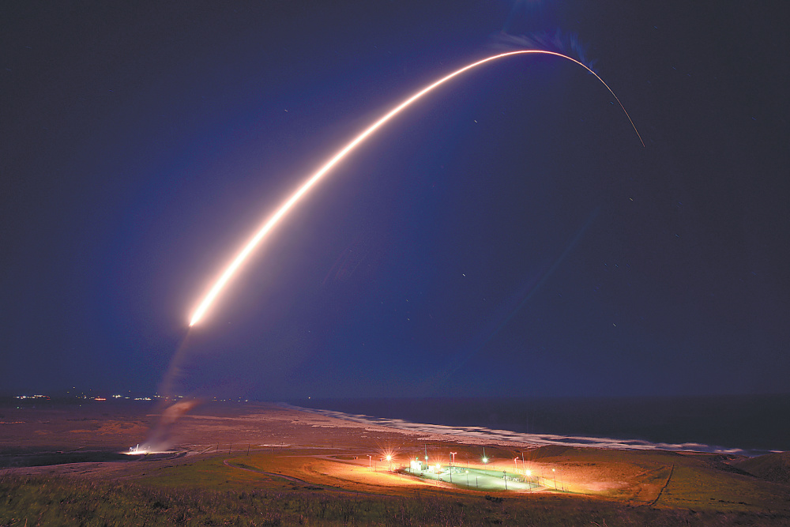
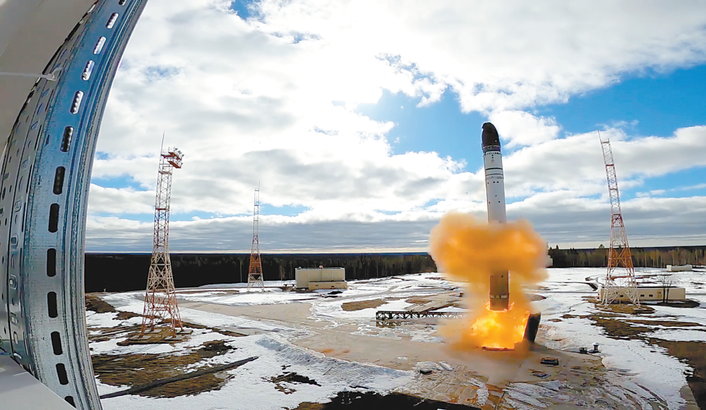

# 美俄停止共享核武器数据，专家：意味着最后一道安全围栏摇摇欲坠

【环球时报特约记者 张锦 柳玉鹏 环球时报记者
刘扬】3月28日，美国官员表示，在俄罗斯拒绝与美国分享其核武库的关键数据后，美国将不会与俄罗斯分享其核武库的关键数据。这被认为是对《新削减战略武器条约》的又一次打击。中国军事专家表示，《新削减战略武器条约》规定双方每年两次交换核武库相关信息，如今美俄双方都已暂停了这一举措，意味着美俄之间最后一道安全围栏摇摇欲坠。

**哪些停了，哪些还在遵守**

美联社29日报道称，美国官员周二表示，美国和俄罗斯停止共享核武器数据。《新削减战略武器条约》是两国之间的最后一项军备控制条约，根据该条约两国应该半年进行一次数据分享。美国《空军与太空军杂志》网站28日报道称，美国不与俄罗斯分享其核武库的关键数据是对《新削减战略武器条约》的又一次打击。此举标志着拜登政府首次对俄罗斯总统普京宣布“暂停”履行该条约进行回应。

《空军与太空军杂志》网站称，3月31日是两国交换双方已部署核力量数量的详细数据的最后期限。美官员表示，他们评估俄罗斯仍处于条约限制之下。五角大楼领导人已表示，他们计划遵守其他条款的限制，不热衷于参与军备竞赛。

不过，美俄双方并未暂停该条约的所有限制。报道称，美国计划隐瞒的数据包括部署在美国特定基地的轰炸机、导弹和核弹头数量的相关信息。然而，美国将继续根据条约要求向俄罗斯通报战略轰炸机、导弹、潜艇的动向及其作战状态。报道称，俄罗斯已经拒绝双方相互进行现场视察，拒绝参加有关合规问题的会议，拒绝交换数据，并停止向美国通报其战略核力量的动向。然而，俄方并未拒绝对其核力量的所有限制。

俄罗斯外交部在暂停参与该协议时表示，莫斯科将继续遵守该条约对其可部署核弹头数量的限制，“以在核导弹领域保持足够程度的可预测性和稳定性。”俄新社30日报道称，俄副外长里亚布科夫当天表示，尽管莫斯科暂停了《新削减战略武器条约》，但俄罗斯仍将根据1988年的协议向美国通报洲际弹道导弹和潜射弹道导弹的发射情况。

《新削减战略武器条约》于2010年签署，将美俄各自部署的核弹头数量限制为不超过1550枚，部署的导弹和轰炸机数量不超过700枚/架。该协议规定进行全面的现场检查以验证双方是否合规。由于新冠疫情，核查自2020
年以来一直处于暂停状态。美俄原本计划在2022年11月讨论恢复核查，但因美国对乌克兰的支持，俄罗斯取消了相互核查。

**俄用战略导弹大演习回应**

俄罗斯《论据与事实》周报30日报道称，俄罗斯国防部新闻处29日发布消息称，俄战略火箭军部队开始举行“亚尔斯”战略导弹系统首长司令部演习，共有3000多名军事人员和约300件装备参与演习。根据年度演习计划，俄“亚尔斯”战略导弹系统将在俄罗斯的三个地区进行演习。战略火箭军部队将在中央军区部队和空天军的配合下演练导弹系统的伪装和对抗包括各种无人机在内的现代空中侦察设备的战法。这一演习是计划内的，俄罗斯战略导弹部队各单位3月底都要进行战备情况检查。此次演习不会发射导弹。“亚尔斯”战略导弹系统隐蔽性是十分重要的。

为此，在目前的战略导弹部队演习中，将首次使用新的科研成果，旨在降低导弹系统在红外辐射范围内的能见度。这将为其提供伪装和防范敌人实施的空中和空间的侦察。俄中央军区的航空兵和俄军用卫星将在演习期间对战略导弹系统的运动和阵地进行侦察。“亚尔斯”战略导弹系统是俄战略导弹部队的主要核威慑力量，可采用井式和机动式两种方式发射，外界认为俄军有约150个该导弹系统。

俄罗斯《真理报》网站30日报道称，俄罗斯军事专家维克托·利托夫金称，在当前俄美关系极度恶化的时刻，任何战略核力量的演习都会引起关注。当然，这是首长司令部演习，是计划内的年度演习，因此没有发射导弹的计划。演习中，战略导弹系统的发射装置和指挥车会驶向预定地点，并在那里进行相关课目的训练。战略导弹部队随时处于战备状态，准备击退敌人可能的侵略。这一演习与俄罗斯计划在白俄罗斯部署战术核武器没任何关系，因为这是战略核武器的演习。“亚尔斯”战略导弹的飞行距离超过1万公里。俄罗斯在西伯利亚部署这一系统与俄罗斯的战略目标有关。

**引发军备竞赛？**

据《空军与太空军杂志》网站报道，美国国防部长奥斯汀去年12月曾表示，暂停条约会引发一场危险的军备竞赛。此外，美方还有意将中国牵扯进来。报道称，美国官员和军方领导人警告说，随着中国不断扩大核武库，美国将在历史上首次面对两个可能不受限制的核武大国。但到目前为止，中国对加入与美俄的核谈判没有兴趣。

今日俄罗斯电视台报道称，俄罗斯科学院安全问题研究中心研究员康斯坦丁·布洛欣认为。目前美国和俄罗斯之间既没有信任，也没有透明度，双方关系日益恶化。在这种情况下，相信双方会延续这一协议是天真的想法。毕竟，只有在尊重相互利益的基础上，才能恢复战略武器领域的合作。

中国军事专家张学峰对《环球时报》记者表示，双方也为防止误判预留了空间，所以短时间内不至于引发核危机。比如进行洲际导弹试射前通报对方。暂停该协议在短时间内也不会导致双方核弹头数量和载具数量增加。这未必是因为双方都愿意遵守协议对核弹头数量的限制。而是难以为大幅增加核弹头和载具提供足够的资金，或者这种增加不会使得己方立刻取得重大优势。当年美俄双方把实战部署的核弹头数量限制在1550枚，主要是基于经济可承受性和战略威慑需要的一个平衡。对双方来说，这个数量基本够用。未来双方可能仍然会维持在这个水平，但会在质量上做文章。比如，美国会更新下一代洲际弹道导弹。俄罗斯则继续用“萨尔马特”“亚尔斯”等洲际导弹替换之前的洲际弹道导弹。

张学峰表示，无论如何，美俄暂停交换核武器相关关键数据，意味着美俄之间最后一道安全围栏正在被拆除。在这种情况下，美国还试图给中国有限的核力量念“紧箍咒”，显然是没安好心。

