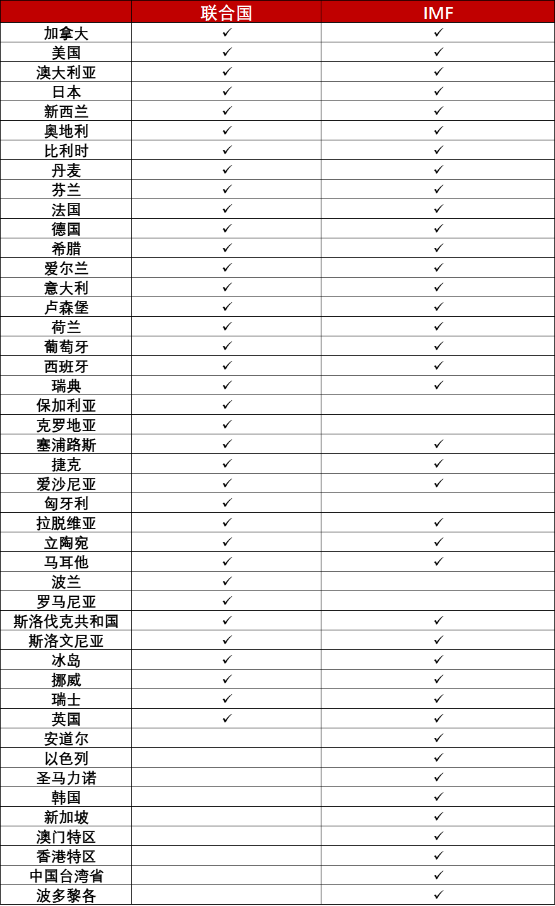
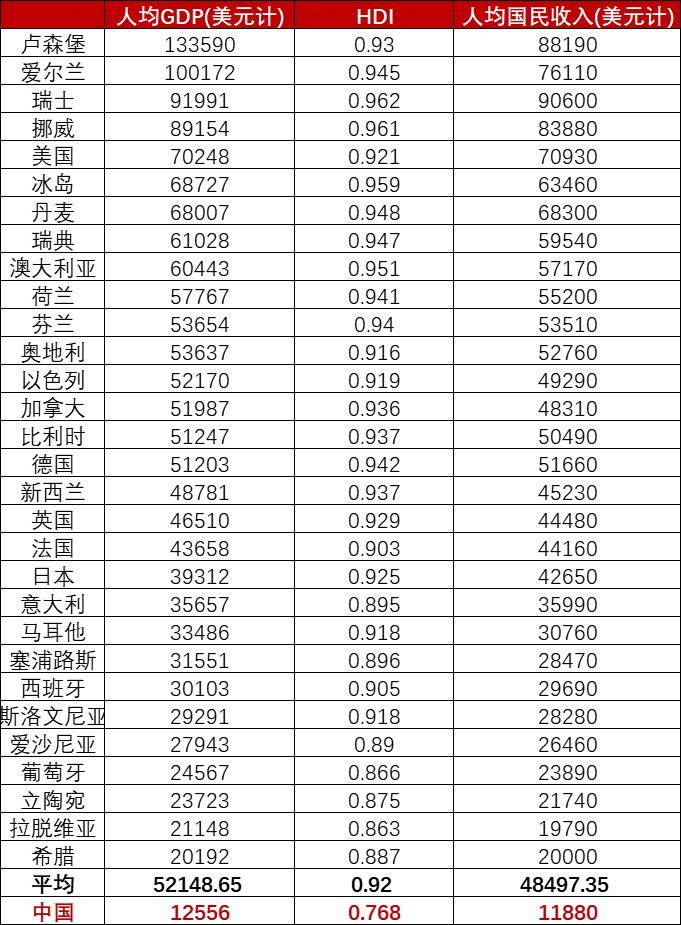
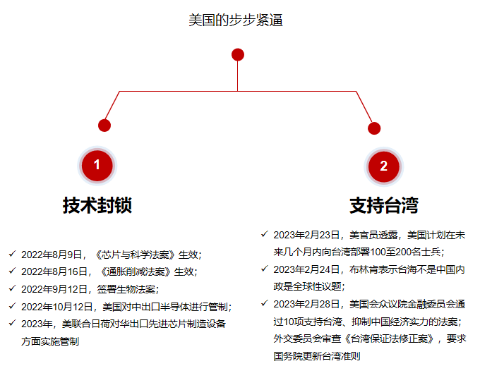
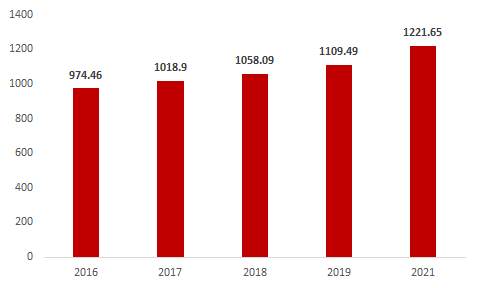

# 美国众议院要让中国当“发达国家”，背后有何意图？

作者：华兴资本首席经济学家 李宗光

3月27日，美国众议院一致通过了一项名为《中国不是发展中国家》的立法草案，
**要求美国国务卿致力于在有美国参与的国际组织中，剥夺中国的“发展中国家”地位**
，将中国的相关地位修改为“高收入国家”或是“发达国家”。此外，该法案还要求美国国务卿努力确保“中国不再会因其具有发展中国家的地位，而获得优惠待遇或援助。
**那么，发达国家是如何界定的？有清晰的标准吗？中国是否真具备了发达国家的条件？被认定为发达国家意味着什么？本文尝试帮助大家厘清真相，以求不惑。**

**01 发达国家是如何界定的？有何标准？**

不同国际组织对发达国家和发展中国家认定指标不同，但大都包括经济指标、健康教育等指标，其中经济指标是最核心的指标。比如， **联合国**
使用的系列指标包括人均GDP，人类发展指数（HDI）、贫困率、教育水平、健康状况等指标。其中，人类发展指数综合考量了一国人口寿命、教育、收入三方面的因素。

**国际货币基金组织（IMF）**
指标则侧重于经济金融指标，包括人均收入水平、出口多样化水平、融入全球金融体系的程度进行分类，同时也表示在决定时，会考虑其他因素。 **世界银行**
则纯粹按基于人均国民收入（GNI）进行分类，将经济分为高收入、中等偏上收入、中等偏下收入和低收入，4个组别。

考虑到发达国家划分标准不同，我们主要以人均GDP、人类发展指数、以及人均国民收入三指标，来说明发达国家的具体标准：

**人均GDP：** IMF认为，人均名义GDP（以2021年为例）达 **2万美元** 可做为发达国家一个最低的门槛——与美国1960年代的发展水平类似;

**人类发展指数：** HDI指数是由联合国编制发布，取值范围在0到1之间，值越高表示国家的人类发展水平越高。按联合国的分类，HDI指数大于 **0.8**
的国家处于极高发展水平，也是发达国家的重要标准之一；0.7到0.8之间的国家处于高发展水平；0.7以下的国家处于中低发展水平；

**人均国民收入：** 我们按照世界银行的分类标准，2021年高收入经济体的门槛为 **13205 美元**
。这一门槛，每年受收入增长、汇率等因素影响在不断变化，并且可能会出现回落。比如，2017年这一门槛为12055美元，而2014年的门槛是12735美元。

**02 按此标准，发达国家主要有哪些？**

联合国和IMF每年都会更新其所认定的发达国家。由于划分标准不同，两份名单也有所差异。可以看到，2022年，有36个国家被联合国归类为发达国家，而在2010年为34个，新晋的两个发达国家为
**克罗地亚** 和 **立陶宛**
。2022年，有40个国家（地区）被IMF归类为发达经济体，这一数字在2010年是33个，新增的有爱沙尼亚、拉脱维亚、立陶宛、安道尔，以及中国澳门等国家（地区）。

**2022年，有31个国家，同时被联合国、IMF同时归类为发达国家。**
其中，韩国和新加坡并没有被联合国划分为发达国家。从分布上看，这31个被“双重认定”的发达国家，主要来欧洲，亚洲国家仅有日本。

_图1
联合国和IMF认定的发达国家（地区）列表（2022）_

**03 我国社会经济发展处在怎样的位置？距离发达国家还有多远？**

我们选取人均GDP、人类发展指数、以及人均国民收入3指标，来量化我国经济社会发展水平： **就人均GDP而言** ，2021年，我国人均GDP为
**1.26万美元**
，世界排名第69位，略高于俄罗斯、哥斯达黎加。超过2万美元标准的国家共有52个，其中我们熟悉的新加坡、日本、韩国，人均GDP分别为7.28、3.93和3.5万美元。

**就HDI而言** ，2021年，我国HDI指数为 **0.768**
，世界排名第79位，低于乌克兰和伊朗的水平。达到高度发达水平（HDI大于0.8）的国家共66个。其中，日本、韩国的HDI指数为0.925，并列全球第19名。

**就人均国民收入而言** ，2021年，我国人均国民收入为 **1.19万美元**
，世界排名76名，略高于俄罗斯。全球高收入经济体一共71个。其中，日本和韩国的人均国民收入分别为4.27万和3.51万美元。

_图2、发达国家与相关指标（2021）_

**可以看出，虽然我国当前已经是第二大经济体，但目前并没有一项指标能达到发达国家门槛。**
就算与发达国家中吊车尾的希腊比，也仍有较大的差距，人均GDP和人均国民收入均只有希腊的6成左右。
**我国三项关键指标排名均在70名以外，距离发达国家榜单（三项指标排名40以内）仍有较大距离。**

不过从购买力平价（PPP）角度看，我们据距离发达国家更为接近。2021年，按够买力评价计算，我国人均GDP已达19338万美元，接近2万美元的发达国家门槛。而且，我国广大一线和新一线城市生活水准已经达到中等发达国家标准。比如，北京人均GDP，早在2017年便突破2万美元，2021年超过2.8万美元。

但是，我们也应看到，我国幅员辽阔，城乡差距、区域差距十分巨大，还有广大地区仍处于不发达状态。党的二十大报告判断，我国仍将处于并将长期处于社会主义初级阶段，最大发展中国家地位短期内不会改变。我们认为，这一判断是实事求是的，也表明未来的发展空间和潜力十分巨大。

按照《“十四五”规划和2035
年远景目标纲要》的计划，我国将在2035年，实现人均GDP达到中等发达国家水平，即2万美元以上。为此，我们还需要艰苦奋斗，团结奋斗，调动全社会的积极性，努力实现向中等发达国家的新征程。

**04 美国执意剥夺我国“发展中国家”地位，背后有何意图？**

**事实上，这并不是美国第一次想要剥夺中国的“发展中国家”地位。** 早在特朗普执政时期，美国便对中国在贸易中享有的优惠待遇十分不满。

2020年2月18日，美国贸易代表办公室直接宣布，将中国、香港、印度等25个经济体排除在“发展中国家”的名单外。但这一次并没有针对中国一家。在被除名的25个经济体中，印度、越南、巴西、阿根廷、马来西亚等国与中国一样，均是被普遍认可的发展中国家。

其后，2022年9月，美国会参议院以96:0全票通过的一项涉华提案，迫使美国国务院官员向联合国提议，终止中国作为发展中国家的地位。

这次变本加厉，直接要求美国国务卿致力于在有美国参与的国际组织中，剥夺中国的“发展中国家”地位。
**目的也十分明确，就是努力确保“中国不再会因其具有发展中国家的地位，而获得优惠待遇或援助。”**

结合近期中美关系的走向，我们也不难理解，美国此次执意要剥夺中国的“发展中国家”地位，只是中美竞争的冰山一角。我们可以看到，特别是去年以来，美国的对我们的打压越发频繁，涉及技术、政治、经济等方方面面。美国就是想要通过各种方式，来减缓我们的发展速度和发展质量。

_图3
美国对中国各方面的施压，技术封锁_

**05 如果失去“发展中国家”的地位，对我们意味着什么？**

**拥有发展中国家地位，我们会得到国际组织在国际贷款、国际贸易、政府援助、碳中和方面的优待**
。当中国失去发展中国家的地位时，这些优待也将相应消失。具体而言有：

**一是国际组织对发展中国家的优惠贷款**
。很多国际组织均致力于帮助和促进发展中国家的发展，为发展中国家提供提供贷款。如世界银行下的国际金融公司，宗旨就是帮助和促进发展中国家私营部门发展；亚投行旨在促进亚洲发展中国家的基础设施建设，推动区域互联互通和经济一体化进程。

_图4
国际组织对华贷款累计承诺额（亿美元）_

根据财政部数据，截至2021年12月，我国利用国际金融组织贷款累计承诺额1221.65亿美元，贷款项目涉及大气污染防治、节能环保、交通、能源、城建、农业、教育、卫生等领域。

如果中国被取消发展中国家的身份，我国便很那从国际金融组织所获取低利率、长周期贷款，用于公益项目和民生福祉等项目。

**二是国际组织对发展中国家贸易关税等方面的优惠。** 我们耳熟能详的WTO，便对发展中国家有许多优惠，主要一下四个方面：

发展中国家进口关税的平均税率可以高于发达国家，目前发达国家关税平均税率4%，而发展中国家为14%；

允许继续享受未加入世贸组织前发达国家给予发展中国家的单方面关税优惠，即普惠制；

给予发展中国家更长的过渡期。

允许在世贸组织里有些例外的原则。比如倾销，发展中国家出口低于国内市场价格不到一定标准，就不叫倾销。再比如投资问题，发展中国家可以按本国经济发展需要对外资利用方向、外资利用比例加以规定。

一旦中国被视为非发展中国家，出口将可能面对较高关税，其它一些优惠也将被取消。取消普惠制待遇会让一些出口企业失去关税优惠，带来一定的压力。

**三是发达国家对发展中国家的经济援助（ODA）**
。ODA可分为偿资金援助、无偿资金援助和技术援助三个方面。作为世界最大的发展中国家，中国也曾是世界上最大的受援国之一。

根据OEDC统计的数据，2020年我国约接受了15.35亿美元的援助。主要涉及的领域包括教育（约35%）、经济基础设施和服务（约21%）、其他社会基础设施和服务（约18%）。

近年来，海外对我国的ODA在逐年减少，日本的对华援助项目与于2022年3月已完全结束。如果我国被视为非发展中国家，当前我国所受到的ODA将进一步缩减。

**四是发展中国家对碳中和的义务。**
理论上，作为早已实现工业化的发达国家，在碳中和中应当承担更大的责任，有义务率先大幅减排，并帮助发展中国家更好应对气候变化。

我国作为发展国家，制定了2030年“碳达峰”，2060年实现“碳中和”的目标，这高度契合《巴黎协定》要求，展示了我国负责任大国的担当。截至2021年底，已有超130个国家承诺在21世纪中叶实现碳中和。

