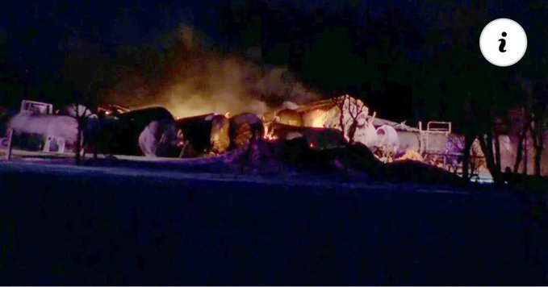

# 美国又遇火车脱轨事故！这回祸起巴菲特旗下铁路公司 载有大量乙醇

**财联社3月31日讯（编辑 潇湘）**
美国当地时间周四(3月30日)凌晨，一列载有乙醇等货物的货运列车在明尼苏达州脱轨，并造成多节车厢起火，附近数千居民已被要求紧急疏散。乙醇是一种高度易燃和具有低毒性的化学物质。

此次脱轨事故发生在明尼阿波利斯以西约100英里的坎迪约希县雷蒙德镇，据雷蒙德消防局的一名官员表示，没有人员在此次事故中受伤。事故发生半英里内的居民被要求撤离。

该列火车由巴菲特旗下的BNSF铁路公司运营。BNSF表示，事故发生在当地时间3月30日凌晨1时02分，总计有22节车厢脱轨，4节车厢起火。这些车厢中装载着混合货物，包括乙醇和玉米糖浆。BNSF现场人员正在现场评估情况，并与急救人员合作。

“事件的原因正在调查中，”BNSF公司在推特上表示。该公司还补充称，火车上没有其他危险物质。

**大量居民被紧急疏散**

乙醇属于易燃物品，尽管本身并非剧毒品，但大量燃烧也可能导致接触它的人产生咳嗽、头晕、眼睛灼痛、困倦等症状。

据当地媒体报道，在这起列车脱轨事故发生约8小时后，大火仍在燃烧。目前，环保局工作人员已抵达现场进行空气质量监测。

坎迪约希县当地的警长办公室通报表示，执法人员在事发后，已迅速对事故发生地周边800米半径范围内的约2500名居民进行了疏散。附近一所学校被设立为临时安置点，目前不建议人员前往事发地雷蒙德镇。

美国交通部长皮特·布蒂吉格(Pete Buttigieg)周四则在推特上称，联邦监管机构已经赶赴雷蒙德的现场，将对这一事件进行调查。

**美国火车脱轨事件持续高发**

今年2月在美国俄亥俄州发生的“毒列车”脱轨事故，令美国的铁路安全持续成为了人们关注的焦点。在此之后，美国的货运列车事故又隔三岔五地在不同地方不时出现。

俄亥俄州政府和当地居民此前已经对“毒列车”脱轨事故的列车运营方诺福克南方公司发起了诉讼，而两党参议员也正在提出对该行业实施新的严格立法。

值得一提的是，此次涉事的BNSF由伯克希尔·哈撒韦公司拥有。该公司是北美最大的货运铁路公司，有着5.15万公里的运营网络，遍及美国28个州和加拿大2个省，每年运送超过500万个集装箱和拖车。

在此次脱轨起火事故发生前，另一列由BNSF运营的火车还曾于3月16日在华盛顿州斯卡吉特县发生过脱轨事故，导致约5000加仑柴油被泄漏在事发地点Swinomish保护区的护堤上。

目前，尽管美国主要货运铁路公司已经宣布计划在全美增加轨道监测设备，但联邦监管部门仍认为，要真正有效防止事故再度发生，铁路公司必须对安全措施进行重大改革。

（财联社 潇湘）

