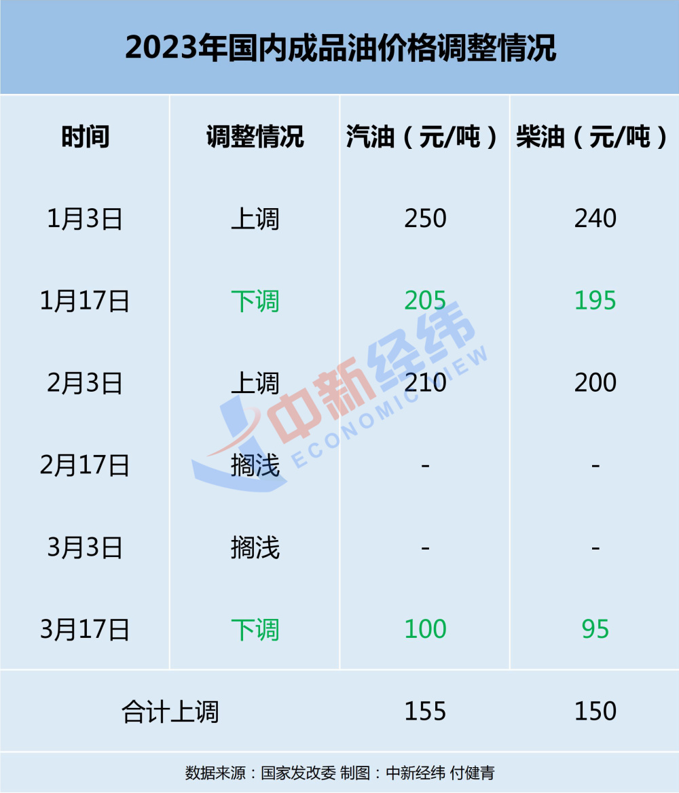

# 车主注意！油价或迎年内第三降，预计加满一箱少花13.5元

中新经纬3月31日电 (付健青)31日24时，国内成品油新一轮调价窗口将开启。机构预计，国内成品油价格将迎年内第三次下跌。

本轮计价周期内，国际原油波动加剧，期货市场上整体先跌后涨。截至北京时间30日凌晨，WTI
5月原油期货报收72.97美元/桶，布伦特5月原油期货报收78.28美元/桶。

中新经纬梳理发现，今年以来，国内成品油价格已进行了六轮调整，呈现“两涨两跌两搁浅”的格局，汽油价格累计上调155元/吨，柴油价格累计上调150元/吨。
**若本次降价落实，国内成品油价格将迎年内第三次下跌。**

欧佩克(OPEC)此前下调了2023年全球原油需求预测。欧佩克在月度石油报告中指出，由于季节性需求低迷，全球石油市场可能在下个季度出现小幅供应过剩，并将2023年全球原油需求预测日均下调20万桶。

据金联创测算，截至本轮第九个工作日，参考原油品种均价为73.20美元/桶，变化率为-6.96%，对应的国内汽柴油零售价应下调340元/吨。

卓创资讯测算指出，截至本轮第九个工作日，参考原油变化率为-7.95%，预计汽柴油下调340元/吨，折合成升价，92#汽油及0#柴油分别下调0.27、0.29元。下调政策落实以后，消费者的出行成本具有一定的降低，
**以油箱容量在50L的小型私家车为例，加满一箱92#的汽油将较之前少花13.5元左右。**

对于油价下调原因，卓创资讯认为，从宏观来看，主要利空来自美国硅谷银行风险，且该风险外溢至欧洲，市场担忧货币流动性收紧后经济衰退的风险，导致油价破位下跌；从基本面来看，沙特和欧佩克+继续实施减产，供应端收紧为油市提供支撑，且中国需求预期依然较好，带动油价适度反弹。受此影响，国内参考的原油变化率从周期初始的负值深位不断回涨，虽下调幅度出现收窄，但整体始终处于负值范围。

根据“十个工作日”原则，下一轮成品油零售限价调整时间为4月17日24时。

对于后市，广发期货研报指出，供应方面，从OPEC+表态来看，暂维持其稳定原产量政策的预期不变，若后期油价在金融风险下跌破70美元/桶，关注其进一步减产的可能性。俄罗斯宣称减产50/天至6月份，且近期或将兑现，预计该减产计划将通过减少炼厂开工以及成品油的出口实现，俄油减产将支撑原油供应维持低弹性。整体而言，短期原油基本面仍有支撑，宏观情绪暂稳的情况下，预计油价下方空间或有限，但短期需求增量有限，布油或维持70-80美元/桶区间震荡。中长期，下游需求改善预期兑现，原油价格中枢或有望上移。

金联创也认为，国际原油或维持震荡走势，变化率负向运行。业者多谨慎消库观望，鲜有入市购进意向，市场交投氛围偏淡。(中新经纬APP)

**(文中观点仅供参考，不构成投资建议，投资有风险，入市需谨慎。)**

**中新经纬版权所有，未经书面授权，任何单位及个人不得转载、摘编或以其它方式使用。**

