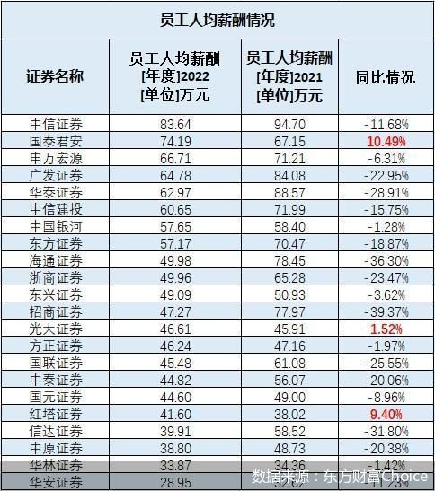
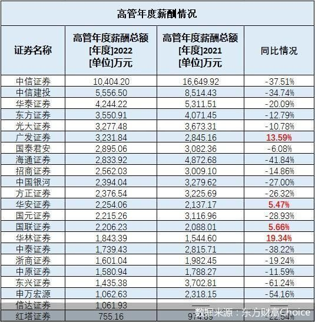

# 降薪实锤，22家上市券商员工薪酬同比降6％，有高管缩水6000万

2022年证券公司年报进入密集披露期。3月30日，包括中信证券、中信建投证券、海通证券等多家A股上市券商披露2022年年度报告。除年度“成绩单”备受关注外，券商的员工人均薪酬同比变化情况也成为市场聚焦点。

事实上，2023年年初以来，已有不少关于券商降薪的消息传出，而随着多家券商年报出炉，也印证了行业降薪的传闻。

从当前已披露年报的22家直接上市券商来看，2022年应付职工薪酬总额合计为912.38亿元，相较2021年的972.29亿元同比下滑6.16%，具体到人均薪酬和高管薪酬情况，其中，有券商人均薪酬同比缩水近四成，更有头部机构高管薪酬总额减少超过6000万元。

**人均、高管薪酬齐“跳水”**

近年来，有关券商薪酬调整的讨论此起彼伏。此前在2022年就有传闻称，证券公司行业人均薪酬或整体下降。

进入2023年3月，更有市场消息称，某头部券商正式发文宣布降薪，不同级别降薪比例在30%到50%之间，一时间相关探讨持续发酵。而伴随券商2022年年报的相继披露，各家机构的员工薪酬数据也终于浮出水面。

公开数据显示，截至3月30日，已有中信证券、中信建投证券、海通证券等22家A股直接上市券商发布2022年年报。年报数据显示，2022年22家券商应付职工薪酬总额为912.38亿元，相较2021年同期的972.29亿元同比下滑6.16%。

具体到员工人均薪酬来看，根据员工年平均薪酬=（支付给员工薪酬+期末应付职工薪酬-期初应付职工薪酬）/[（期初员工人数+期末员工人数）/2]的公式计算。

东方财富Choice数据显示，在22家上市券商中，员工薪酬降幅最大的券商当属招商证券。数据显示，其2022年员工人均薪酬为47.27万元，2021年同期则为77.97万元，同比下降39.37%，也这意味着，仅一年，招商证券的员工人均薪酬减少超30万元。

除招商证券外，还有多家券商的员工人均薪酬同比降幅超30%。例如，海通证券2022年人均薪酬降幅排名第二，降幅达-36.3%。人均薪酬降幅超30%的还有信达证券，已达-31.8%。

除上述券商外，还有6家券商降薪幅度超过20%。不过，同期也有券商逆势涨薪。如国泰君安证券在2022年的人均薪酬为74.19万元，同比增长10.49%。

此外，红塔证券、光大证券的2022年职工人均薪酬也均有涨幅，分别同比上涨9.4%、1.52%。

值得注意的是，此轮券商降薪风波在高管薪酬上体现得更为明显。整体来看，除信达证券未有可对比数据外，在其余21家券商中，有17家机构的高管年度薪酬总额同比下降。

其中，当前高管年度薪酬总额同比降幅最突出的为东兴证券，2022年高管年度薪酬总额为1435.38万元，较2021年的3702.81万元同比减少61.24%。

此外，降幅超50%的还有申万宏源，2022年高管年度薪酬总额为1062.63万元，同比减少54.16%。

值得一提的是，“一哥”中信证券的高管薪酬同比也缩水超6000万元。数据显示，中信证券2022年高管年度薪酬总额为1.04亿元，较2021年的1.66亿元减少6245.72万元，同比减少37.51%。

**“一哥”率先回应降薪**

对于此番降薪的情况，在3月31日举办的“中信证券2022年度业绩说明会”上，中信证券董事长张佑君回应道，“中信证券的薪酬体系均是经过公司董事会、薪酬委员会、职工代表大会的意见共同研究制定的。

同时，也会考虑主管机构有关薪酬指引和指导意见来设定薪酬管理办法，秉承着市场化要求发放薪酬。未来的薪酬体系也会充分体现短期和长期、个人和集体、不同层级包括前台和后台员工的不同要求和布局，相信未来的薪酬体系一定能够使股东满意、使员工满意”。

也有业内人士认为，券业降薪与证券公司业绩下滑、市场大环境以及行业事件有关。在财经评论员郭施亮看来，券商降薪主要与市场环境影响有关，与券商业绩下滑有一定联系性，此前“晒薪”事件，引起了行业薪酬调整压力，同时相关政策的出台，也使券商行业薪酬待遇逐渐回归理性。

中泰资本董事王冬伟则提到，降薪可能是由于券商在2022年度的业绩下滑所导致的。“受宏观经济环境和政策影响，券商在某些时期可能会面临客户交易量减少、资金净流出等压力，这可能导致其业绩下滑。为了控制成本，券商可能会采取减少员工薪酬等措施。”

正如上述分析人士所说，券业降薪，早有传闻。在大众视野中，金融行业从业人员向来光鲜亮丽，并领着远高于普通“打工人”的薪资。而此前部分证券公司从业人员的“晒薪”行为，也再度证实了这一情况。

此前在2022年7月，一张印有某证券公司公章的收入证明图片在小红书上传播，图片内容则显示“XX月均收入为人民币捌万贰仟伍佰元（82500元）”。据发布相关图片博主的博文表示，此为其在头部券商做交易员老公的收入水平。该图片传出后，引发市场哗然。彼时，该博主还回应网友评论表示，“他的薪水不是还没达到（公司）人均嘛”。往前追溯，同年1月，也有券商分析师因在小红书上晒年薪而登上热搜。根据截图内容显示，截至2021年11月，该分析师的年内税前收入合计达224.67万元。

在上述“晒薪”事件的催化下，市场偶有传出证券公司行业将实施“限薪令”的传闻，2023年以来，先后传出“央企券商薪酬将向银河证券看齐”“国内Top
1券商MD级别以后都不能坐公务舱了”等传闻，而在今年3月，也有市场消息称，有头部券商将降薪，根据不同级别，降薪比例在30%到50%之间。

虽然上述情况的真实性尚未可知，但不可否认的是，近年来，证券公司行业确实面临着薪酬制度改革。

2022年5月13日，中证协就曾发布《证券公司建立稳健薪酬制度指引》，其中提到，证券公司应当将薪酬管理纳入公司声誉风险管理体系，加强薪酬相关声誉风险管理等内容。同时要求证券公司在制定薪酬制度时，应当结合行业特点制定稳健薪酬方案，适度平滑薪酬发放安排，同时做好薪酬激励的极值管控和节奏控制。此外，明确要求券商告知员工薪酬保密的规定。

从当前披露年报的券商来看，多家机构表示将合理进行资源分配。例如，招商证券在年报中提到，在薪酬总额内，由公司管理层按照市场化和绩效导向原则，进行薪酬资源的分配。信达证券也在年报中提到，公司重视人才的吸引、激励、培养和保留，不断检视和优化公司薪酬体系，坚持市场化分配、绩效导向、兼顾公平的激励原则。

**或致头部券商虹吸现象**

在业内人士看来，此番券业降薪，或对不同规模的券商产生不一样的影响。其中，有观点认为，券商降薪或对头部券商影响更大。

郭施亮指出，事实上，在市场中，头部券商起表率作用，薪酬待遇调整压力可能更大。而从当前披露的几家头部券商来看，似也证实了郭施亮的观点。除上述提及的招商证券、海通证券外，华泰证券、广发证券、国联证券等头部券商的员工平均薪酬下降幅度同样超过20%。

不过也有观点指出，券业降薪或可能加速头部机构的虹吸现象，使更多资源向头部涌入。在深圳中金华创基金董事长龚涛看来，“券商因业务差异不大而导致同业竞争激烈，基本盘就是一线员工的创收能力，一旦降薪则可能会导致人员流失。

还有一种情况则是全行业普遍降薪，在这种情况下，资源反而会向头部券商倾斜，因为全行业降薪意味着行业风险加剧，以前靠高薪挖脚的中小券商在薪酬上已无优势，最后资源则仍逐步向头部靠拢”。

事实上，一直以来，券商薪酬“出场”均自带流量，而相关话题讨论度飙升的背后，或意味着市场对券商价值的认同并不一致，例如有网友表示，券商投行等岗位有其专业性要求，也需要时间、技术成本，高薪无可厚非。而也有网友指出，券商薪酬“溢价”严重，并无多少真正的含金量。

那么券商薪资的“含金量”到底有多少？中央财经大学证券期货研究所研究员、内蒙古银行研究发展部总经理杨海平认为，券商在市场上生存发展，总体上靠的是过硬的研究能力、风险管控能力、业务创新能力，比拼的是对宏观经济、产业和微观主体的理解。券商行业对从业人员的专业性和综合素质要求较高，从业人员的工作强度也较大。在全面注册制落地之后，对券商从业人员的要求会更高。

从券商未来发展角度而言，王冬伟坦言，降薪可能对券商带来一些积极影响，例如可以控制成本、提高效率、增加利润等。然而，也可能带来一些负面影响，例如员工士气下降、员工离职率上升、招聘难度增加等。如果行业整体薪资受到规范，券商可以采用其他激励措施，例如提供更好的晋升机会、加强培训，提供更好的福利待遇等，以吸引和留住优秀员工。

龚涛则表示，券商降薪是有必要的。券商需要在兼顾公平性的同时有正确的激励机制，正所谓“有奖有罚”。郭施亮也总结称，以券商为代表的金融行业，依然是全行业薪酬偏高的行业，后续，券商可能通过股权期权激励等方式留住人才。

北京商报记者 李海媛 郝彦

