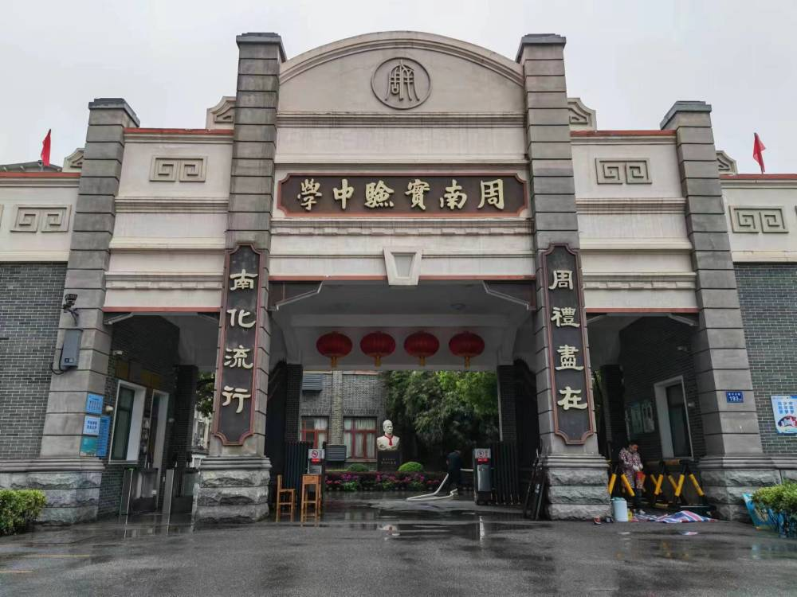
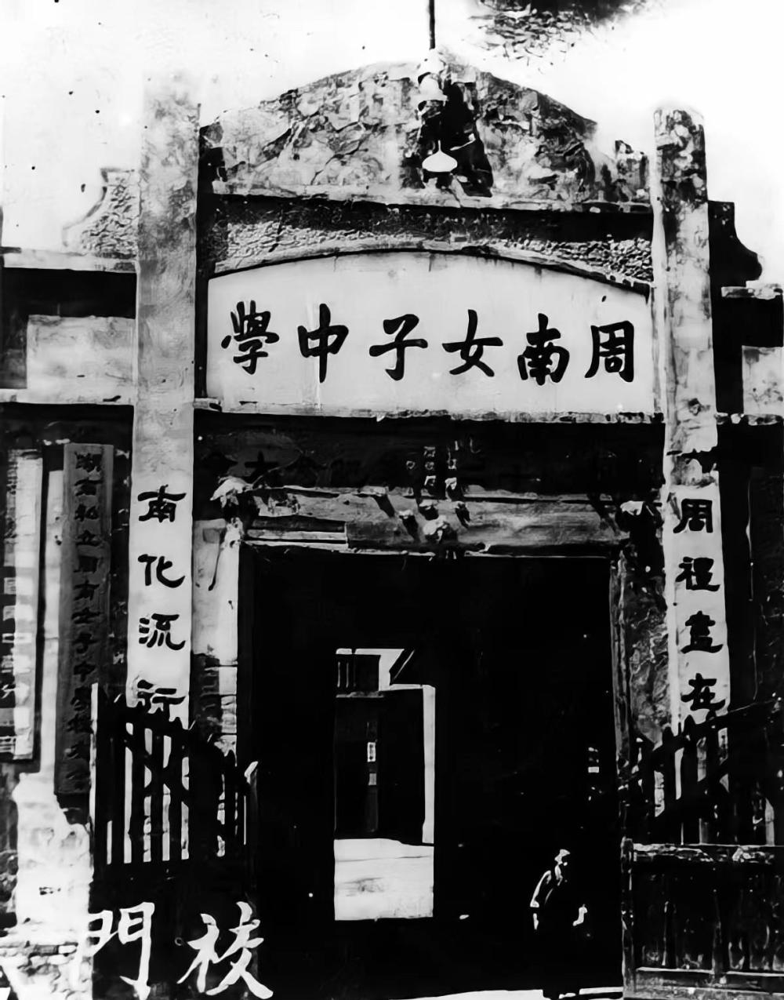
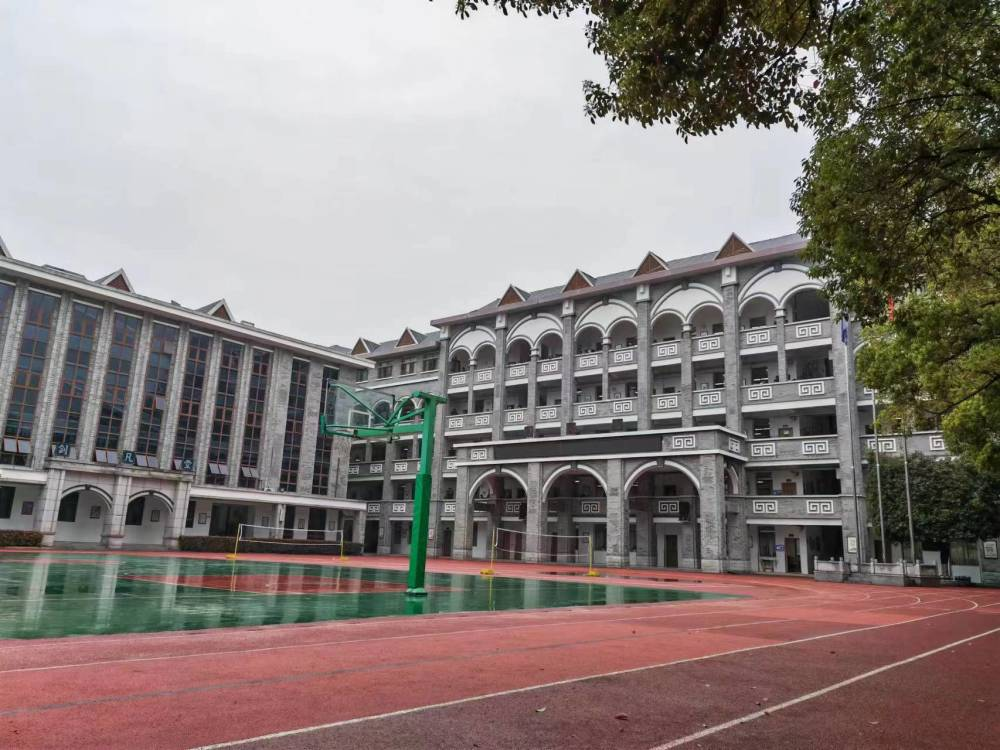
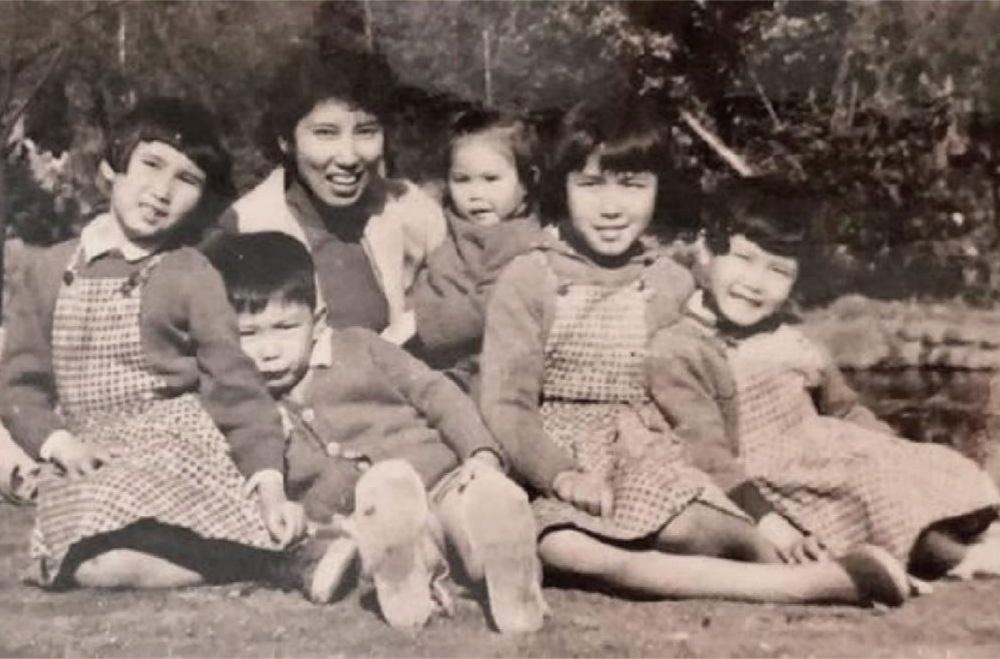
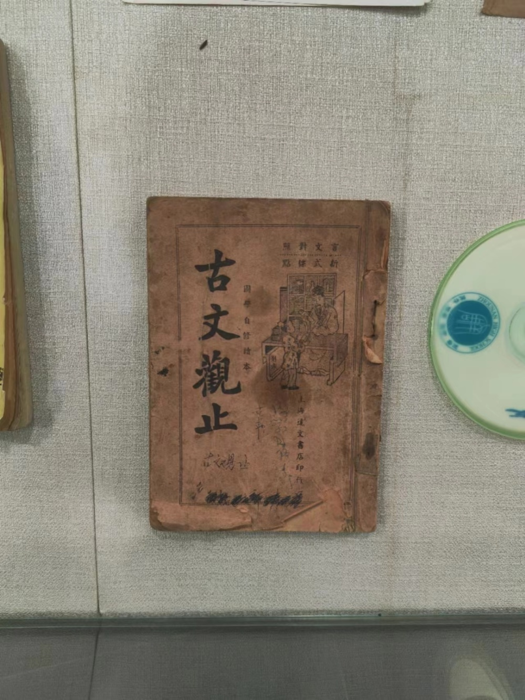
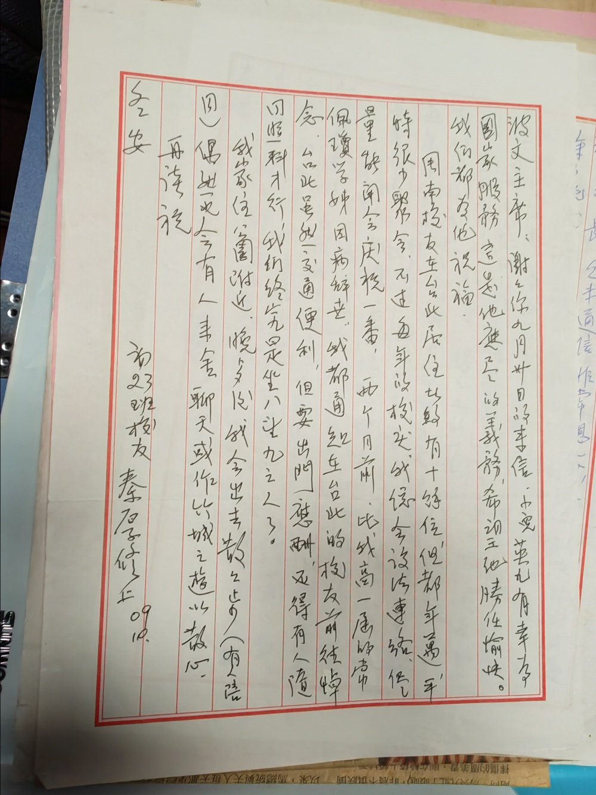

# 马英九母亲曾两次回长沙参加校庆 “育子有方”的故事被编入中学教材

_周南中学现在名为周南实验中学。
本文图片除标注外均澎湃新闻记者 谭君 摄_

“父母知书达礼，她幼受庭训，从小聪慧善良，进小学前念过私塾，国学底子不错，又写得一笔娟秀洒脱的好字，有大家风范。妈妈小学毕业后，初中、高中念的都是长沙著名的周南女中与省立长沙女中。”在一篇《怀念我的母亲》的文章中，马英九曾如是描述自己的母亲秦厚修女士。

3月31日，马英九抵达长沙后的首个安排，就是参访母亲的母校周南中学。“周南”二字，出自《诗经·国风·周南》。周南中学建校于1905年，秦厚修于1933年至1936年在此就读。1995年和2005年周南中学九十周年和百年校庆时，秦厚修都曾回校参加庆典，周南中学校友中也流传着优秀校友秦厚修的故事。

“秦厚修大姐对家乡非常眷念，对母校感情很深。（我们）很高兴马英九回来寻根。”周南中学校友会会长成波文说。

_早年的周南女子中学校门：“周礼尽在、南化流行”
受访者供图_

**“很高兴有这么优秀的学姐”**

秦厚修民国时期就读的周南女中，现在名为周南实验中学，是湖南省重点中学周南中学的南校区。1905年，从日本留学回国的革命教育家朱剑凡先生，有感于女学救国，将私家宅院花园和宁乡田产全部献出，创办了这所女子学堂。蔡畅、向警予、杨开慧、丁玲等一大批先进革命女性成为了这所学校早期最知名的校友。

_周南实验中学操场和教学楼。_

1930年，年仅8岁的秦厚修随父母从宁乡迁到长沙。1933年，秦厚修来到宁乡老乡朱剑凡创办的周南女校上学。在这里，秦厚修度过了非常美好的人生三年。

湖南省档案馆保存的学籍资料显示，那个年代，她修读国文、算学、理化、史地、英语、公民、生物、图画、音乐、体育、劳作、看护训练等十余门课程。她的英语与国画成绩最高，有88分，其次是劳作。在秦厚修的回忆文章中，国文老师对她影响最大。国文老师教她背的朝代歌，让她在1942年投考政大时猜中了一道历史题。题目是，“中国历代朝代名称，以及哪几代是大一统的王朝？”她很轻松地答出来了。

_秦厚修在周南女中时的成绩单。_

在马英九《怀念我的母亲》一文中，马英九回忆母亲白天工作，晚上教他读《古文观止》。“数十年来，每次回忆当时妈妈灯下课子的温馨画面，就感动不已。”在2014年母亲病危时，马英九曾背《桃花源记》给母亲听。“背对了，她点头；背错了，她摇头。我们重温了50多年前母子共享的快乐时光。”

_秦厚修和子女们在一起。受访者供图_

成波文会长则介绍了另一个小故事。那是她和秦大姐煲电话粥时听说的。马英九小时候，秦厚修每天都要给他讲解一篇古文。有一次，马英九和妹妹吵架，秦厚修也不责骂他，只吩咐道：“去把《左传》拿来。”马英九捧着书走过来，秦厚修又说：“翻到《郑伯克段于鄢》，大声读出来。”马英九照办了。

秦厚修育有四女一子，为了严格教育子女，她在走廊的每个窗户下都钉了一块木板，给孩子们当书桌，把走廊改造成书房。每天早上6时，她催孩子们起床读书，到了晚上10点，她就直接关电闸。

这些小故事，被编进2018年周南中学德育教材《核心素养周南行》中，标题为“育子有方 情牵故土”。

_周南实验中学的校史馆展出的一本民国时期出版的《古文观止》。_

周南实验中学的校史馆，展示着这所百年老校，从女校到现代化示范中学的办学历程。在一个展示柜里，存放着一些历代的教科书，其中是一本民国时期出版的《古文观止》。秦厚修的名字也出现在知名校友墙上。在迎接马英九的参访、了解秦厚修的一些故事后，周南中学初二班的黄雅婷说，“很高兴有这么优秀的学姐。”

**在家都是讲长沙话，炒辣椒喜欢放豆豉**

“马英九这次来大陆，要来寻根，来秦厚修大姐的母校是来对了。他应是知道，他的母亲对家乡非常眷念，对母校感情很深。”成波文说。

1995年，秦厚修回到长沙。落脚第二天，在周南校友会的邀请下，她第一次回到阔别59年的周南中学。此次，她见到了曾经的同班同学，“开心得不得了”。时任湖南文史馆馆长陈云章邀请秦厚修和其妹妹秦冰煕等人到长沙时务学堂小聚。时务学堂是清末戊戌变法运动期间，由谭嗣同等人发起，国内最早一批建立的新式学校，也是湖南大学的前身之一。1903年，戊戌变法后数度更名的原时务学堂与千年学院岳麓书院合并组建湖南高等学堂，最后在1926年组建成立湖南大学。秦厚修的父亲秦卓安青年时代就曾在岳麓书院读书。此次，马英九的行程中亦包括参访岳麓书院。

_成波文和秦厚修
受访者供图_

2005年10月1日，秦厚修再次回到阔别十年的长沙，参加周南中学的百年校庆。她收到母校为她准备的70多年前的报到注册单、学习成绩单。同时，她递上周南中学台湾校友会捐款17000元人民币及祝贺母校百年华诞的楹联。“湖南周南母校成立百周年志庆：衡岳钟灵遍地桃李争辉欣见故国家园百年大庆；湖湘毓秀全球鱼雁祝嘏恭维高龄慈母万寿无疆。”该楹联为“周南女婿”、马英九的父亲马鹤凌撰书。

作为周南中学台湾校友会会长，秦厚修一直与周南中学的校友们保持着密切联系。

_秦厚修与成波文的书信。_

“我们经常打电话聊天，都是用长沙话，她的长沙话讲得蛮好。她在家里兄弟姐妹都讲长沙话，”成波文说。

2014年秦厚修去世，成波文很感伤。“在电话里，她聊过想参加母校110周年校庆，想去看看周南中学新校区，想去长沙坡子街火宫殿呷百粒丸、猪血汤，之前回来都太拘束了，没来得及。”成波文说，虽然在台湾那么多年，秦厚修的长沙人特质一直没变，“她们家都是吃湘菜，吃辣椒，炒辣椒时要丢一把豆豉。”

