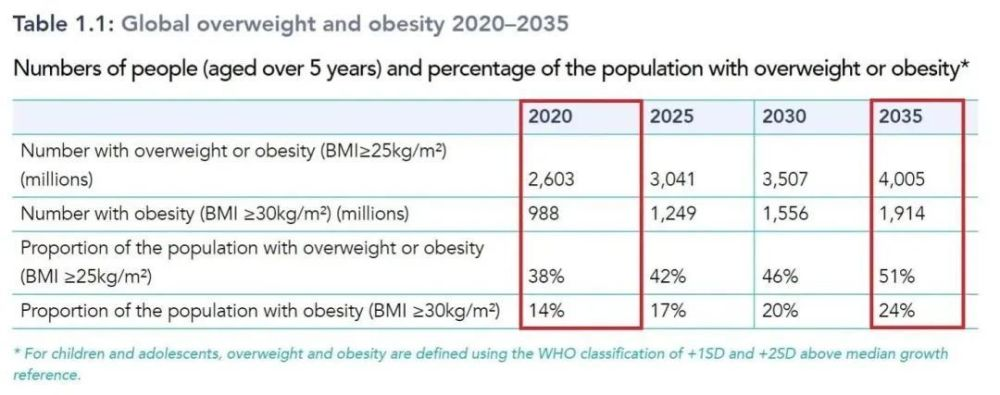

# 世界肥胖联盟：预计2035年全球有40亿人超重，造成4万亿美元经济损失

在慢慢长胖的路上，你不是一个人。

近日，世界肥胖联盟公布了最新版《世界肥胖地图》报告。数据显示，从2020年至2035年，全球肥胖/超重人数急剧上升。

肥胖让人看起来笨重臃肿，更重要的是，200多种病都“拴”在肥胖这根绳儿上，包括糖尿病、心血管疾病、多种癌症和抑郁症等。

**受访专家**

北京大学第一医院内分泌内科主任医师 袁振芳

**新版肥胖地图点名10个国家**

该报告对超重和肥胖的界定，采取的是体重指数BMI≥25kg/㎡和BMI≥30kg/㎡。体重指数BMI=体重/身高的平方（国际单位kg/㎡）。

报告称，预计到2035年，全球超重患病率将从2020年的38％升至51％，约40亿人超重；肥胖患病率从2020年的14%升至24%，人数近20亿。

报告公布了全球180多个国家或地区的相关数据：

**预测肥胖率较高的10个国家**

预计到2035年，汤加、基里巴斯两国成年人肥胖率高达67%，为全球之最。

此外，萨摩亚（66%）、波西利亚（65%）、密克罗尼西亚（64%）、美国（58%）、沙特阿拉伯（57%）、波多黎各（57%）、约旦（56%）、土耳其（55%）等国也位列其中，预测成人肥胖率均超过55%。

**预测肥胖率较低的10个国家**

其中有不少亚洲国家，越南（7%）、日本（8%）、新加坡（9%）均低于10%，是预测肥胖率最低的三个国家。孟加拉国（11%）、印度（11%）、韩国（12%）、柬埔寨（12%）、埃塞俄比亚（12%）、尼泊尔（12%）、东帝汶（12%）等也位列其中。

报告还指出，预计到2035年，全球超重导致的经济影响将占全球GDP的2.9%（2020年为2.4%），将造成4万亿美元的经济损失。

**2035年，中国预计肥胖率为18%**

报告显示，2035年中国成人肥胖率预测为18%，属中等水平，但成人和儿童的年均增长肥胖率都比较高，分别为5.4%、6.6%。

报告评估认为，2035年中国成人肥胖对GDP的影响（包括但不限于医疗花费和因为劳动力超重产生的生产影响和过早死亡等）也较高，为3.1%。

在即将到来的2025年，中国将因超重而在经济上损失4589亿1300万美元，占该年预估GDP的2.4%；在2020年，损失为2833亿美元左右。

亚洲国家及地区的肥胖率，几乎都在20%以下，与动辄超过40%甚至50%的美洲、欧洲国家截然不同，或许与其判定标准有关。

报告将超重和肥胖定义为BMI≥25kg/㎡、BMI≥30kg/㎡，这一标准更适应欧美人，因此，我们不能因为我国预测肥胖率不高就放松警惕。

**肥胖与200多种病有关**

肥胖不只是外在表现，1948年，世界卫生组织就将「肥胖症」列为一种疾病。

我国对超重和肥胖的界定更为严格，其中BMI≥24kg/㎡为超重，BMI≥28kg/㎡为肥胖。

达到这两个临界点，肥胖相关的疾病发病率和过早死亡率，会出现拐点式上升，还会给个人和国家带来多方面重大损失。

**胖与200多种疾病有关**

肥胖与200多种疾病有关，而这些疾病本身的治疗过程可能会加重肥胖，形成恶性循环。

**胖会缩短寿命**

经合组织此前分析，2020~2050年期间，肥胖和相关疾病将使经合组织、欧盟和二十国集团国家的预期寿命减少约3年。

另有研究显示，对男性青壮年来说，重度肥胖平均缩短寿命20年。

**肥胖让你花费更多**

此前有研究显示，肥胖人群处方数量是正常人的两倍多。

一项报告显示，平均而言，在英、美、法等38个国家，肥胖占糖尿病所有治疗费用的70%、心血管疾病治疗费用的23%和癌症治疗费用的9%。

**管好体重是种长寿优势**

控制饮食和增加运动，是防治肥胖的首选方案。

**肥胖者如何科学地“吃”？**

除了清淡饮食，少吃高脂食物，肥胖者还要控制好食物摄入总量，同时保持膳食均衡、丰富多样。

少吃猪牛羊等脂肪含量较高的红肉，可用鸡肉、鱼肉等白肉代替。同时改掉暴饮暴食、爱吃零食的习惯。

炒菜用油要少摄入饱和脂肪，如猪油、牛油；多吃不饱和脂肪酸，如亚油酸、EPA、DHA等，可从大豆油、玉米油、葵花籽油中获得。

用豆类和薯类，来替代一部分精白米面。在主食里加点杂豆，能做到减热量而不减饱腹感。

**肥胖者如何科学地“动”？**

研究显示，慢跑、爬山、步行、快步走、跳舞、瑜伽，均可有效降低易胖体质人群的BMI。

体重较重的人运动时，要特别注意保护膝关节，推荐游泳和骑车。

建议每天至少进行30分钟中等强度的锻炼。以前很少运动的人可从每天走3000~5000步开始，逐步培养运动习惯。

需要提醒的是，减肥要循序渐进，世卫组织的建议是：每周减0.5~1公斤，一个月减1~3公斤，这种匀速减肥的方法，对身体损伤小且不易反弹。

肥胖就像一块滋生疾病的土壤，让很多慢性病生根发芽。控好体重不仅节省医疗费用，保持健康，更是拥有了一项长寿资本。是时候下定决心减肥了！

本期编辑：郑荣华 本文作者：生命时报记者 牛雨蕾

