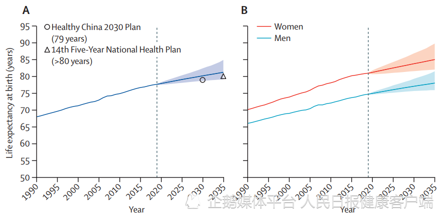

# 中疾控专家研究：2035年中国人的预期寿命或将增长到81.3岁

**人民日报健康客户端 谷雨微**

“到2035年，中国人的预期寿命或将增长到81.3岁，有可能实现国家提高预期寿命的目标。”3月30日，中国疾病预防控制中心慢性病中心周脉耕等人在《柳叶刀》子刊“
The Lancet Public Health “上发表的一篇题为“Projections of future life expectancy in
China up to 2035：a modelling study ”的研究论文中指出。

_中国人预期寿命趋势与预测。_

该篇研究通过分析全国31个省级单位的人口数据，按照与全球疾病负担研究相同的方法，使用最大的流行病学和人口统计数据集来估计死亡率，预测了2035年全国及各省份的预期寿命。研究发现，中国人口出生时预期寿命将会进一步增长，从2019年的77.7岁稳步上升，预计到2030年，预期寿命将达到79岁，到2035年，预期寿命将达到81.3岁，女性平均为85.1岁，男性为78.1岁。

西南财经大学社会发展研究院院长杨海洋对人民日报健康客户端表示，“居民期望寿命上升，主要的影响因素包括以下几点：一方面，我国经济发展使人均可支配收入大幅增长，从1978年的200元左右已上升到2022年的3.69万元，居民生活水平明显提高，为提高预期寿命提供了物质基础；另一方面，医疗卫生机构建设提质扩容，从新中国成立时的1万所增长到近100万所，带动国家医疗卫生建设水平提升；此外，医疗健康方面的科技进步，使得很多人类过去无法应对的疾病正在被攻克，也有很多健康方面的认识误区被纠正，基因疗法等新的变革性疗法也提供了新的治疗选择。

研究还发现，在大多数省份，预期寿命的增长主要来源于65岁以上的老年人。与之相对应的，2022年国家统计局数据显示，我国人口自然增长率已现负值，65岁以上人口占比达14.9%，进入中度老龄化社会。随着人均预期寿命的延长和人口老龄化程度的加深，我国该如何实现预期寿命目标？

“提高预期寿命是一个系统工程，需要加强社会保障、增强居民健康意识，当然也离不开生态环境的改善、医学技术的进步等各个环节的共同发力。”杨海洋认为，从经济学的角度来看，要解决好人口老龄化背景下的健康问题，首先是要解决好社会保障资金未来可能不足的问题，帮助居民尽可能地建立起正确的养老观念，号召老百姓做好收入支出的规划，利用个人养老金账户等手段做好准备；其次，要进一步做好健康教育和健康管理，特别是让年轻人重视健康，不要透支生命，养成有规律的健康生活习惯。

