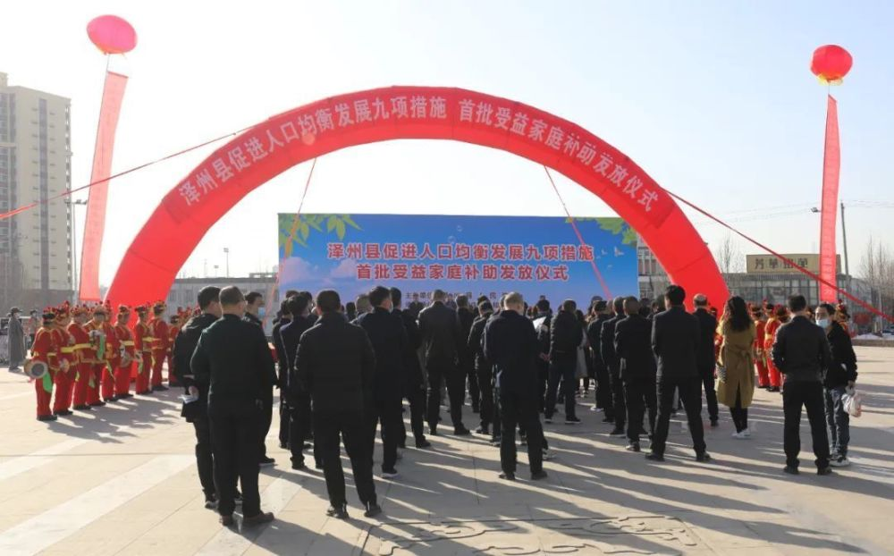

# 争议之下，山西泽州生育政策删除“二三孩中考加10分”表述

4月1日，澎湃新闻查询山西省晋城市泽州县政府官网时注意到，泽州方面低调修改了《泽州县促进人口均衡发展九项措施》的内容，其中删除了早前引发争议的“二三孩中考加10分”表述。

泽州县政府办公室原发布于今年1月初的解读文章也同步进行了删改。原文介绍，当地是从纾解教育压力、降低教育负担的角度出发，制定了中考加10分等政策。

上述“九项措施”最初在去年12月由泽州县政府办印发，其第八项“推进义务教育扩容”部分原写道：在泽州县落户、就业的二（三）孩家庭子女，免费享受义务教育学校放学后托管服务。
**中考报考县内公办高中时可加10分**
。由县慈善总会牵头成立二（三）孩成长赞助基金，对二（三）孩参加高考升入统招大学的给予一次性补助（本科3000元、专科2000元），进入职业教育学校的一次性补助2000元。

改后版本为：在泽州县落户、就业的二（三）孩家庭子女，免费享受义务教育学校放学后托管服务。由县慈善总会牵头成立二（三）孩成长赞助基金，对二（三）孩参加高考升入统招大学的给予一次性补助（本科3000
元、专科2000 元），进入职业教育学校的一次性补助2000 元。

根据泽州方面早前公布的相关实施细则，符合“中考报考县内公办高中时可加10分”优惠的条件包括：2023年元月30日之后出生且首次户口登记在泽州县的二（三）孩；二（三）孩父母至少一方为泽州县户口、且在本县就业至少缴纳社保满一年；双胞胎或多胞胎家庭，按孩次计算。申请时需提交二（三）孩生育服务证（原件、复印件），并填写《泽州县二（三）孩中考加分申请表》，经审核后实行。

等到这批新生儿参加中考，已经是十几年之后的事，因此加分措施还未执行过。

事实上，泽州“九项措施”在出台之初，尚未引发大范围关注。直到今年3月媒体报道当地首批受益家庭补助发放仪式并提及政策背景时，这一触及教育公平的二三孩中考加分政策，才被置于县域外广阔的舆论场接受审视。

泽州县十年间常住人口从48万人降到41万人、自我评估“县域人口减少过快、人口发展问题尤为突出”。“九项措施”中除了中考加分，还有5000元的生育补贴、6000元的奶粉补助、218天的产假、免费托管以及二三孩学费减免，另外，在二（三）孩满周岁前，父母可晚上班或早下班1小时等。这些优待和政策激励也获得了舆论肯定。

“泽州县为了鼓励生育二、三孩，在政策上确实是挺‘拼’的，给出的补助和激励也很实际。”光明网早前评论文章指出，但二、三孩“中考报考县内公办高中时可加10分”这个操作，则值得商榷。

文章称，要知道，针对二、三孩的各种优待和政策激励，社会有一个重要共识，那就是不会影响到“一孩”的利益。但很显然，对“二、三孩中考加分”，明显是构成了对“一孩”群体的不公。毕竟，中考分数线事关教育公平，如果因人而异，就很容易导致不公的问题。这也是近年来，中高考加分项目大幅削减的一个重要背景。因此，哪怕是当前鼓励生育的迫切性和重要性显著上升，也不应该拿教育公平来作为“催生”的工具。

这篇文章当时还呼吁，作为一个处于“未来时”的激励政策，对二、三孩中考加分的政策既然已经遭遇了质疑，当地若及时作出调整，应该不至于带来实质性的伤害。并且大可不必因为个别受争议的政策，就否定当地其他生育政策的善意。但这个现象的出现，还是应该让更多地方以及相关部门意识到，生育政策的完善也要掌握好分寸和边界，切勿用力过猛，或跑偏了。

此外，红星新闻文章指出，教育公平的底线，不应该被当成鼓励生育的临时性工具。对于正处于青春期、价值观正成型的孩子来说，通过地方性政策，让他们在小小年纪就意识到“学得好，不如生得好”，“老大天生低人10分”的错误观念，危害相当严重。这对于社会公平意识的伤害，远远大于可能产生的激励生育的结果。

