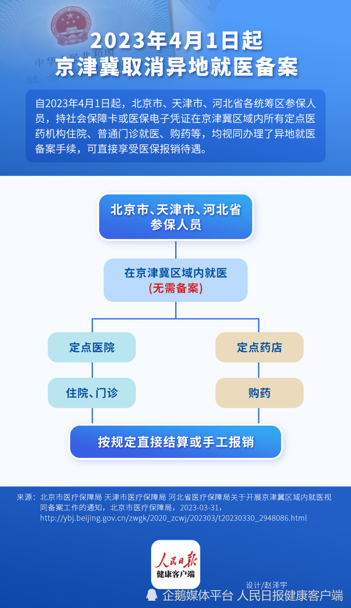

# 京津冀异地就医打通，患者不再“跑断腿”交材料

**人民日报健康客户端 记者王振雅**

4月1日起，京津冀三地全面取消异地就医备案。河北省医疗保障局党组书记、局长赵新喜向人民日报健康客户端记者介绍，取消一切没必要的材料，畅通京津冀异地就医报销渠道，就是为了放开群众就医选择权。

**“跑断腿交材料”不再有，异地就医不发愁**

异地就医费用结算问题，一直是群众“急难愁盼”的问题之一。据河北省医疗保障局医药服务管理处处长郑东花介绍，“以前，河北的患者去北京看病需要交暂住证、工作证、转诊转院证明等资料来办理异地就医备案手续，办完才能住院。”

要解决“跑断腿”的流程和“一厚叠”的报销材料，关键在于信息化和解放思想。2019年河北省率先探索异地就医直接结算便民之路，从实现网上异地就医自主备案到如今全面取消异地就医备案，河北省医保局对异地就医报销问题给出了答案。

赵新喜告诉人民日报健康客户端记者，取消一切不必要的材料，就是让群众依规办事不求人，方便快捷少跑腿，身在异乡不愁医。

2月10日起，河北参保人员到京津冀异地就医取消就医备案；4月1日起，北京、天津、河北三地参保人员，在京津冀区域内异地就医取消备案手续。郑东花介绍，无论是河北人到天津、北京看病，还是京、津两地到河北看病，都无需异地就医备案可直接结算，简化手续，优化流程，为群众提供了方便快捷的异地就医服务。

**按就医地目录、参保地比例报销**

2022年3月，家住河北省承德市双滦区的尹先生，在北京积水潭医院做人工髋关节置换手术，而且需要使用进口假体。“在外面做的手术，回当地报销，当地承认吗？给报销吗？”当他咨询了当地医保政策后，一颗悬着的心终于放了下来。

异地就医直接结算主要惠及两类人群：一是异地长期居住人员；二是临时外出就医人员。由于距离北京、天津优质医疗资源近，河北省群众到北京、天津跨省就医需求较大。

郑东花介绍，京津冀异地报销原则上执行就医地规定的基本医疗保险药品、医疗服务项目和医用耗材等支付范围，执行参保地规定的基本医疗保险基金起付标准、支付比例、最高支付限额、门诊慢特病病种范围等有关政策。

“增进民生增祉没有终点，只有连续不断的新起点。”赵新喜表示，异地就医的根本目的就是要解决群众异地看病不方便和急难危重病救治的问题，群众既然参了保、缴了费，就应该允许其根据个人意愿到自己想去的医院看病就医。

