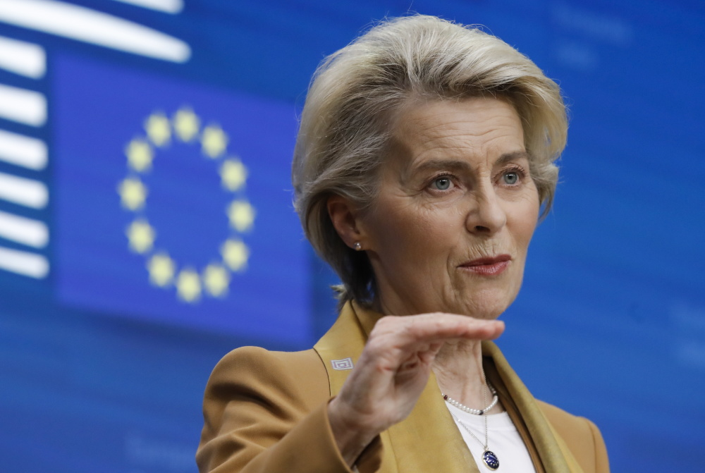

# 冯德莱恩访华前就中欧关系“隔空喊话”，专家：想影响中欧双边议程

【环球时报驻德国特约记者青木
环球时报记者白云怡】欧盟委员会主席冯德莱恩3月30日在比利时布鲁塞尔就欧中关系发表“原则性讲话”。她称，欧盟不希望与中国“脱钩”，但需要平衡与中国的关系，降低欧盟对华关系的风险及对中国的依赖。她同时谈及乌克兰问题，声称北京在这场冲突中的表现对欧中关系具有决定性的意义。同一天，中国驻欧盟使团团长傅聪大使在接受英国《金融时报》采访时表示，中方希望积极推动中欧关系，但这必须以相互尊重为前提。没有正确的认知，还在以旧思维看待新时代，这是不符合历史潮流的。将中欧关系与乌克兰危机捆绑有政治意图。

_欧盟委员会主席冯德莱恩_

欧洲媒体报道称，下周，法国总统马克龙和欧盟委员会主席冯德莱恩将一同访华。行前，这名欧洲领导人在由欧洲智库组织的讨论会上发表演讲，阐述了她对欧中关系未来的看法。冯德莱恩说，与中国的关系是“世界上最复杂和最重要的关系”之一，如何处理这个问题，对欧洲未来的经济繁荣和国家安全具有决定性意义。冯德莱恩赞扬中国成功地让数亿人摆脱了贫困。她说，中国在世界政治舞台发挥着重要作用，并且有着成为世界大国的雄心。但她同时表示，“很明显，我们的关系在过去几年里变得更加疏远，更加困难。”不过，冯德莱恩认为，“与中国‘脱钩’既不可行，也不符合欧洲的利益”，所以欧洲需要关注的不是和中国“脱钩”（de-
coupling），而是“脱险”（de-risking）。

冯德莱恩称，欧洲不想切断同中国在经济、社会、政治和科学方面的联系，但欧中关系目前不平衡。因此，欧盟“需要在透明、可预测和互惠的基础上重新平衡这种关系”。谈到被欧洲方面“冻结”的“中欧全面投资协定”，冯德莱恩表示，“在过去三年里，世界和中国都发生了巨大的变化——我们需要根据我们更广泛的对华战略重新评估”。冯德莱恩在演讲中提及乌克兰危机及其对中欧关系造成的影响，并呼吁中国为乌克兰的“公正的和平”而努力。她说，北京在这场冲突中的表现对中欧关系具有决定性的意义。

对于冯德莱恩的讲话，德国《南德意志报》称，她向全世界展示了将在北京展示的东西。然而，很明显，并非每个欧洲人都乐于听到冯德莱恩演讲中的强硬措辞，据说马克龙的态度要温和得多。一周前的欧盟峰会上，中国只是一个边缘话题，最终宣言中根本没有提到中国。德国《商报》称，尽管一段时间以来，德国联邦政府一直警告说，德企应更独立于中国，但德国经济研究所的一项新研究表明，去年德企在华投资比以往任何时候都多。如果欧盟引入对外投资审查，监管机构可能会禁止其中一些投资。瑞士《新苏黎世报》则展望冯德莱恩与马克龙下周的中国之行，称这将是“一次艰难的访问”。

冯德莱恩就中欧关系发表演讲的同一天，傅聪大使在接受《金融时报》采访时表示，中欧关系具有良好基础，欧洲领导人近期纷纷访华。中欧双边贸易投资去年实现强劲增长，欧洲经济界对中国市场充满信心。但欧盟近年出台系列贸易政策工具，保护主义上升。中欧关系受到影响，问题不在中方。将中欧经贸关系政治化，违背欧洲各界期待，也损害欧洲自身利益。欧盟应坚持战略自主，发展欧美关系不应以损害中欧关系为代价。傅聪同时在乌克兰危机问题上表示，中俄关系不受制于第三方，这同样适用于中欧关系。中欧关系是多维度的，不能仅从乌克兰危机视角看待中欧关系，将两者捆绑有政治意图。

中国国际问题研究院欧洲研究所所长崔洪建31日对《环球时报》记者表示，冯德莱恩的演讲一方面旨在对欧洲内部有所交代，另一方面则是对北京隔空喊话，在启程前表明欧盟的立场和目的，寻求影响接下来的中欧双边议程。“欧洲的对华政策正处在一个辩论与调整时期，有激进的声音，也有温和的立场。冯德莱恩在中欧经贸关系上‘去风险化’的提法，意在代表欧委会的立场，在两种观点中寻求某种平衡，既不像激进派那样搞‘脱钩’，也声明欧洲不希望中欧合作继续按照以往的方式走，欧洲不会增加对中国的所谓‘依赖’。”崔洪建说。

对于冯德莱恩将中方对乌克兰问题的立场同中欧关系的发展挂钩，崔洪建认为，这是欧盟内部从去年就开始抬头的一种声音，冯德莱恩此次演讲旨在进一步明确这一立场。乌克兰问题是当下欧洲地缘政治的头号挑战，也是冯德莱恩等欧洲领导人近期访华的目的之一。在这方面，中欧双方存在比较明显的分歧。中方认为乌克兰危机不应影响中欧之间的其他议程。“冯德莱恩的这次演讲是一次‘出牌’，看中方如何‘应牌’。”崔洪建认为，既然来访，就是双方从不同立场去讨论问题，看是否能在讨论后达成共识，或虽不能达成共识但能搁置争议。

美国《纽约时报》30日评论称，欧洲领导人陆续到访北京时，正值美国加大对欧洲的压力，要求他们在中美之间选边站。“访华实际上是在向华盛顿发出一个重要信号：这是在告诉美国人，我们在乎与中国的关系。”报道援引一名分析人士的话这样说。

