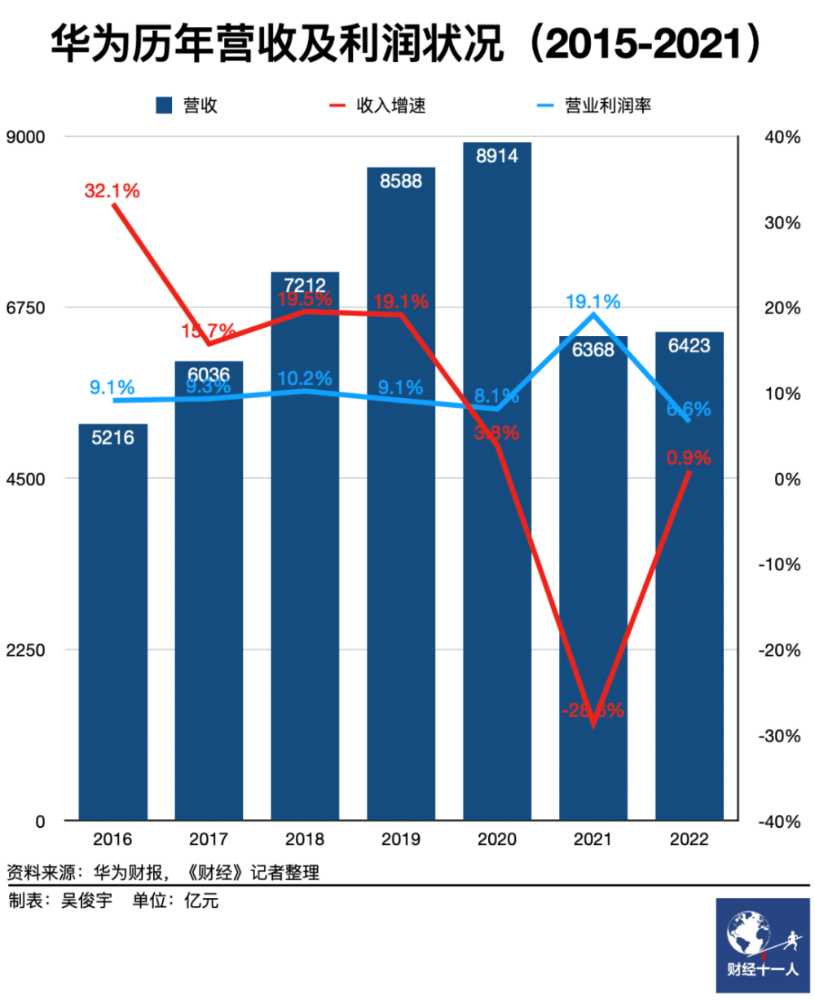
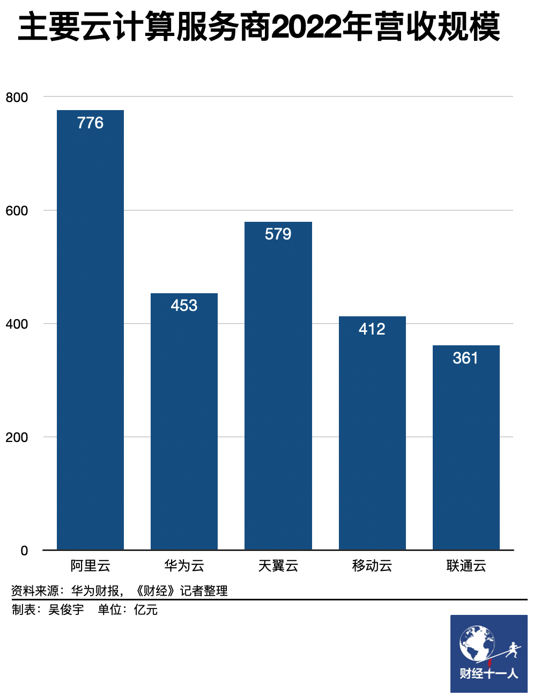
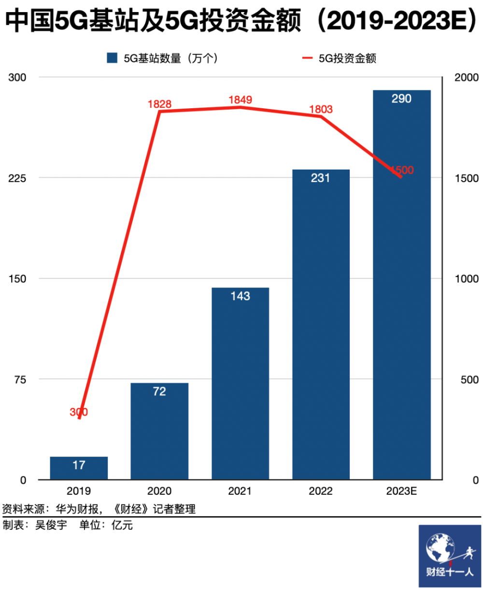
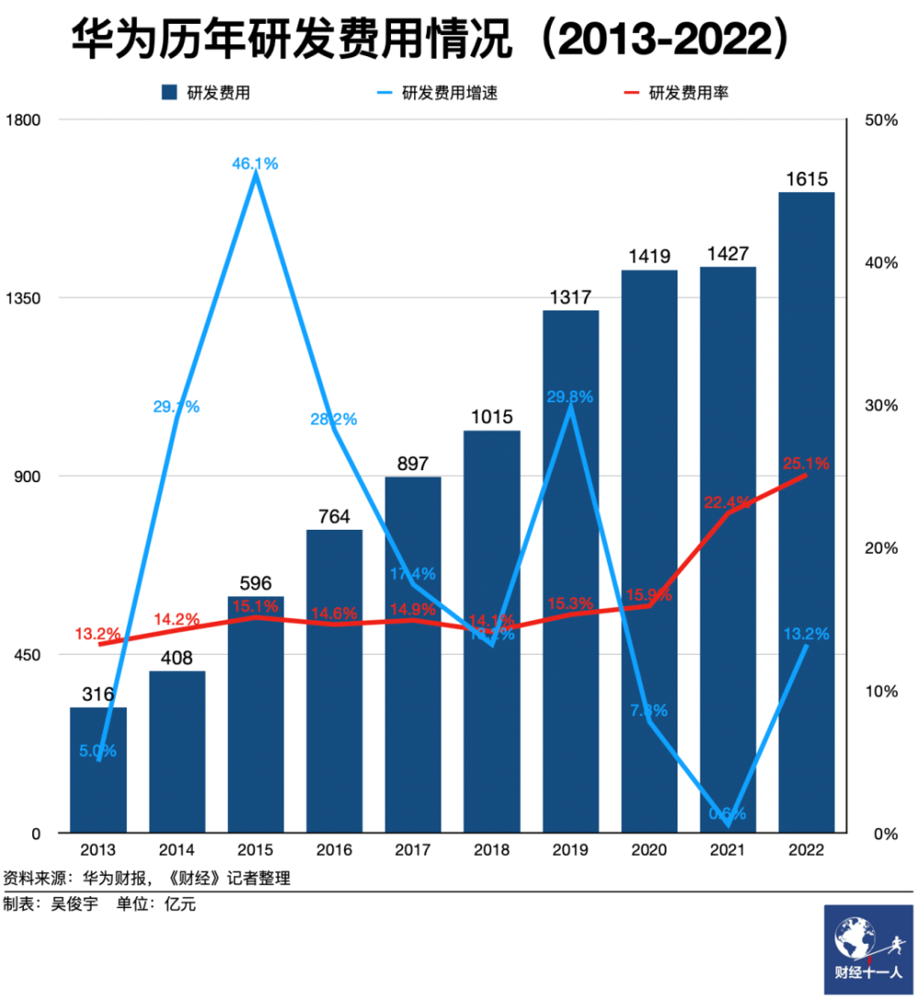

# 华为不造车，“因为没得选”？

**文 | 吴俊宇 顾翎羽 柳书琪**

**编辑 | 刘以秦**

3月31日，华为公布了2022年度业绩报告。距离2019年5月华为被添加到美国工业安全局的“实体清单”已过去46个月。这也是华为被列入“实体清单”后公布的第三份业绩报告。

过去10余年，华为长期按照业务板块的方式拆解运营商业务、企业业务、消费者业务的业绩报告。今年，华为首次通过产业组合的方式公布经营报告：包括ICT（信息与通信技术）基础设施、终端、华为云、数字能源及智能汽车解决方案部件。五大产业组合2022年分别营收3540亿元、2149亿元、453亿元、508亿元、21亿元。数字能源营收超过华为云。

传统的三大业务划分方式无法完全反映华为各业务线的实际情况。尤其是无法真实反映成长中的业务，如华为云、数字能源、智能汽车的实际情况。

徐直军对此解读称，华为一直在构筑有韧性的产业组合，因此把隐藏在ICT基础设施中的华为云、数字能源等业务单列出来，希望这些业务未来能够更好发展。

财报显示，2022年，华为全年营收6423亿元，同比增长0.9%；营业利润422亿元，同比下滑65.2%；营业利润率6.6%，为历史最低水平。其中，运营商业务营收2840亿元，同比增长0.9%；企业业务1332亿元，同比增长30.0%；终端业务2145亿元，同比下滑11.9%。

**华为2022年报基本符合预期。**
营业利润大幅下滑，主要受2021年非经常性收入过高影响。2021年，华为出售荣耀手机、超聚变数字公司，获得574亿元净收益，当年营业利润大幅增长。然而，这并未改变华为长期承压的现状。2022年华为营业利润率处于历史低点，这反映了华为的严峻现状。

在华为2022年年度报告发布会上回应媒体提问时，华为CFO孟晚舟表示，随着法官批准检方的撤诉申请，她的个人案件（加拿大引渡案）已经画上了一个句号。未来她的工作中的国际出行需求将不会受到影响。

**值得注意的是，周五在中国深圳总部公布华为年度业绩后，华为公司CFO孟晚舟将出任该公司当值轮值董事长，任期六个月。**
轮值董事长制度是华为的组织特点。在华为内部治理架构中，轮值董事长共三人，三人轮流当值，任期6个月，当值期间是公司最高负责人。职责包括召开董事会和高管委员会会议。该职位拥有否决权，但较少参与公司的日常运营。

被列入“实体清单”后，美国政府一直在限制华为获取先进技术，并遏制华为现金流业务。美国政府对华为的制裁手段还在升级，甚至在朝着彻底扼杀华为的方向发展。因此，华为轮值董事长徐直军在年报发布会上称，持续生存发展仍是华为的核心命题。

**华为三大业务、五大产业现状**

华为运营商业务主要为全球电信运营商提供网络产品、服务及解决方案。企业业务为政府、金融、能源、交通、制造等领域的政企客户提供云网、软件、存储、数据中心、5GtoB等ICT产品及解决方案。消费者业务提供手机、电脑、可穿戴设备、智选汽车等终端设备。

**华为三大业务中，运营商业务面临中国5G开支下滑的挑战，增长空间有限。**
终端业务中的手机业务缺少芯片，汽车业务仍在探索阶段。企业业务是唯一取得高速增长的板块。2019年被列入实体清单后，企业业务成为华为的“压舱石”，被内部寄予厚望。

**企业业务是华为目前增速最快，发展空间最大的业务板块。**
华为云是该业务旗下增长最快的板块之一，也是驱动华为企业业务转型的重要力量。华为云2022年营收453亿元。和2022年已公布营收数据的其他云服务商相比，其收入规模仅次于阿里云的776亿元、天翼云的579亿元。

除了云业务，各大军团也是驱动华为企业业务增长的板块。2021年末，华为企业BG内部通过成立数十个军团组织，以此横向整合资源，形成针对性的解决方案。其中包括煤矿军团、公路水运口岸智慧化军团、电力数字化军团、政务一网通军团、机场与轨道军团、园区军团、广域网络军团、数据中心底座军团、数字站点军团、数字金融军团、制造行业数字化系统部、公共事业系统部等组织。

为激发服务深度，华为企业业务对考核方式也做出了调整。2022年11月，华为政企中国区总裁吴辉曾对《财经十一人》表示，华为首次把“交易客户数和交易伙伴客户数以及复购率”作为一线重要的考核指标。要求每一个区域、每一个作战单元，在做深或者做好它的大型客户的同时，也要扩大客户群，以此获得增长动能。

华为运营商业务目前面临中国5G开支下滑的挑战。该业务收入主要来自三大电信运营商（中国移动、中国电信、中国联通）。2020年-2022年是中国5G基站建设高峰期，三大运营商每年合计要花费超过1800亿元采购5G基站。华为是其中最大受益者。

此前中国移动管理层公开表示，2022年是5G投资高峰期最后一年，投资重点将转向产业数字化。三大电信运营商5G资本支出在2022年出现下滑，投资重点转向数据中心等算力方向。《财经十一人》统计了三大运营商2022年年报推介资料：2023年，三大运营商合计用于5G网络的资本开支将低于1500亿元。这意味着，华为运营商业务的压力将变大。

汽车业务方面，有关华为是否造车等内部发展路线的争议长期存在。3月31日，华为创始人、董事长任正非署名发出董事会决策公告，再次强调“华为不造车”，“有效期5年”，并表示将严格管理华为品牌滥用。

**华为有三种与车企的合作模式，最浅的合作是售卖零部件。**

**深一些的合作是2020年11月推出的HUAWEI Inside 全栈式方案**
（HI模式），华为向车企提供鸿蒙车机与自研车载计算芯片在内的全套解决方案，并授权在车身上使用HI的Logo。

**第三种合作由华为汽车业务掌舵人余承东推出，也是与车企绑定最深、介入产品开发和渠道售卖的智选车业务。**

过去一年，智选车的成功和HI模式的失败加剧了华为汽车业务的割裂。在华为内部，围绕余承东支持的智选车模式和王军主导的HI模式孰轻孰重的争论越来越大。从华为外部来说，随着智选车模式取得了亮眼的成绩，外界对华为可能自己下场造车的猜忌越来越大，认为华为可能不再将自己继续定义为供应商，而是与类似赛力斯这样的车企绑定更深。

这种猜测随着任正非今日发文，失去了意义。
**多位华为人士向《财经十一人》表达了同一个观点，华为不造车，看似是主动选择，实际是没得选——华为不上市，也不对外融资，这两个原则不打破，以华为被美国制裁后失去终端这一利润奶牛的现状，没钱造车。**

手机市场，华为仍在尝试回到中国的牌桌上。徐直军在年报发布会上表示，由于美国商务部的限制，华为仍然无法获得5G芯片，因此只能提供4G手机。

2021年华为自研麒麟芯片接近消耗殆尽，产品发布断档。2022年后则借助高通芯片逐渐恢复了节奏。《财经十一人》了解到，在600美元（不含税）以上的中国高端手机市场中，华为的份额已从2021年四季度的8%恢复至14%。

国际市场调研机构Canalys分析师Amber
Liu告诉《财经十一人》，华为终端业务的路线是聚焦高端。华为有意识地避免与其他手机厂商在中低端产品上“内卷”竞争，将有限的精力集中在高端市场上，以求获得更稳健的出货量增长、更大的利润空间。

**靠研发和自主替代抵御制裁**

被列入实体清单后的46个月间，华为一方面寻找业务增量、强化财务韧性，另一方面则是做自主替代。

根据美国政府要求，未经美国工业安全局许可，任何公司禁止将《出口管理条例》（EAR）管制的物项出口、再出口、或转让给华为。
**这46个月间，美国政府对华为的制裁策略主要聚焦两点：**

一是限制华为获取先进技术，如限制华为获取芯片制造技术、28纳米以下先进制程芯片、5G芯片。后果是，5G商用已近4年，华为手机至今仍停留在4G。

二是遏制华为现金流业务，如禁止华为手机使用安卓系统、禁止华为采购英特尔x86服务器芯片。华为被迫售出荣耀手机和x86服务器（超聚变）这两大现金流业务。

美国政府对华为的遏制并未止于此。制裁手段还在升级，甚至在朝着彻底扼杀华为的方向发展。

今年1月，多家外媒报道称，美国政府考虑停止对美国企业核发向华为出口商品和技术的许可证。目的是禁止华为获取5G、4G、Wifi6、Wifi7、AI及高性能计算以及云相关的商品和技术。上述政策目前仍在讨论阶段。如果许可证停发，意味着华为运营商业务中的大基站零部件会受影响，华为现存手机、个人电脑也将缺少关键芯片。

**多轮制裁让华为内部放弃依赖美国技术的声音愈加强烈。在此背景下，华为按照“一切只能靠自己”的原则，持续“压强式”投入研发费用。**

虽然营收增长停滞，营业利润承受压力，华为依旧保持研发高投入。2022年，华为研发费用1615亿元，同比增长13.2%，近十年累计投入的研发费用超过9773亿元。2022年研发费用率（研发费用/总营收）为25.1%，是历史最高水平，同时也是中国目前研发费用率最高的大型科技公司。华为在2022年报中解释称，研发费用率提升的原因是，华为坚持对云、智能汽车部件及软件根技术等面向未来基础研究与开放创新的持续投入。

高强度的研发投入也带来了实际成果。

**自研软件业务是华为的重点突破方向之一。**
自2019年软件被陆续断供后，华为不再寄望于美国政府放松限制，确定了新的思路——采用自己研发加联合合作伙伴一起研发的策略，来实现自给自足，保障研发工具的连续性。范围涉及硬件（X86->ARM）、操作系统（Linux/Windows->欧拉）、数据库（Oracle->RDS）、中间件、应用软件改造五个大类的全栈自研替换，涉及几百个组件的替换，千万行代码的测试验证。

《财经十一人》了解到，华为目前在基础软件四大领域（操作系统、数据库、中间件、编程工具）均实现了自主可控。2022年12月起，华为连续发布了11款软硬件开发工具和服务，华为自身的产品线研发，已经切换到自己的工具上。构筑起了一套涵盖软件开发全流程、全环节的软件开发生产线。

今年2月，华为披露了软件设计工具的最新进展。华为已在芯片领域完成14纳米以上EDA工具国产化，预计今年将完成验证。华为“硬软芯”（硬件开发、软件开发和芯片开发）三条研发生产线目前完成了78款软件工具的替代，基本可以保障研发作业的连续性。

EDA是芯片IC设计中不可或缺的重要部分，涵盖集成电路设计、布线、验证和仿真等所有流程，贯穿芯片全产业链，各个工具环环相扣，被称为“芯片之母”。近三年来，华为在基础工具软件领域的突破，是和国内产业链上的合作伙伴们共同完成的。华为完成了工具软件自主替代的关键一步，国内相关产业链得到了新一轮的进阶和整合。

徐直军在此次年报发布会上介绍，华为和合作伙伴实现了14纳米以上EDA工具的国产化，这意味着所有国产半导体企业都可以使用国产EDA工具设计14纳米以上的芯片。

