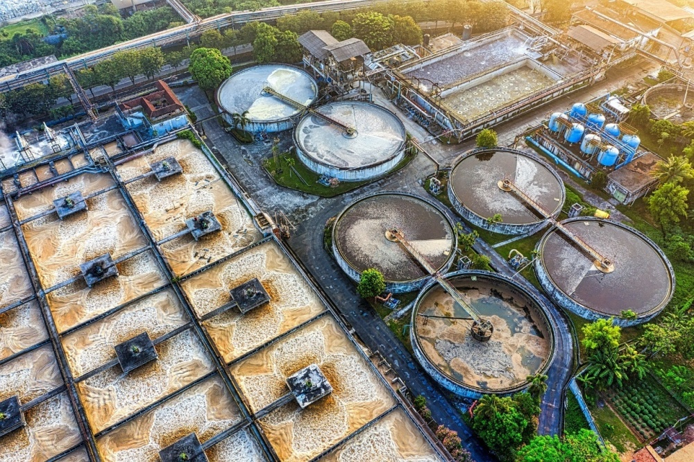

# 如果万亩林场只能用工业水浇灌，废水脱盐成本很高吗？

  * _1_ 盐水淡化的成本非常高，别说用来灌溉林场，日常使用都太奢侈。
  * _2_ 无论是加热冷凝还是半透膜加压，淡化处理工艺价格都非常昂贵。
  * _3_ 宁夏林场缺水事件，如将工业废水处理成可灌溉的淡水，将面临更难的环境处理难题。

近日，宁夏“煤矿截断万亩林场水源，林场主人崩溃跪地求供水”视频引发关注。供水纠纷中，煤矿方面称只剩一些含盐量高的工业水可供。用废水脱盐的方式供水，成本很高吗？

用一句话来说，就是盐水淡化的成本非常高，别说是用来灌溉林场，就算是日常使用都太奢侈了。

工业排放的高盐水，主要的盐分是氯化钠，此外还有硫酸盐、硝酸盐、钙盐等成分，大体上与海水类似。当废水中总含盐量超过1%时，就可以被称为高盐废水，实际生产中通常可以达到4%以上，甚至能够超过10%。
**相比于海水3%左右的盐浓度，工业废盐水的浓度可以说是不遑多让。**
更重要的是，工业废盐水中，除了常见的无机盐外，还可能含有一些有机物，例如甘油、乙醇等，或者含有汞、铅这样的重金属离子，这都增加了后续处理的难度。

因此，和海水一样，工业废盐水具有 **很高的渗透压** ，并且往往会因为存在有机物或有毒成分，生物体在这样的水中无法存活，也不能直接用于浇灌。

要处理这样的污水，需要先进行初步净化，脱除其中的有机物，降低污水的化学含氧量（COD）。所谓COD，指的是用诸如高锰酸钾的强氧化剂与污水反应时消耗的强氧化剂。直观来说，COD的数值越高，水中的有机物就越多，溶解在水中的氧气很快就会被消耗，大多数生物就很难在水中生存。

降低COD的方法很多，如吸附沉淀的物理法、加入化学试剂氧化的化学法以及使用厌氧细菌分解的生物法。目前，生物法因二次污染小而被普遍使用，但是由于高盐废水中同时还含有高浓度的盐分，厌氧细菌也无法生存，因此只能使用其他方法。如此一来，处理成本与环境成本都会有所增加。

在COD控制到合理的范围后，剩下的污水就可以像海水淡化那样进行处理了。

目前，世界上已经有多个国家实现大规模商业化海水淡化，如沙特、卡塔尔、阿联酋、以色列和新加坡等等。这些国家的特点非常鲜明，一是在地理环境上极度缺乏淡水，二是经济实力较强。除此以外，中国、日本、美国等国也都有海水淡化的设备，主要是实验性质，仅在极少数城市布局了工业化设备。例如，天津和厦门都已经建设了海水淡化设备，但是生产出来的淡水量在整个城市供水中的占比并不高。

之所以会这样，原因都是同一个，就是 **海水淡化工艺的高成本** 。

沙特的海水淡化设备

目前，海水淡化的脱盐工艺主要分为两类： **一是** 加热到沸腾，再将冷凝后的淡水收集，剩下的盐分可以结晶回收； **二是**
使用半透膜，用加压的方式将淡水“过滤”出来，剩下更浓的盐水废弃排放。

在我们的厨房中，就可以实现这两种淡化的工艺。

比如 **煲汤**
的时候，汤水不断浓缩，盐分会保留在汤中，淡水则以水蒸气的方式进入到空气中。此时，如果用一只冷锅盖挡住热气，水蒸气就会在锅盖上凝结成液态的水。这个方法非常简单，也很实用，但是水的比热容很大，因此无论是在加热沸腾还是冷凝的阶段，都需要消耗极大的能量。

再比如，目前常见的 **反渗透（RO）净水器**
，其原理和海水淡化的方法也是一致的。反渗透工艺的核心是半透膜，这种膜只能让水分子通过，但是盐不能通过。在正常条件下，当盐水和清水分别位于半透膜的两边时，清水会向着盐水方向流动。但是，海水淡化是要将盐水处理成清水，就需要通过加压的方式，让这个过程反过来进行，故而被称为反渗透膜法。反渗透膜不能用来处理浓度特别高的盐水，当盐水一侧的浓度高到一定程度时，加压也不足以让盐水中的水分渗透到另一侧，此时，半透膜已经非常脆弱。另外一方面，高浓度的盐水无法进一步处理，只能废弃，或重新采用加热结晶的方式处理。在整个过程中，半透膜所占的成本非常显著。

因此， **无论是采取何种工艺进行脱盐，在成本上都会相当高。**
以卡塔尔为例，2022年11月举办世界杯期间，该国投入大笔资金，免费为游客提供很多便利，但是并没有在公共场所提供饮用水。不仅如此，每瓶饮用水在卡塔尔的售卖价大约是20元人民币，是中国的10倍以上。在网络上曾经盛传，以色列的反渗透法海水淡化成本已经压缩到每吨淡水5元左右，然而这一价格并没有计入政府补贴，也没有考虑浓盐水排放的代价。事实上，以色列因海水淡化工艺排入地中海的浓盐水，已经成为一项很值得关注的环境危机。如果将这些因素全部考虑在内，那么以色列的淡水成本仍然超过每吨30元，同样是中国大多数地区自来水成本的10倍以上。

回过头看看这次发生在宁夏的林场缺水事件，如果将工业含盐废水处理成可以灌溉用的淡水，不仅要经过淡化脱盐的工序，还要考虑其他成分的处理问题，如果采用反渗透法，则会面临比以色列更麻烦的环境处理难题。

因此，将废水脱盐后再灌溉，这在目前的科技水平下，成本上仍然是不可接受的。

