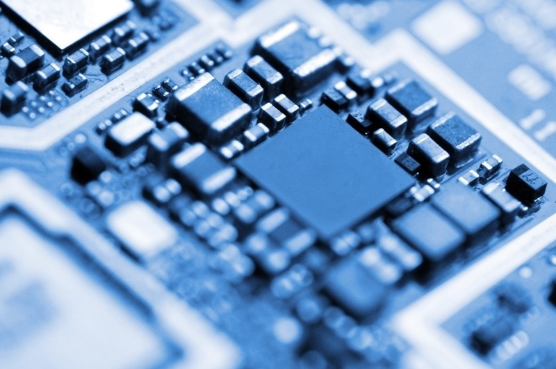

# 日本要限制23种芯片设备出口，专家：失去中国市场它很难找到替代者

【环球时报综合报道】日本经济产业省3月31日宣布，将修改《外汇及外国贸易法》相关法规，以加强尖端芯片领域的出口管制。日本共同社报道称，被限制出口的芯片制造设备共有6大类23种，涉及芯片的清洁、光刻、蚀刻以及检测等。目前，修改后的法规已开始公开征集意见，预计将于7月开始实施。

《日本经济新闻》报道称，修改后的法规并未指名将中国等特定国家和地区作为限制对象，日本经济产业大臣西村康稔也在当天表示，并不是针对特定国家。但《日本经济新闻》分析认为，本次追加的23种产品除了面向42个“友好”国家和地区外，其余出口对象国家和地区都需要经济产业大臣的个案审批许可。因此这些产品实际上很难向中国出口。

路透社称，去年10月，美国出台限制芯片制造设备和相关技术对华出口的禁令，还要求日本和荷兰“追随”。中国外交部发言人毛宁31日表示，全球芯片产业链供应链的形成和发展，是市场规律和企业选择共同作用的结果。将经贸和科技问题政治化、工具化、武器化，人为破坏全球产供链稳定，只会损人害己。

英国《金融时报》援引一名日本设备分销商的话表示，由于预计禁令将生效，他们已匆忙向中国客户发货。日本企业（中国）研究院执行院长陈言对《环球时报》记者说，日本自身市场有限，一旦实施出口限制，失去中国市场的支撑，它很难找到替代者。（岳林炜
丁雅栀）

