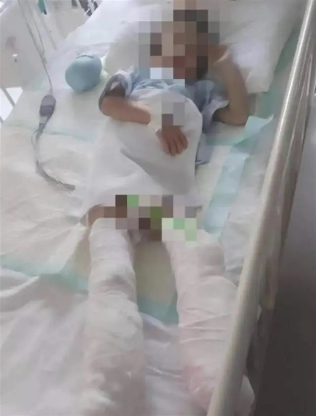

# 江苏男童被生母虐待导致截肢，为何有的人会对自己孩子下狠手？

近日，江苏一名6岁儿童被生母虐待导致截肢的新闻引发网友关注，目前，男孩已完成手术继续治疗，其生母被批捕。

看到这个信息，痛心多过惊讶，很多人可能会觉得母亲的母性肯定会使女性会更加疼爱孩子，但实际上在虐待行为上来说，这一点并不足以去支撑，因为很多时候施暴者对亲生孩子的虐待，其动机相对来说会比一般的虐待要特殊一些。

如果论虐待的比例，男性在总的虐待行为比例上会略高于女性，这个也很好理解，因为就好像大家普遍认为的那样，男性在身体素质、激素分泌、冲动控制等方面，容易对他们的极端行为产生影响。

那女性呢，有催产素、雌性激素等，可以很好地激发共情，但在一些特殊的情况下，这些对于情绪唤醒的促进，也会同样带来与男性差不多的情绪化。

_躺在病床上的男孩。图源：新闻媒体_

但我们前面也说了，虐待亲生孩子的动机，是特殊的，姑且分为三种：情绪型虐待、补偿型虐待，以及转移型虐待。

首先是情绪型虐待，刚开始对孩子的虐待行为只是发泄当时的情绪，但后面可能多了一些工具属性，只要一有不开心，就想起来这种发泄方式，形成了一种习惯；

其次，就是补偿型虐待，补偿什么？补偿自己某些方面的缺失，比如情感的缺失、评价的缺失、陪伴的缺失等。为什么虐待孩子？就是那种随意支配的掌控感，施暴者会有一种反正也是自己孩子的先入想法；

最后，转移型虐待，就是将对大人的不满，转移到孩子身上。本案中的虐待动机，这种可能性比较大，就是另一半长期在外打工，虽然经济上有支撑，但始终还是会有缺失和摩擦，这种不满无法直接向成年目标发泄，就很容易转移到无法反抗、言听计从的亲生孩子身上。

还需要注意一点，就是虐待无论是来自父母哪一方，我们都需要把虐待看作是一种长远影响和危害特别大的暴力行为，它不但会造成身体上的伤害，比如本案中的严重后果，还会让孩子对亲密关系甚至人际关系产生特别严重的社会关系恐惧，无法很好判断他人的行为中所蕴含的意义，从而回避社交，社会功能减退，还会出现严重的被抛弃和孤独感等，这些对于孩子来说，任何一项都是致命的。

