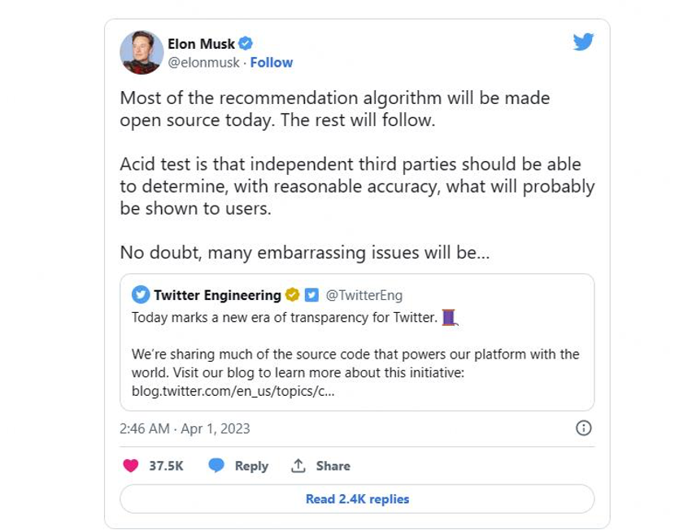
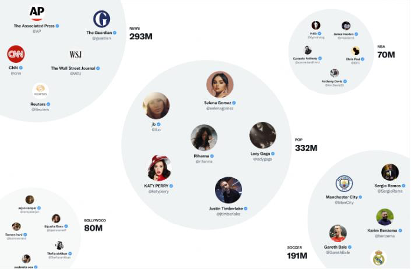

# 马斯克兑现承诺，推特开源推荐算法

**划重点：**

  * _1_ 推特于美国当地时间周五开源了该公司部分源代码，特别深入介绍了推荐算法的工作原理。
  * _2_ 开源代码帮助马斯克兑现了承诺，还可能有助于增加用户信任度，帮助产品快速改进。
  * _3_ 许多人对推特开源代码的行为表示怀疑，有些用户也感到不满。
  * _4_ 马斯克希望将推特打造成类似Linux的开源项目，但其面临着许多竞争。

腾讯科技讯
4月1日消息，美国当地时间周五，推特兑现了其新老板埃隆·马斯克的承诺，公开了决定这家社交媒体网站如何推荐内容的源代码，让用户和程序员得以窥探其工作原理，并能够对算法提出修改建议。推特此举可谓一举四得：帮助马斯克兑现承诺、代码透明将带来更高用户信任度、促使产品快速改进以及缓解立法者担忧。

马斯克兑现部分承诺

推特开源代码是在马斯克要求下做出的，现在他终于兑现了承诺。早在2022年3月24日，马斯克就曾在推特上发起调查，询问推特是否应该开源算法，当时有83%的投票者支持开源。今年2月份，马斯克承诺在1周内完成开源。但在3月初，他将开源的最后期限推迟至3月31日。

马斯克曾表示，开源代码将让推特的运行更加透明，这将带来更高的用户信任度，并促使产品快速改进。此外，这还能用来解决用户和立法者的共同担忧。他们正在越来越多地审查社交媒体平台，关注算法如何选择用户看到的内容。

周五当天，马斯克在推特上表示，第三方应该能够分析推特的开源代码，并“以合理的准确性确定推特可能会向用户展示什么内容”。他写道：“毫无疑问，人们可能会发现很多令人觉得尴尬的问题，但我们会很快解决它们！”
马斯克还表示，推特将每隔24至48小时更新一次基于用户建议改进的推荐算法。

马斯克希望此举能让推特变得像Linux那样，后者可能是史上最著名、最成功的开源项目。他补充道：“我们的总体目标是最大限度地利用用户时间，并且不让他们为此感到遗憾。”

并非开源全部代码

马斯克在推特上表示，周五发布的内容“大部分与推荐算法有关”，并表示其余部分将在未来陆续发布。推特称，Github上的代码不包括为推特广告推荐提供支持的代码。此外，该公司也未公布可能会危及用户安全或隐私的代码，同样不含可能破坏该平台上防止儿童性虐待材料传播的功能细节。

对于开源推特算法，马斯克认为人们看到它后可能会感到失望。他说这些算法“过于复杂，就连公司内部都没有完全理解”，人们会“发现许多愚蠢的事情”，但他承诺会在发现问题时及时解决。他在推特上写道：“一开始，提供代码透明度会令人非常尴尬，但它应该会导致推荐质量的迅速提高。”

**推荐算法原理大曝光**

推特的目标是为人们提供世界上正在发生的、他们最为关注的事情。这需要推荐算法的支持，以便从每天发布的大约5亿条推文中提炼出几条最热门的推文，最终显示在用户设备的For
You时间轴上。这篇帖子介绍了推荐算法如何为你的时间轴选择推文。

推特如何选择推荐推文?

推特推荐算法的基础是一组核心模型和功能，从推特、用户和参与度数据中提取潜在信息。这些模型旨在回答关于推特提出的重要问题，比如“你未来与另一个用户互动的概率有多大?”或者“推特上有哪些社区，这些社区里有哪些热门推文?”准确回答这些问题可以让推特提供更相关的建议。

推特的推荐管道由使用这些特性的三个主要部分组成：

——从不同的推荐源获取最好的推文，这个过程称为候选源

——使用机器学习模型对每条推文进行排名

——应用试探法和过滤器，例如过滤掉你屏蔽用户的推文、NSFW内容和你已经看到的推文

负责构建和服务于For You时间轴的功能叫做Home Mixer，该功能以Product
Mixer为基础构建，这是推特自定义的Scala框架，可以方便地构建内容提要。该服务充当连接不同候选源、评分函数、试探法和过滤器的软件主干。

下面让我们研究一下这个系统的关键部分，大致按照在单个时间轴请求期间调用它们的顺序，首先从候选源中检索候选推文。

**候选推文来源**

推特推荐的推文有几个候选源，我们用来为用户检索最近和最相关的推文。对于每个请求，我们试图通过这些源从数亿条推文中提取出最好的1500条推文。我们从你关注的人(网络内)和你不关注的人(网络外)中寻找候选推文。如今，For
You时间轴平均由50%的网络内推文和50%的网络外推文组成，尽管这可能因用户而异。

1）网络内资源

网络内资源是最大的候选消息源，旨在提供你关注的用户最近发布的最相关推文。它使用逻辑回归模型根据你关注的推文相关性有效地排名。排名靠前的推文会被送到下一个阶段。

网络内推文排名中最重要的组成部分是Real Graph，这是一种能够预测两个用户之间互动可能性的模型。你和推文作者之间的Real
Graph得分越高，我们就会包含更多他们的推文。

网络内资源是推特最近工作的重点。我们最近停止使用Fanout服务，这是一项有12年历史的服务，以前用于从推文缓存中为每个用户提供网络内推文。我们还在重新设计逻辑回归排名模型，该模型最近一次更新和训练是在几年前！

2）网络外资源

在用户网络之外寻找相关的推文是非常棘手的问题：如果你不关注作者，我们怎么知道某条推文是否与你相关？为此，推特采取了两种方法来解决这个问题。

A.社交图

推特的第一个方法是通过分析用户关注的人或有相似兴趣的人的活动，来预估其可能关注的重点。

通过浏览社交图，并寻找以下问题的答案：我关注的人最近发了哪些推文？谁喜欢和我相似的推文，他们最近还点了什么赞？我们根据这些问题的答案生成候选推文，并使用逻辑回归模型对结果推文进行排名。这种类型的社交图对于我们的网络外推荐是必不可少的。

此外，推特开发了图形处理引擎GraphJet，用以维护用户和推文之间的实时交互图，帮助构建社交图。虽然这种搜索推特参与度和关注网络的试探法已经被证明是有用的（目前这些方法用于约15%的家庭时间轴推文)，但嵌入空间方法已经成为网络外推文的更大推荐来源。

B.嵌入空间

嵌入空间方法旨在回答一个关于内容相似性的更普遍问题，即哪些推文和用户与我的兴趣相似？

嵌入空间的工作原理是生成用户兴趣和推文内容的数字图表。然后，我们可以在这个嵌入空间中计算任意两个用户、推文或用户与推文对之间的相似性。如果我们生成准确的嵌入，就可以使用这种相似性作为相关性的替代品。

推特最有用的嵌入空间之一是SimClusters。SimClusters使用自定义矩阵分解算法发现由有影响力用户集群锚定的社区。这样的社区有145000个，每三周更新一次。用户和推文表现在社区空间中，并且可以属于多个社区。社区的规模从个人朋友群的几千用户到新闻或流行文化的数亿用户不等。以下是一些最大的社区：

我们可以通过查看推文在每个社区中的当前流行程度来将其t嵌入到这些社区中。一个社区的用户越喜欢某条推文，该推文就会与该社区联系得越紧密。

排名体系

For
You时间轴的目标是为用户提供相关的推文。在这一点上，我们有大约1500个候选人可能是相关的。评分直接预测每个候选推文的相关性，是在您的时间轴上对推文进行排名的主要信号。在这个阶段，所有候选对象都被平等对待，而不考虑它来自哪个候选对象。

排名是通过一个约有4800万个参数的神经网络来实现的，该神经网络不断地训练推文交互，以优化积极的参与度(例如点赞、转发和回复)。这种排名机制考虑了数千个特征，并输出10个标签给每条推文打分，每个标签代表参与的概率。我们根据这些分数对推文进行排名。

**探索法、过滤器和产品特性**

在排名阶段之后，我们应用探索法和过滤器来实现各种产品功能。这些功能可以兼容，创建一个平衡和多样化的提要。比如：

——可见性过滤：根据内容和用户喜好过滤掉推文，例如从你屏蔽或静音的账户中删除推文

——作者多样性：避免同一作者连续发布过多推文

——内容平衡：确保我们发布的网络内和网络外推文取得平衡

——基于反馈的疲劳：如果用户提供了负面反馈，我们会降低某些推文的分数

——社会证明：排除没有二级连接的网络外推文作为质量保障。换句话说，确保你关注的人关注了这条推文，或者关注了推文的作者

——对话：通过将回复与原始推文串联在一起，为回复提供更多上下文

——编辑过的推文：确定当前设备上的推文是否过时，并发送指令用编辑过的版本替换它们

此时，Home
Mixer已经有一组推文准备发送到用户的设备上。作为该过程的最后一步，系统将推文与其他非推文内容(如广告、关注推荐和登录提示)混合在一起，这些内容将返回到用户的设备上显示。

上面这个过程每天运行大约50亿次，平均每次不到1.5秒就能完成。单个过程执行需要220秒的CPU时间，几乎是你在应用程序上感知到的延迟的150倍。

质疑、不满与竞争

马斯克提高推特推荐算法透明度的决定并非凭空而来，他此前多次公开批评推特前管理层处理内容审核和推荐的方式。现在，马斯克认为，在推特的新推荐算法中，负面和仇恨内容将被“最大限度地降级”，但之前没有访问过这些代码的外部分析师对此表示怀疑。

同时，马斯克的决断也遭遇到很多反对声音。用户们对自己 For You
页面中经常显示马斯克的推文表示不满，而马斯克的支持者们则担心自己在社区中的参与度正在降低。

此外，推特也面临着来自开源社区的潜在竞争，去中心化社交网络Mastodon在某些圈子里越来越受欢迎。推特联合创始人杰克·多西正在支持另一个类似的项目Bluesky，而该项目建立在开源协议的基础上。

在推特开源其代码之前，该公司部分源代码在Github上被泄露，Github上周应推特要求删除了这些代码。根据一份法律文件显示，推特曾要求美国加州北区地区法院命令Github提供与发布泄露代码的Github账户相关的“所有可识别信息”，以追查泄密者身份。（金鹿）

