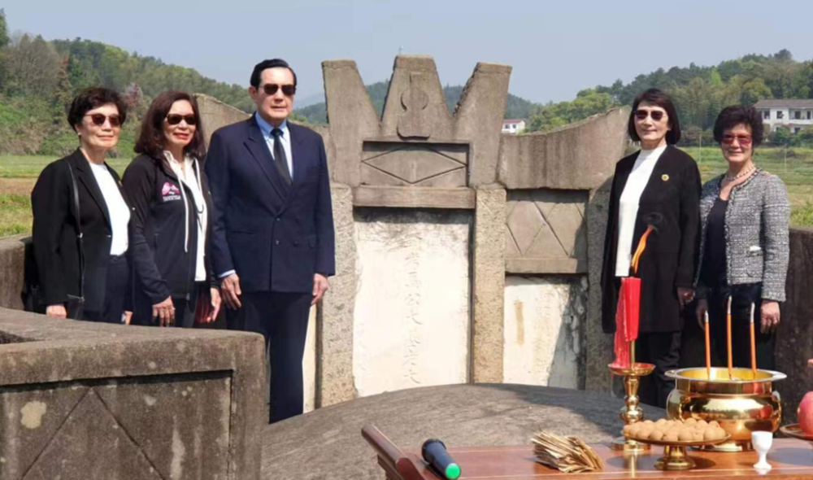

# 马英九用长沙话念祭文，一度哽咽落泪

今天（4月1日），马英九和他的四个姐妹一起回到湖南湘潭老家祭祖。马英九在祖父的坟前上香后以长沙话阅读祭文，自述这是他第一次到大陆祭祖探亲，内心非常感动。

马英九在阅读祭文途中，一度哽咽落泪。在祭祖后接受采访时，马英九再次动情落泪。他说，他终于实现了心愿，终于能够亲口对祖父说，他一直在遵照家训做人做事。

马英九的祖父马立安曾亲自写下“黄金非宝书为宝，万事皆空善不空”的对联，挂在家乡善馆的大门上，以教子孙，并劝人读书为善。这一对联也成了马英九的家训。

马英九在今天接受联访时再度说到这段往事，他说到他父亲才7岁祖父就过世了，“当然不可能见过他，但是心心念念只是希望来祭祖。中国人慎终追远，民德归厚，这是我们中国人道德教育非常重要的一部分，今天来看到我祖父的坟，内心非常感动。我们这一家子从我父亲到叔叔、姑姑已经过世了，到现在已经有38个子孙，大家都能自立自强，一直遵照他给我们大家的遗训：黄金非宝书为宝，万事皆空善不空。”

马英九还说，他在台湾出版博士论文的时候，也特别在扉页上把这句话写上去。“我父亲原来不知道，看了以后非常感动，他说这是祖泽与孝思，我们祖父的祖泽，他儿子的孝思，他觉得他家庭教育没有失败。”

马英九在阅读祭文时也说，“我并印制中英文马氏家训书签，与亲友、学生分享，这次也带来大陆送给大家。”

记者丨陈佩瑶、巫志刚，深圳卫视直新闻特派记者

编辑丨刘立平，深圳卫视直新闻主编

视频剪辑丨盘思仪，深圳卫视直新闻编辑

排版丨汤乐怡，深圳卫视直新闻编辑

