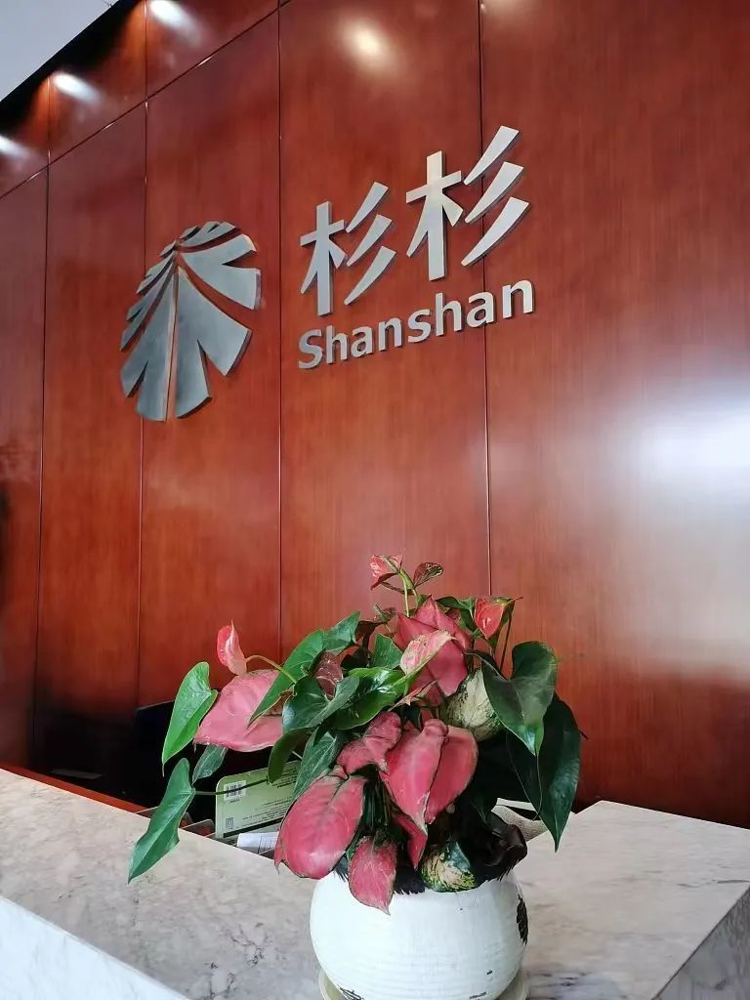

# 400亿杉杉股份：长子与继母的交接班之争

3月23日，农历闰二月初二，星期四。

这一天是第63个世界气象日暨世界气象组织成立150周年纪念日，今年的主题是“天气气候水 代代向未来”。

当天下午，浙江省宁波市鄞州区日丽中路777号杉杉大厦28层会议室里，杉杉股份正在召开2023年第一次临时股东大会，其中一项议题是选举新一任董事长。

今年2月，杉杉股份实际控制人、董事长兼法定代表人郑永刚突然离世。在本次股东大会上，郑驹全票当选为公司新一任董事长。资料显示，1991年出生的郑驹为郑永刚与前妻所生。

然而郑永刚遗孀周婷也出现在当天大会现场，并称该次股东大会是违规和错误的。

_图/视觉中国_

此事一经报道迅速引发全网关注，甚至上交所也向公司发来监管工作函，督促公司及相关方妥善处理有关事项、保障上市公司经营稳定和规范运作。

我国约80%的民营企业是家族企业，而历史上首个交接班的浪潮也已到来。此次杉杉股份家族内斗也给所有家族企业提了个醒：交接班要趁早。

股东大会违规？

一切都要从郑永刚的突然离世说起。

今年2月10日，郑永刚因突发心脏疾病救治无效去世，享年65岁。在他的身后，是一个年收入过200亿元、市值约400亿元的杉杉股份。

资料显示，郑永刚于1989年创立服装品牌杉杉，并在上世纪90年代风靡一时。1996年，郑永刚带领杉杉股份在上海证券交易所成功上市，成为“服装第一股”。

1999年，公司开始向新能源材料领域进行转型。如今的杉杉股份，主营业务已经变成了锂电池负极材料和偏光片的研发、生产和销售。官网显示，2022年，杉杉股份偏光片全球市场份额增长至29%，继续位居全球第一；人造石墨出货量突破20万吨，蝉联全球第一。去年前三季度，杉杉股份实现营收约158.41亿元；归母净利润约为22.09亿元。

根据杉杉股份公告，由于郑永刚的离世，公司董事会成员人数由11人减少至10人。为了保证公司董事会平稳、持续、高效运作和公司整体的稳健经营，董事会积极推进相关董事补选及重新选举董事长的工作。

换句话说，这么大的企业不能没有人掌舵，这也是杉杉股份重新选举董事长的由来。

在此次大会上，郑永刚与前妻之子郑驹全票当选新一任董事长。根据杉杉股份的披露，郑驹，男，中国国籍，1991年出生，无境外永久居留权，本科，清华大学五道口金融学院金融EMBA在读。

事实上，在郑永刚去世前，郑驹已在杉杉内部任职，2019年起担任杉杉系核心平台杉杉控股法定代表人及董事长，2020年1月又升任杉杉集团总经理。

2018年10月，郑永刚在接受媒体采访时谈到企业接班人问题：“我正在培养儿子（郑驹）接班。儿子从小在上海长大，现在公司任总裁，就是学习接班。我在员工大会上公开讲，公司肯定是要儿子接班的。”

据报道，此前在郑永刚的追悼会上，郑驹表示将接过父亲的旗帜，把杉杉建设成为受人尊敬的全球化高科技企业。

但郑永刚的遗孀周婷对股东大会的决议并不认同。资料显示，周婷生于1986年，又名慰笛，曾是一名电视台财经主播。根据公开报道，郑周二人于2017年12月完婚。

3月23日，在杉杉股份的股东大会现场，周婷向到场股东表示，董事会擅自审议未经自己审阅和同意的议案并对外发布，是违规和错误的。

周婷认为，董事会的做法对她和子女应该合法继承的财产及权利造成了损害，也违背了郑永刚先生的遗愿；并且，上市公司治理结构与实控人完全脱节，可能对杉杉股份治理结构、规范运作产生重大不利影响，继而引发上市公司合规性风险。

周婷主张，她作为郑永刚的现任配偶及3名亲生子女的法定监护人，基于继承关系，她应当为杉杉股份的实际控制人，且应由她来填补空缺的董事席位。

有没有遗嘱是关键

不过从法律角度来看，周婷的诉求似乎并不能站住脚。

北京全瑞律师事务所主任律师黄启瑞告诉中国新闻周刊，郑永刚在公司的董事席位及董事长职位是不能继承的。

依据《公司法》及相关规定，公司董事长的职位是由公司董事会以全体董事的过半数选举产生的。而要成为公司董事长，首先要被选举为公司董事。股份有限公司的董事有职工代表担任的董事和非职工代表担任的董事。其中，职工代表担任的董事由公司职工通过民主形式选举产生，非职工代表担任的董事由公司股东大会选举产生。

至于周婷能否成为实控人，则要看郑永刚此前通过何种形式实际控制杉杉股份。

黄启瑞解释道，依据《公司法》及相关规定，实际控制人是指虽不是公司的股东，但通过投资关系、协议或者其他安排，能够实际支配公司行为的人。

有下列情形之一的，为拥有上市公司控制权：投资者为上市公司持股50%以上的控股股东；投资者可以实际支配上市公司股份表决权超过30%；投资者通过实际支配上市公司股份表决权能够决定公司董事会半数以上成员选任；投资者依其可实际支配的上市公司股份表决权足以对公司股东大会的决议产生重大影响；中国证监会认定的其他情形。

根据股权穿透，郑永刚主要是通过宁波青刚投资有限公司（下称“宁波青刚”）实际控制杉杉股份。

郑永刚直接持有宁波青刚51%的股份，而宁波青刚是杉杉控股的大股东（占44.55%股份），杉杉控股又是杉杉集团的大股东（占54.08%股份），杉杉集团又是杉杉股份的大股东（占19.27%股份）。

“但依据《民法典》关于继承的有关规定，郑永刚死亡时持有的公司股份属于郑永刚的遗产。”黄启瑞表示，如被继承人在生前留有有效遗嘱，则按遗嘱安排进行遗产继承；如被继承人在生前未留有遗嘱，则适用法定继承。

因此，遗嘱成为股份归属的关键。

不过郑永刚去世后，杉杉股份并没有披露郑永刚是否留有遗嘱，也没有郑永刚留有遗嘱的确切消息出现，黄启瑞猜测郑永刚生前没有立遗嘱。

“如果郑永刚没有立遗嘱并且公司章程对股份的继承又没有特殊规定的话，他持有的公司股份中原属于他的那一部分将由他的第一顺序的法定继承人继承，包括父母、配偶、子女，且同一顺序的继承人继承遗产的份额一般是均等的。”黄启瑞补充道。

对于周婷的主张，杉杉股份在之后的公告中表示，北京市天元律师事务所见证了本次股东大会，并出具结论意见如下：公司本次股东大会的召集、召开程序符合法律、行政法规、《股东大会规则》和《公司章程》的规定；出席本次股东大会现场会议的人员资格及召集人资格合法有效；本次股东大会的表决程序、表决结果合法有效。

谁才是实控人？

事实上，实控人突然离世，导致家族企业陷入内斗，此前已有先例。

曾以烂尾楼收购而闻名业内的光耀东方，资产规模一度超百亿元。但2017年2月创始人李贵斌意外病逝后，其第二任妻子徐君与小叔子李贵杰、原配妻子之子李烨东对簿公堂，拉锯多年。

家产争夺过程中，光耀东方资产被变卖，且所获资金流向不明；同时公司动荡，人心不稳，经营面临困难。多份法院裁决文书显示，“光耀东方系”核心企业都被列为失信人、限制消费，且可执行资产所剩无几。

在清华大学五道口金融学院全球家族企业研究中心主任高皓看来，杉杉股份内斗给所有家族企业提了个醒，交接班要趁早规划。

提到家族企业，大众对其的第一印象都是神秘又陌生。但实际上，家族企业作为普遍存在的企业组织形态，无论是在我国还是在世界各国，在数量上都处于绝对优势。例如，美国家族企业约占企业总数的75%，而意大利家族企业占比高达93%。

从市场主体总数来看，当前中国有4700多万家民营企业，1亿多个体工商户，其中家族企业约占民营企业总数的80%左右。从上市公司数据来看，截至2020年底，在中国4264家上市公司中，民营企业有2996家，家族企业有2769家——家族企业在中国A股上市公司中占比高达65%。

眼下，我国家族企业交接班的浪潮已经到来。2012年全国工商联发布的《中国家族企业发展报告》显示，未来5-10年大约有3/4的家族企业将面临交接班问题。而近几年便是报告中提及的交接班高峰期。

“从某种意义上说，关心家族企业的传承，也是关心中国经济的健康可持续发展。”高皓指出。

在外界看来，企业传承可能是一个很短的过程，管理者完成股份和权力交接即可，其实不然。

高皓表示，传承不是某个时点上的单一事件，而是一个漫长的过程。根据国际经验来看，提前进行规划准备有助于避免出现重大问题或风险。“这些年经常有企业家问我，从什么时候开始准备企业传承最好？我的回答是：10年前。当然，如果没能从10年前开始，那么最好的开始时间就是今天。”

3月26日，杉杉股份相关人士表示，目前双方已建立起正常的沟通渠道，并就未来平稳解决目前争议持积极开放的态度。

在高皓看来，双方建立沟通渠道肯定是一个积极的信号，但家族内斗的彻底结束还有待各方的共同努力。

根据杉杉股份公告，公司尚未收到任何具有法律效力的书面文件或通知，确认公司新的实际控制人。

值得注意的是，郑永刚控制杉杉股份的源头——宁波青刚，并非由其独资控股。企查查显示，郑永刚持股51%，另一名自然人股东周继青持股49%，同时周继青还担任宁波青刚监事。

有接近杉杉股份的人士对媒体称，周继青是郑永刚的前妻，也就是现任董事长郑驹的生母。根据徽商银行在香港联交所披露的信息，2019年8月29日，郑永刚和周继青均为徽商银行内资股大股东，各持有8.42%的徽商银行已发行有投票权股份，两人均在信息披露的配偶一栏中写下了对方名字。

中国新闻周刊就周继青身份向杉杉股份方面求证，截至发稿尚未收到公司的回复。

参考资料：

杉杉股份法定代表人变更为郑驹，豪门之争是结束还是刚开始？澎湃新闻，2023-03-29

作者：余源

