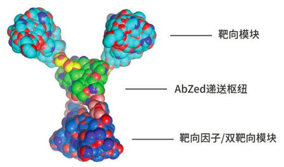

# ChatGPT向癌症开了一枪

出品 | 虎嗅医疗组

作者 | 陈广晶

编辑 | 陈伊凡

头图 |《绝命毒师》剧照

经典靶点的奠基人到中国创业，会带来哪些改变？

前不久，一家名为赛得康的生物技术公司获得种子轮投资的消息，在医药行业媒体来了一轮“轰炸”。除了创业者之一宾夕法尼亚大学副教授张洪涛博士作为知名科普作家的感召力，其合伙人也非常值得关注——Mark
Greene教授是肿瘤治疗经典靶点（HER2）治疗的奠基人。

是的，这个对大多数中国人来说很陌生的人名和生僻的字母组合，曾经突破乳腺癌治疗的瓶颈，给至少20%的患者带来活下来的希望。
**如今他的学生、同为该领域顶尖学者的张洪涛教授带着技术平台归国创业**
，专注于多特异性融合蛋白药物研发，让行业对这个科学家亲自下场实现科研成果转化的明星团队充满期待。

而这家公司的落地实际上也预示着全球第四波新药研发革命浪潮，正在中国达到新的高度。

**两位科学家在中国创业影响几何？“第四波新药研发革命浪潮”对中国来说意味着什么？与之前的浪潮相比，中国的地位正在发生什么样的变化？在它的影响下，新药研发将走向何方？**

从癌基因到靶向治疗

1981年，Robert
Weinberg实验室发现大鼠的基因“neu”发生突变后会导致癌症。这个癌基因“neu”，就是后来被确认的“HER2基因”。1984年， Mark
Greene 实验室的研究证实，针对这癌基因所编码蛋白的抗体靶向治疗，可以逆转肿瘤发展，这奠定了HER2/neu靶向治疗的基础。

1998年，当HER2/neu单克隆抗体赫赛汀获得美国FDA批准之后，乳腺癌的治疗进入了靶向治疗的时代，
**这也成功开启了单抗药物用于实体肿瘤治疗的行业热潮。**

美国癌症协会发布的2022年乳腺癌调查数据显示，过去近30年的时间里，美国乳腺癌总死亡率下降了43%。结合预防意识的加强，手术、化疗等技术的提高，乳腺癌对于很多人来说，已经不再是绝症。

在中国早期患者的10年生存率也可以达到90%以上。

可以说，在今天乳腺癌尽管仍然是全球发病率最高的肿瘤，但已经不是无药可治令人绝望的代名词了。

同时，HER2靶点也展现了巨大的商业价值：目前全球相关药品的年收入总和已超过百亿美元；赫赛汀，自1998年获批到2022年累计销售收入超过了1000亿美元，成了跨国药企罗氏拉动业绩增长的“三驾马车”之一。

伴随着HER2这一具有时代意义的靶点的出现，赫赛汀根本地改变了乳腺癌患者的命运。
**然而临床医生很快发现，早期对赫赛汀敏感的患者中，有一部分很快就对该药产生了耐药，这个比例达到了30%左右。**
行业专家一直在探索，如何以更新的药物作用机制，规避这些副作用和耐药性问题，带来新一代更加安全、有效的HER2癌症治疗。

这一次HER2靶向治疗奠基人和他合作多年的学生来到中国，创立了一家叫做赛得康的生物技术公司，带来的不是抗体，而是一个AbZed多特异性蛋白平台技术。

利用该平台技术所研发的多特异性重组蛋白，正是目前“第四波新药研发革命浪潮”的创新药，而针对HER2所建立的AbZed蛋白，已经在小鼠模型上验证了新一代HER2抗癌药的优越表现效能。

当然，AbZed蛋白不仅限于HER2，它拥有像“乐高”一样的拓展能力，有希望广泛地针对各种癌细胞上的特殊蛋白，设计出一系列的多特异性重组蛋白药物，利用新一代技术，将新的免疫治疗机制精确地递送到目前已经成熟和未来有待开发的靶点。
**赛得康生物技术公司的落地，也表明第四波新药研发浪潮的高峰正在涌入中国。**

“玩抗体”30年

“从最开始的HER2靶点被发现，到赫赛汀获批，我们一直在想怎么去做一个更好的二代的抗体。”Mark
Greene的学生、创业合伙人，赛得康CEO张洪涛教授告诉虎嗅。

**一个新靶点被发现、验证后，往往能催生一批创新药，然而率先上市的新药与后来者相比，往往存在诸多局限性，这是以专利保护为基础的药物市场的进化规律，既反映了技术保护与创新突围之间的妥协，也体现了药物持续创新的机遇和商业驱动力。**

正是在这样的规律之下，医药企业受到政策与市场红利的鞭策，前仆后继地挑战Best-in-Class的药物突破，也在不断探索全新的技术，寻求First-in-
Class的创新药。

1994年加入Mark Greene实验室以后，张洪涛也加入到了寻找更好的HER2靶向药物的研究中。经过多年的研究，他最终聚焦到了
AbZed蛋白的中枢模块。

赛得康的AbZed平台

该结构可以结合并招募体内的天然抗体分子，利用AbZed蛋白上的有超强“导航”能力的模块，对癌细胞形成靶向杀伤；同时，AbZed另一端功能模块可以搭载免疫细胞因子或抗体等功能结构，可以将免疫细胞精确递送到癌症细胞周围的微环境中，突破肿瘤的防护机制；蛋白中间人源化的ZED模块还可以通过多种机制招募免疫细胞，引入ADCC细胞毒作用，进一步加大对肿瘤的杀伤力，一套组合拳下来，实现精准、安全又高效的免疫杀伤。

**“当我们意识到这一技术具有像‘积木’一样的模块更换能力，有潜力作为一个多特异性的药物平台，为更多的癌症靶点带来新一代免疫靶向治疗药，就开始萌生了自己创业的想法。我们希望这项有潜力的技术能真正地转化成药物。”张洪涛向虎嗅解释。**

从最初的拆解蛋白，到后来寻找“蛋白骨架”的设想，前后经历了近20年的研究，直到疫情前夕，他们终于摸到了时机成熟的“苗头”。

2018年，相关研究结果在肿瘤免疫学期刊ONCOIMMUNOLOGY上刊登，这篇以张洪涛为第一作者、Mark
Greene为通讯作者的论文显示，在非常低的剂量下，他们所做的新融合蛋白也表现出了优于抗HER2 /neu单抗的活性。

不同于传统的药物，AbZed“融合蛋白”属于“多特异性药物”，属于第四波新药研发革命浪潮。

第四波新药研发革命浪潮，这一说法是2020年美国知名药企安进公司的全球研究高级副总裁Raymond Deshaies
博士在权威期刊Nature发表的一篇文章中提出的，其核心就是以复杂对抗复杂。

这类药物的一个特异性，是对治疗靶标的识别，将药物所携带的治疗机制限制在人体内特定的细胞区域、分子区域，从而带来特异性更高、更好、更安全的治疗效果；其余的特异性，指的是能够结合其他的效应器，或者激发某种免疫功能，或者促进蛋白降解，或者引发化疗杀伤的效果。

**总之，“多特异性”是第四波药物革命性浪潮的标志，可令传统技术下“不可成药”的靶点得到开发。**

在第四波浪潮之前，单抗药物是第三波浪潮的主流 。根据第三方数据平台Umabs-
DB统计，从1986年美国食品药品管理局（FDA）批准第一个抗体药以来，到2022年6月30日，全球已经有162种单抗药物上市，广泛用于感染、自身免疫性疾病、退行性疾病和肿瘤治疗等领域。

来自：第三方机构弗若斯特沙利文（Frost&Sullivan）报告

**抗体药物颠覆了很多疾病的治疗，许多曾无药可治的疾病正在变成可控的慢性病，其中就包括多种曾经谈之色变的肿瘤。**

然而，这些
“吞金兽”癌症药虽然相比以往疗法效果已有提高，但还远称不上“神药”。低反应率、治疗机制或药物本身带来的毒副作用、用药后的耐药性，复杂的存储和给药方式，成为限制这类癌症药治疗效果的难题。

实际上， **肿瘤等恶性疾病机理复杂，加之肿瘤自身的防御机制，以及疾病对人体内环境的破坏，单一的药物治疗机制往往效果有限。**

张洪涛和他的AbZed平台，正是这样一个可以同时兼顾多项功能的 **“瑞士军刀”**
，不仅可以稳定地结合IgG（虎嗅注：人体感染后生成的一种抗体），极大地提高药物在人体内的稳定性和半衰期，同时可以通过“弹头”将搭载的功能模块“精确制导”到肿瘤微环境中，让更多的治疗机制在肿瘤细胞周围发生功效。

这个平台的特点是延展性特别强。

**“靶向的HER2模块和后面搭载的功能模块都是可以替换的。”** 从产业化的角度，私募基金Forcefield
Ventures合伙人冯孝文博士因为长期关注Greene实验室等研究机构的动向，他很快意识到这个研究的前景远远不是解决HER2一个靶点问题这么简单，他清楚地看到了AbZed模块化设计的优势，可以替换弹头，也可以替换弹药，可以实现对不同癌症的定制化打击，有着无限的潜力。冯孝文博士给张洪涛提出了很多商业化与开发策略上的建议。

经过打磨，他们最终得到了“AbZed蛋白模块技术平台”，前不久获得了Forcefield Venture、晶泰科技和Bopu Capital
的种子轮投资，总金额数千万元。

同时，赛得康也和晶泰科技达成了研发合作。借助AI药物发现平台的进一步加速，AbZed第一款针对HER2靶点的多特异性蛋白药物，已经在生物模型中取得验证，其抗癌活性与耐药性超越单抗药物，目前已获得临床前候选药（PCC），
**开始向临床实验推进。**

“ **AbZed是全球唯一能够’搭载’抗体分子的多特异性重组蛋白分子平台。”**
张洪涛告诉虎嗅。这个平台，类似一种“蛋白骨架”，以“AbZed”为链接枢纽，两端可以链接抗体、免疫细胞因子，同时与体内抗体分子结合形成新的复合物。

他表示，通过与晶泰科技AI抗体药研发平台的合作，平台进一步优化了AbZed枢纽蛋白，提升了其活性及成药性。在首个管线获得验证的同时，还将借助AI研发平台的加持，快速通过模块替换，为HER2之外的潜力靶点设计融合蛋白，持续开发新一代多特异性蛋白抗癌靶向药管线。

第四波浪潮成主流

AbZed平台获得研发进展与VC（创业投资）注资的背后，标志着多特异性药物的研发已走向成熟，正在成为潮流。

**“其实各大公司都在做。”结构生化专家王年爽向虎嗅证实，多特异性蛋白药物研发近年来一直有突破，现在已经成为主流方向之一。**

而以其作用于多个靶点，联合体内体外多种活性成分共同“围剿”肿瘤的机制，这种药物被寄予厚望，有潜力通过与已知药物联用，发挥出“1+1＞3”的威力。

现代制药业的发展主要建立在两次技术突破上。

第一次，是上世纪70年代的“理性药物设计方法”，它改变了以往“观察+碰运气”的药物发现模式，开创了从理解治病机理入手，以干预疾病靶点来筛选、设计药物的时代，也带来了第二波药物研发浪潮；

第二次技术突破，是1980年代诞生的重组蛋白技术，不仅生产出了胰岛素，解决了1型糖尿病无药可治的问题，也让单克隆抗体药物（也就是单抗）、免疫治疗成为可能。在此基础上，新药研发经历了三波浪潮，大分子生物药陆续上市，人们熟悉的抗体药、细胞疗法、基因疗法都在其列。

新药研发四次浪潮示意图。来自Nature。

**这三波浪潮带来了丰富的药物形式与治疗机制，逐渐形成了有竞争有合作的“新药宇宙”。**
同时，一些重磅靶点有望以更新的机制再度开发，产出疗效、毒副作用、适用范围都比前一代更加优越的药物产品，一步步接近“战胜疾病”的愿景。

**虽然每一代技术带来全新的机遇，也有无法解决的机理局限。与HER2类似，需要打破僵局，释放出更多能量的药物和靶点还有很多。**

第四波浪潮所指的多特异性药物，与前三次浪潮最大的差异，是“多重治疗机制”，
以更丰富的结构实现多重功能以对抗疾病。目前热门的双特异性抗体药、抗体与小分子药偶联的ADC，CAR-T、人体内的抗体及细胞因子等通过“纽扣”蛋白链接的分子，都是多特异性药物的具体表现。

以AbZed为代表的多特异性蛋白药物，通过一体化的理性设计，达到活性、稳定性、开发难度的最优化，标志着第四代技术真正走向成熟的应用。

而在此之前，第四波浪潮的“初代”技术发展几经周折，如今竞争正在趋于白热化。

作为一种多特异性药物， ADC（抗体偶联小分子药）
可以很好地解决药物活性的问题，但也具有合成复杂、开发难度高的缺点。AbZed所代表的多特异性药物，因为比ADC少了化学合成的步骤，成本和难度都有所减少。

ADC的早期发展并不顺利。2000年辉瑞在美国推出的Mylotarg，是全球第一个ADC药物，可惜这款药表现欠佳，10年后退市了。在此期间并没有其他ADC药物获批。

与之类似，全球首个双抗直到2009年才获批，因为商业化不成功，也在2017年黯然退市了。直到近年来才重新红火起来。

目前已上市的双抗药物至少有9种、ADC药物13种，涉及多家知名跨国药企，罗氏、渤健，以及前述Raymond Deshaies
博士所在的安进公司都包括在内。另据国泰君安证券统计，全球在研的多特异性药物，仅抗体类就有293个，其中绝大部分集中在一期的双抗药物上。

“
**多特异性药物对创新药开发是一个促进，特别是在技术上有很大突破，给创新药研发的公司也提供了更多的机会，特别是在不改变单个药物分子作用机制的前提下，可以尝试不同的形式的组合。”**
逻晟生物创始人、CEO董欣博士告诉虎嗅。逻晟生物也是一家对双抗、融合蛋白等复杂分子药物开发为主要方向的生物药创新公司。

复杂分子在中国都开始卷了

中国的药企在多特异性药物领域也有成功的表现。

目前已上市的15款ADC药物中，中国有1种，来自荣昌生物；已经上市的9种双抗药中，也有中国康方生物的产品。

在第一批产品商业化失败后，2010年代ADC和双抗都陆续迎来大药。比如：在双抗领域，罗氏2017年推出的针对FIX和FX靶点的Hemlibra，到2022年的年销售额已经达到了45.19亿美元。ADC领域也出现了多款十亿美元分子。

这更加激发了研发的热情，特别是在中国。从国泰君安证券的研报看，中国公开出来的双抗药物就有31条管线，涉及至少17种化合物。较为知名的恒瑞医药、信达生物等都在其中。

在ADC领域，据医药经济报统计，截至2022年11月份，中国国家药监局药品审批中心受理的ADC类药物上市申请已经达到79款。其中22个药的靶点为HER2，占到总量的26%，其次是TROP2、Claudin18.2。

因为选择更多，过去几年中国ADC也成了跨国药企买入的对象，荣昌生物、科伦药业、石药集团都有“license-
out”的战绩，总交易价格已经推高到了接近百亿美元的水平。

**当Greene教授、张洪涛带着新一代多特异性药物技术来中国创业之时，中国也有药企布局多特异性抗体。**

这其中既有传统药企转型而来的上市公司百利药业——根据该公司公开消息，他们的研发平台从双抗一路延伸到四抗、五抗；也有基石药业这样的创新药企，已经拥有了三抗管线；还有李彦宏投资创办的“制药新势力”百图生科，据百图生科首席AI科学家宋乐介绍，该公司的“免疫机器人”可以像乐高一样挂上多种“组件”，在一定条件下触发、发挥特定的功能，这些组件包括但是不局限于抗体药。

**当然，多特异性抗体不像PD-1这样的单抗，竞争是正面直接的对抗。因为多特异性靶点组合、结构、链接方式的不同，有更大的发展空间，可以产生更多样的“全球新”药，但是围绕相同适应症的竞争还是不可避免。**

多位投资人、创新药企研发相关负责人也认为，更多产品上市后，不排除出现PD-1式内卷的可能性。

但如果从患者的角度来说，新药研发上的“内卷”对他们来说有一定好处，比如可以提供更多更具有针对性的治疗选择，也有望将药价降到更低。毕竟在中国，因为医保谈判，曾经高不可攀的免疫疗法价格降到了不可思议的新低。

而对于行业和具体产业来说，在最初的“百家争鸣”之后，逐渐走向某些更集中的领域也是必不可少。“这是企业选择的结果。”董欣向虎嗅分析，能够快速拿到成果，实现商业化成功的路线，大家都愿意走，势必会卷起来。包括双抗在内的复杂分子也是董欣创办的逻晟生物的主攻方向。

多特异性药物的产业成熟以后，哪些方向走不动，哪些地方能够走通，也会越来越清楚，到那时产业集中到那些成本效益高的领域，也就不难理解了。

对于长期关注这一领域发展的冯孝文来说，经过一体化设计的AbZed融合蛋白，除了抗体，还可以将细胞因子等更丰富的功能模块运送到肿瘤微环境中，蛋白中间的ZED模块还可以通过多种机制招募免疫细胞，引入ADCC细胞毒作用加大肿瘤杀伤，以丰富的机制为不同肿瘤定制治疗策略。这是他期待已久的项目，有机会成为“第四次药物革命浪潮”的标杆企业。

从独奏，走向乐队合奏

据张洪涛介绍，动物模型体内试验中，该平台针对肿瘤HER2靶点所设计的AbZed多特异性蛋白也表现出了比单抗更好的抗癌活性，对已耐药肿瘤也表现出良好的抗癌活性。

这个数据仍然需要临床试验的验证，不过也在一定程度上反映了多特异性药物的潜力，验证了AbZed蛋白模块技术平台。

**这是否意味着，类似AbZed多特异性蛋白平台，可以取代单抗，或对其形成降维打击？这种新技术与新药研发又是怎样的关系？**

理论上，这就是一个降维打击。“打个比方来说，
**第一、二、三波的药物就相当于是一把小提琴，或是某种乐器，但第四波浪潮的多特异性药物，是一个乐队，里面有不同的组合，也就有更大的空间。**
”张洪涛向虎嗅表示。

而在实践中，多特异性药物研发本身也是难度很高的。首先，它不能是化合物的简单叠加，如何组合可以达到“1+1＞2”的效果，需要解决临床上哪些问题，是值得入局者考量的。其次，治疗中的投入产出效益问题也是不容忽视的，如果某疾病已有性价比更高的药物，是否还需要“生物导弹”出手？

董欣向虎嗅分析认为， **药物研发正进入一个更加多元化、个性化的阶段。** 多特异性药物对现有的药物结构形式（modelity）更多是一种补充。

可以看到，近年来在基础科学突破迟缓的情况下，新靶点发现越来越难，现有靶点中，能够成药的越来越少，投入越来越多，收益却没有相应增加，这也被行业人士称为新药研发的“反摩尔定律”。新药研发也亟待新技术的撬动。

“现在简单的疾病已经解决得差不多了，我们还是要去解决更多的未被满足的临床需求。”晶泰科技联合创始人、董事长温书豪向虎嗅表示，而
**在这过程中，生物学研究、AI技术都在持续演变中，新药开发平台和各种新技术形成了互补，** **“这对创新药是一波机会”**
。在温书豪看来，晶泰要做的，就是和Greene教授与张洪涛这样掌握新机理、新靶点，对生物学机理有深刻见解的行业专家合作，帮助他们快速将学术突破快速转化为药物管线。

不过，这并不意味着，新技术将解决靶点发现的困难。多特异性药物本质上还是在已有靶点基础上进行的排列组合，虽然可以达到比叠加更大的力量，但是对新靶点的发现并没有直接的促进作用，它的作用更多体现在提高现有治疗水平的方面。

**在缺医少药的年代，人们靠一种药解决所有的问题，忽视个体的差异。在现在制药业发展的基础上，多样复杂的临床需求越来越受到重视，越来越多的研究者也希望用特定药物，来解决细分领域的疾患。**

而与前三波浪潮药物的比拼，还是要看进一步临床试验的结果。“临床试验实际上还是挺复杂的，如何找到最有效的适应症或者某一类病人，包括如何设计一个分子结构形式，都没有固定答案，必须从临床实践中发现。”董欣向虎嗅强调。

也就是说，无论是“所谓简单结构”的单抗，还是“复杂分子形式”的多特异性药物，未来前景如何都需要临床数据、实际疗效来支持，究竟是谁取代谁，还是互相补充、配合都需要在实践中寻找答案。

AI使第四波浪潮成为可能

**前述提到多特异性药物在最初的几十年里，发展并不顺利。今天之所以能形成爆发式发展趋势，本身也依赖技术的进步。**

温书豪告诉虎嗅，晶泰科技对赛得康的孵化正是看中了两家平台强强联合带来的更大机遇。晶泰的AI抗体药研发平台，可以对抗体分子实现快速的理性设计与性质优化，将多特异性融合蛋白的研发周期显著压缩，能让赛得康以更低的成本将AbZed的优势拓展到其他肿瘤治疗管线中。

晶泰科技“AI+机器人实验+专家经验”三位一体的研发模式，让人工智能算法与自动化实验机械臂，成为科学家的效率工具，可以成几何倍数地拓展新药搜索空间的同时，又能更好提高验证的效率和成功率，其公开发表的合作信息显示，这种AI+机器人的研发模式相比经典方法至少缩减一半研发时间。

过去两三年时间里，AI制药技术的质变已经在发生。Alphaford2已经破译了2万多亿个蛋白质结构，“一键生成蛋白”的技术已经在应用。

**chatGPT大火之后，根据多家科技公司的透露，AI大平台，类似chatGPT的蛋白质生成平台也早就有初步成果了。**

这里面有李彦宏创办的生物科技公司百图生科的全球首个生命科学大模型，超大规模 AI 模型驱动的生命科学平台
AIGP平台；也有晶泰科技的AI抗体药物生成算法，这被团队称为“ProteinGPT”，其一键生成的大分子药物已获得了实验验证。前沿的AI技术在生物医药领域落地成全新的算法工具，都相继向大众亮相。

“在坚持制药新势力的同时，我们也想应用平台定制蛋白的优势，与药企合作，为双抗、ADC等复杂分子提供偶联蛋白。” 百图生科联合创始人、首席执行官刘维告诉虎嗅。

围绕新药研发，AI制药领域，“智能算法、（机器人）湿实验、专家经验“三位一体”的创新模式正在形成一种新的行业范式。在其中智能计算能力的提高，也在酝酿更大的改变。

**“人工智能的发展落地确实是量变引起质变的过程。”**
温书豪向虎嗅表示。在这个过程中算法的突破将会带来指数级的改变。“未来，AI与机器人技术会像水和电一样，成为新药研发的一种基础设施。”而算力的不断提升，AI与新技术的持续融合，也让算法对更复杂体系的模拟成为可能，以精确的预测为研发保驾护航，持续提高药物临床实验的成功率。

可以说，AI制药等新技术的发展，给复杂分子研究提供了新的可能性。新药研发的第四波浪潮背后，也带有AI技术渗透在多个环节，加速和赋能多特异性药物的设计与研发。新一代多特异性药物，或许正加速向我们走来。而AI能发挥多大价值，中国企业是否能在这片广阔的市场中掌握先机，还需要在漫长的研发中经受考验。

**当然，无论是第四波浪潮还是AI技术、大模型都不应该被过度神化。未来，他们都还有很长的路要走。AI技术还需要与产业的持续互动，才能实现更大突破。**

中国创新药企的野心和内卷

由于基础研究普遍较弱，已有科技成果转化难等问题，长期以来，中国医药创新主要依靠在医药行业沉浸多年的海外研究者回国创业。

**而从创业者心态看，与20年前第一批回国创业者希望让老百姓吃上便宜的靶向药不同，新一代创业者更加希望能够抢占“全球新”的高地。**

和导师Mark一同回到中国创办赛得康的张洪涛，就曾不无遗憾地告诉虎嗅，以往实验室的研究成果都是交给药企去做转化，结果往往是没有得到足够的重视，最后让竞争者后来居上。

**“现在竞争非常激烈，如果你不能很快的把它推进，那么你就失去了先机。”张洪涛说，如果不出来创业，只是发几篇文章，并不能达到你想达到的目的。**

这个目的除了有抢占“全球新”的野心，还有希望更快让药品上市治病救人的信念。

之所以选择中国，也与中国的创业氛围、产业支撑等因素有很大关系。其中，非常关键的因素就是成熟、完备、性价比高的CRO服务体系。CXO，也就是为药企提供“合同外包服务”的组织。目前有CRO、CMO、CDMO和CSO等，可以围绕研发、生产、销售等药品研发产业链提供支持。

中国的“工程师红利”之下，中国CXO取得快速发展。根据第三方机构观研报告数据，2017年以来仅CRO市场就从290亿元增长到了2021年的639亿元，预计到2026年将达到1878亿元。这一行业年度增长最高达到34%，普遍都在20%以上。这个增速远超同期医药行业整体的增长。

而AI药物研发服务作为新一代研发技术，正逐渐成为药企在激烈竞争中降本增效、提高研发成功率的重要工具而备受青睐。一些AI药企选择自建管线，投入从靶点发现到临床实验的创新药研发；也有像晶泰科技这样的服务型平台，以广泛的合作与AI+模式的赋能，寻求药物研发的规模化效益。这样的技术正在成为中国药企创新转型中的AI“新基建”。

据第三方研究机构艾瑞建模测算，2020年到2025年间，中国AI制药的市场规模年复合增长率可以达到56.8%。

这些都给回国创业者，甚至是海外的创业者提供了信心和保障。

然而从整体来看，新药产业的挑战仍很明显，其中最为突出的瓶颈问题，就是如何让新的生物学发现跨越商业化“死亡之谷”，如何快速争取到研发投入，并在投资耗尽之前转化为药物产品。

当然，在有的时候，上市并不等于“善终”。“中国创新药不能上市，一旦上市就没有故事可讲”，已经成了投资界广为流传的话题。其背后原因是多方面的，既有创新药本身商业化难的问题，也有中国药企不擅长创新，靶点过于集中带来的同质化竞争、低水平重复问题，乃至定价体系不完善的问题。

**这些也引发了“内卷导致同质化竞争，进而导致国产创新药医保谈判价格越来越低，导致企业入不敷出难以持续创新”的恶性循环**
，最终导致新一轮国家医保目录谈判前，至少13个符合条件的国产创新药主动弃权。其中就包括了康方生物的双抗。

医保基金是中国医药市场最大的支付方，曾经是新药最看重的对象。离开医保支付，这些新药的前途如何，也将影响投资界对新药价值的评估，在某种程度决定着创新药的走向。
**这些并非技术进步就可以解决的。**

