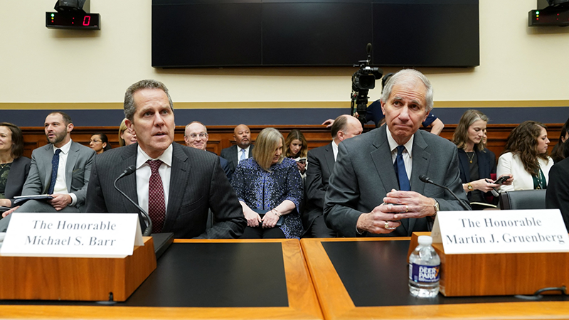

# “2018年的特朗普政府对银行太过友好”，美国白宫呼吁监管机构收紧

为防微杜渐，美国拜登政府计划收紧针对中等规模银行的监管力度。

近期（3月30日）， **白宫呼吁金融监管机构加强对资产规模介于1000亿至2500亿美元之间的中等规模银行的监管。**

白宫在声明中明确将责任指向了上一届政府，表示在特朗普政府时期，共和党放松对银行业监管，而当下需要收紧监管力度。如果白宫的想法成为现实，这将意味着2018年针对中小银行的多德-
弗兰克规则松绑将被重新推翻。

面对此波因硅谷银行倒闭而引发的银行业震荡，特朗普政府是否应当“背锅”？

欧洲工商管理学院(INSEAD)经济学教授、经济与政策研究中心（CEPR）研究员法塔斯（AntonioFatas）是国际货币基金组织（IMF）以及美联储的外部顾问，毕业于哈佛大学。

他对第一财经记者表示，银行希望放松监管，这并不是一个新鲜事儿，“银行本就不希望被监管，它们希望能更自由地开展业务，希望在监管问题上减少花销。因此，这可能发生在本届政府、下届政府或下下届政府。但出于本身特质或政治色彩，的确有些执政者对银行更为友好。显然，2018年的特朗普政府对银行太过友好了”。

绕过国会加强监管

白宫此次还呼吁美国监管机构探索增加资本压力测试的频率，并恢复对此类银行提交综合处置计划的要求。

“（拜登）总统认为，特朗普政府期间对大型地区性银行的常识性银行保障和监管削弱应该得到扭转，以加强银行体系并保护美国的就业和小企业。”白宫在声明中表示。

同时，白宫方面还希望银行加强压力测试，“以确保拥有1000亿美元或更多资产的银行有足够的资本来承受不断上升的利率”。

目前，鉴于美国国会同美国政府之间在银行业监管方面存在严重分歧，拜登政府正在寻求不需要通过国会立法审批，可直接由监管机构采纳和实施的措施。

白宫的提议呼应了美联储负责监管的专职副主席巴尔的评论。他在近期的听证会上表示，建议对于资产超过1000亿美元的贷方，需要制定更严格的资本和流动性标准。

同时，他在分析硅谷银行破产原因时，也称美联储本可以在监管方面做得更好。“当发生这样的银行倒闭时，背后是银行的管理无方，监管者失察，我们的监管系统失灵。”

美国财政部部长耶伦也表示，随着硅谷银行和签名银行接连关闭，美国政府需要重新审视银行业管理和监管规则，以确保解决当前的银行系统风险。

不过，目前国会方面的共和党立法者对需要更严格监管的想法进行了反击，暗示拜登的提议将在国会遭到强烈反对。

美国众议院金融服务委员会主席麦克亨利表示：“我们不应向在这些银行倒闭之前睡着的监管机构授予更多权力，而应让他们对无法利用现有监管工具负责。”

BCG董事总经理、全球资深合伙人、BCG金融机构专项中国区负责人何大勇接受第一财经记者采访时表示，硅谷银行的问题表面上看起因是美联储的加息，但实际上银行的资产负债表本来就是有问题的。

“其实两年前就有一家基金公司对这家银行进行过测试，告诉过他们资产管理是有问题的，如果利率发生变化，就会产生很大的问题，而且其客户也集中在创业企业，但是他们没有采取行动。除了市场的原因之外，银行本身自身管理还是出了很大的问题，引发连锁反应，这一类的小银行在市场当中产生了动荡。”何大勇表示，预计整个美国监管成本会进一步上升。过去可能对大银行严格监管、大量罚款，现在硅谷银行事件之后，监管的力度可能会更大。

他并进一步解释道：“从2008年金融危机之后，从欧债危机一直到现在，长期低利率的环境下，肯定是做了很多高风险、高收益的业务，积累到现在，加上市场的波动，导致了损失。其次，集中度的风险，带销了很多家庭理财产品，背后还是风险管理的问题，高风险业务的敞口管理，包括客户和交易对手的集中度。所以，最后其实原因也是风险管理的问题。”

特朗普的“锅”

法塔斯对记者则表示，欧洲银行譬如瑞信也出现了法律和金融问题，但欧洲没有银行出现硅谷银行类的问题，其原因在于2008年之后，“欧洲的监管机构比美国要小心得多”。

欧洲监管机构严格到法塔斯总会听到业界抱怨在欧洲难以开展业务，“在美国我可没听到这种抱怨。”他说。

他并对记者解释道，欧美在监管上的区别在于监管机构的严格程度，其对银行的监督有多频繁，对银行进行压力测试的频率有多高，确保这些银行的资产负债表即使在最坏的情况下也能差强人意，“欧洲以更高的频率执行着这样的规则。而美国在2008年后收紧了监管，但在2018年后又放松了一些监管，特别是对中小型银行”。

例如，“目前在美国，硅谷银行这样的银行无需每年进行压力测试，但欧洲则有要求必须每年都做。”他说，“这些事情可能看起来是小事，但非常重要。如果银行有问题，你不必等待几年后才能发现，因为这些问题会暴露在压力测试中。”

在他看来，特朗普政府时期放松监管，对银行业“没起到积极作用，这是错误的方向。也可以说，这是银行业游说的结果”。他说，“在硅谷银行破产前担任行政总裁的贝克（GregBecker）曾主张减少监管，他后来得到了自己想要的东西，很明显，当初的决定和现在所发生的事情之间存在着联系。”

法塔斯所说的是贝克曾在2015年的参议院听证会上，要求放松多德-
弗兰克规则中的监管规则，他和其他几位银行业高管要求参议员将应受这种扩大监管水平的银行的门槛从500亿美元资产提高到2500亿美元。

最终这些游说，在2019年促成了一项由时任总统特朗普签署的法案，按照硅谷银行和其他银行的要求取消了监管。

