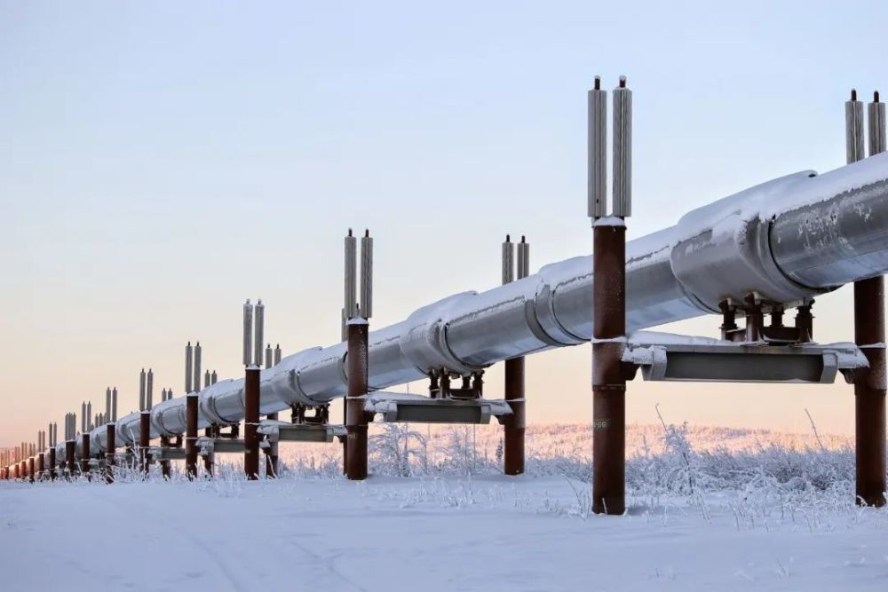
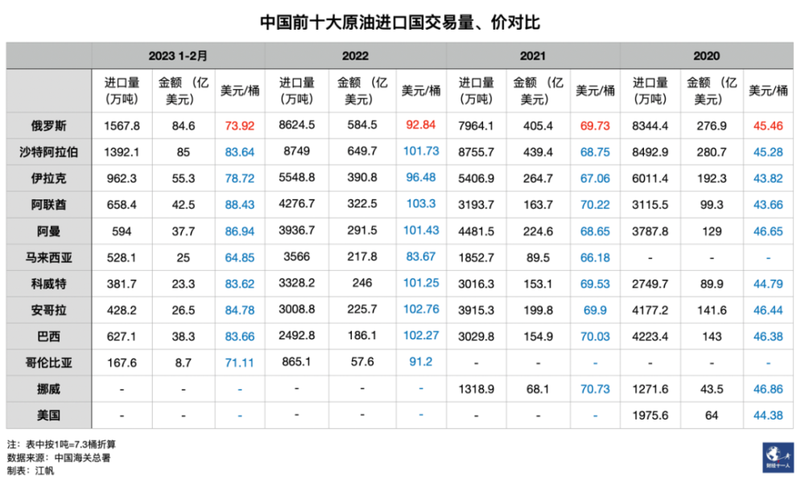
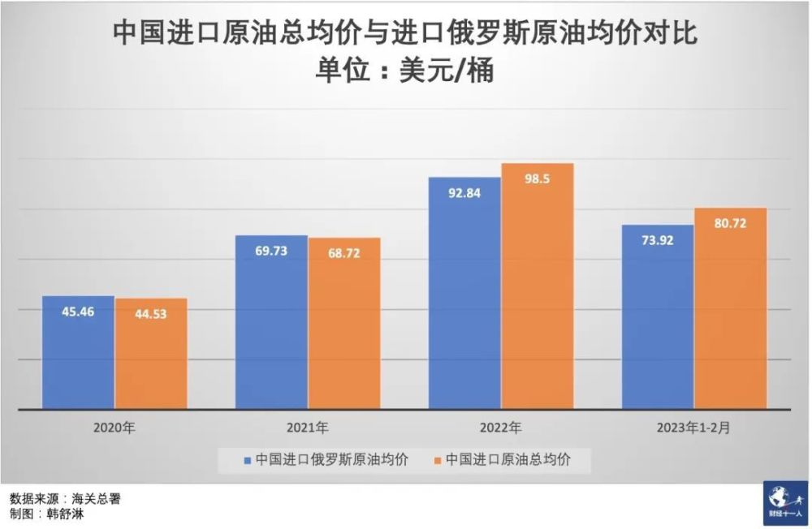

# 中国在高价购买俄罗斯原油吗？

2022年以来，中国进口俄罗斯原油的价格在十大进口国中第三便宜。进口量与俄罗斯相当的沙特原油，均价则比总进口均价高出近10美元/桶

**文｜江帆 徐沛宇 韩舒淋**

**编辑 | 马克**

俄罗斯再次超过沙特，成为中国原油最大的进口来源国。

3月20日，中国海关总署数据显示，2023年1-2月，中国进口原油总量共8406万吨，进口金额495.2亿美元，分别同比下滑1.3%、5.3%，其中自俄罗斯进口1567.8万吨，自沙特进口1392.1万吨，俄罗斯暂时超越沙特，成为中国最大的原油进口国。

近七年来，中国最大原油进口国的头衔在俄罗斯、沙特之间交替，2016-2018年为俄罗斯，2019-2022年为沙特。

2022年，中国前十大、前五大原油进口国的进口量分别占总进口量的87%、61%。沙特与俄罗斯的比重接近，分别为17.2%、17%左右，同比上升0.1个、1.5个百分点。

2023年头两月俄罗斯再次超越沙特后，有关中国进口俄罗斯原油的价格问题也再度成为热议话题。“中国从俄罗斯进口了全球最贵的原油”、“
俄罗斯原油卖印度35美元/桶，却卖中国80美元/桶”等言论四起。

事实真的如此吗？

**俄罗斯原油第三便宜**

2022年2月乌克兰危机升级后，美国、欧盟等相继对俄罗斯施加多轮制裁，涵盖原油和石油产品；6月，欧盟决定禁止进口俄罗斯的海运原油和石油产品（2023年2月5日起生效）；12月，欧盟、七国集团和澳大利亚对俄海运出口原油设置60美元/桶的价格上限。

2023年3月27日，中石油经济技术研究院发布的《2022年国内外油气行业发展报告》显示，从俄罗斯石油海运出口流向来看，目前依然以亚欧市场为主，但流向欧洲市场的海运石油占比趋势性下降。与冲突爆发前相比，2022年12月，俄罗斯海运原油出口至欧洲占总出口的比重由56%降至33%，亚洲占比由30%升至66%。

随着欧美对俄油制裁全线生效，俄油“西降东升”趋势明显，全球石油贸易结构进一步重塑。从月度数据来看，2022年2月乌克兰危机升级后，2022年5月、6月、7月、11月、2023年2月，俄罗斯均为中国最大原油进口国，沙特紧随其后。欧盟统计局最新数据显示，2022年12月，欧盟18%的进口原油来自美国，美国替代俄罗斯成为欧盟最大原油供应国，而俄罗斯进口原油占欧盟进口总量的比重已从年初的31%降至4%。

中国海关总署数据显示，2023年1-2月，中国从俄罗斯进口原油同比增长24%，约1568万吨，占总进口量的近两成，折合约194万桶/日（按1吨=7.3桶折算）。价格方面，进口金额84.6亿美元，均价折合约73.9美元/桶，同比下降12%。

2020年、2021年、2022年、2023年1-2月，中国进口俄罗斯原油均价在十大进口国中分别位列第六、第六、第八、第八。同期，中国原油总进口均价与进口俄罗斯原油均价的差额分别为-0.93美元/桶、-1.01美元/桶、5.66美元/桶、6.8美元/桶。

**由此可见，2022年以来中国进口俄罗斯原油的价格正在走低，油价在十大进口国中第三便宜。**
进口量与俄罗斯相当的沙特原油，均价则比总进口均价高出近10美元/桶。

中国进口俄罗斯原油分为陆上管道油和海上运输。

陆上东北方向经东西伯利亚-
太平洋原油管道（ESPO），从斯科沃罗季诺至中国大庆为其中国支线（中俄原油管道），年供应能力为3000万吨，为俄罗斯石油公司和中石油集团间的长期供应合同，合同期限为30年，价格有较大优势。2022年供应量大约为2973万吨。价格约78.7美元/桶。陆上西北方向经中哈原油管道每年进口1000万吨俄罗斯原油，2022年初续签10年合同，共1亿吨，交易双方为俄罗斯石油公司和中石油集团。

海上原油进口分东向和西向。东向来自ESPO管道在太平洋的终端——俄罗斯科季米诺港。ESPO管道的输油总能力为8000万吨，其中3000万吨至中国支线，5000万吨至科季米诺港。自从中国放开原油进口权后，ESPO油受到中国贸易商，特别是地炼的青睐。因此这5000万吨油很大部分为中国企业采购。

西向来自俄罗斯西部的港口，主要为乌拉尔（Urals）原油。俄罗斯出口乌拉尔原油的港口包括波罗的海的普利莫尔斯克港和乌斯季卢加港，以及黑海的新罗西斯克港和图阿普谢港。由于距离比较远，中国进口商此前较少进口乌拉尔油。

**印度“35美元”的低价从何而来？**

3月28日，俄罗斯能源部长Nikolai Shulginov表示，俄罗斯已经成功地将受西方制裁影响的所有原油出口转向“友好”国家。

中国、印度成为俄罗斯原油的两大进口国。2022年，俄罗斯石油出口总量达到2.42亿吨，增长幅度为7.6%。根据中国海关总署、印度商务部数据测算，中国2022年进口俄罗斯原油约8625万吨，印度2022年进口俄罗斯原油约3221万吨，分别占俄罗斯出口总量的35.6%、13.3%。

在中国高价进口俄罗斯原油的议论之中，有关“俄罗斯区别对待，原油卖印度35美元/桶，却卖中国80美元/桶”的讨论非常热烈。这一说法混淆了两个概念：乌拉尔（Urals）原油和ESPO原油，离岸价和到岸价。

首先，俄罗斯海上原油出口主要分为乌拉尔原油、ESPO原油两大类。乌拉尔原油主要供应给欧洲和西半球，ESPO原油主要供应亚洲。

一般来说，油品质量主要取决于API度和含硫量两大指标。API度是显示石油及石油产品密度的一种量度，API度越高，密度越小，原油越轻，价格也越高。

综合来看，油品API度越高、含硫量越低，品质越好、价格越高。根据油气领域咨询机构阿格斯（Argus）统计，乌拉尔原油API度为29.77-30.71，含硫量为1.6%-1.7%；ESPO原油的API度为35.08，含硫度为0.59%。也就是说，ESPO原油相对乌拉尔原油品质更高，因此定价也更高。据阿格斯3月30日最新的估价数据，乌拉尔原油离岸价45美元/桶左右、ESPO原油离岸价66美元/桶左右，存在超过20美元的价差。

**换言之，同样是原油，油品却有明显差异，价格也不能简单直接对比。这就好比一个中配的 iPhone14
Pro和一个低配的iPhone12，同样是iPhone，定价显然会有差异。此外，这种价格差异不仅有油品差别的原因，还有贸易流向、计价方式的因素。**

其次，由于俄罗斯出口乌拉尔原油的港口相比ESPO到印度距离更短，2022年乌克兰危机升级后，欧洲国家弃购乌拉尔原油，为寻找新市场，俄罗斯出口商开始为乌拉尔原油打折，相比印度之前采购的中东油有价格优势，3月底向印度报出35美元/桶的折扣价。因此印度从2022年开始大量采购乌拉尔原油。

但这个“35美元/桶”是不包含运费、保费的乌拉尔原油离岸价。根据阿格斯最新的股价数据，乌拉尔原油至印度的DAQ到岸价（不含清关费用）在58美元/桶左右。

国际现行通用的贸易方法一般分为离岸价（FOB）、到岸价（DES）。离岸价即船上交货价格；到岸价即成本、保险和运费的总和。

**中国进口的俄罗斯原油主要是ESPO原油。由于ESPO原油品质更好，且基本在亚洲销售，并未受到欧洲弃购的严重影响**
，因此2022年以来ESPO原油价格相比乌拉尔原油更高，但由于运输路途近，在途时间短，仍受到国内进口商的青睐。乌拉尔原油虽然便宜，但路途遥远，且运费、保费受制裁影响严重波动，从成本上看并没有绝对优势。

据阿格斯最新估价，乌拉尔原油到岸中国价格较布伦特油价低10美元至11美元/桶；ESPO原油到岸中国价格较布伦特油价低6.6美元/桶，价差仅约5美元/桶。此外，习惯加工ESPO原油的炼油厂也不会轻易更改油种。

综合船运数据推测的出口流向来看，乌拉尔原油出口变化明显，出口到欧洲的原油大幅减少，其减量主要被印度承接，并在2023年延续了这一趋势。而面向亚洲的ESPO原油出口继续以中国为主要目的地，也有少量ESPO原油出口至印度。

此外，从海关数据比较来看，2022年以来，中国、印度进口俄罗斯原油的均价也较为接近。

根据印度商务部网站公布的最新贸易数据，2023年1月，印度从俄罗斯进口的原油总量为604.6万吨，价值32.45亿美元，均价折合73.5美元/桶。同期，中国进口俄罗斯原油的均价折合74美元/桶。

2022年，印度进口俄罗斯原油3321万吨，价值214.55亿美元，均价折合88.5美元/桶。同期，中国进口俄罗斯原油的均价折合92.84美元/桶。

（刘乾对此文亦有贡献）

