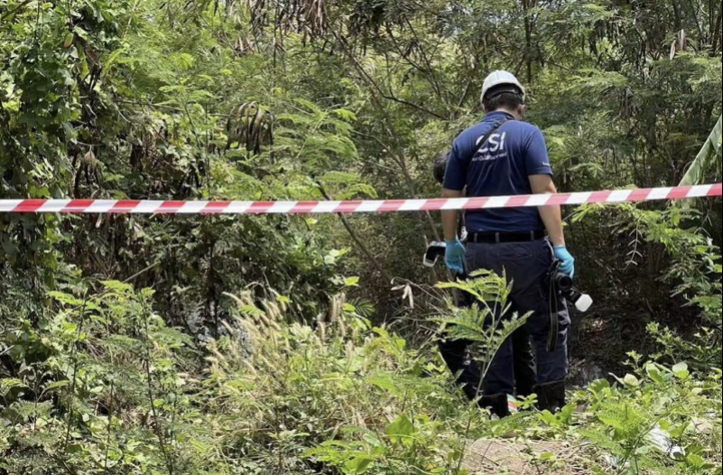
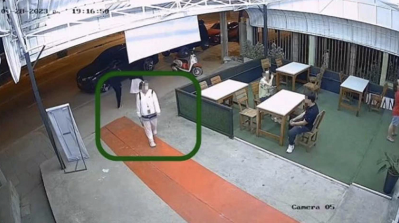

# 中国女留学生在泰国遭绑架后弃尸：嫌犯为3名中国人，已逃离泰国

南都记者获悉，4月1日，泰国暖武里府BangMaeNang警局接到报案，称在当地Ton Chuek
Salaya寺附近一片香蕉林的水沟中发现一个塑料袋，里面装有一具女尸，手脚被捆绑且有被殴打的痕迹，初步判断死亡时间已有约3至4天。经泰国警方初步调查，死者为日前失踪的中国留学生Jin
Can（音译），嫌疑人为3名中国籍男子，现已逃离泰国。

_尸体在一片香蕉林被发现。_

据了解，此前3月31日，曼谷一所大学负责中国留学生事务的老师前往警局报案，称一名音乐专业大三年级的中国留学生Jin
Can失踪。当地警方、移民局等相关部门立即展开调查，寻找该学生下落。直至当地时间4月1日9时许，警方在暖武里府Ton Chuek
Salaya寺附近一片香蕉林的水沟中发现死者尸体。

泰国警方随后对死者生前行动轨迹进行了详细调查后透露，死者大一至大二期间均为网上授课，刚于今年3月8日入境泰国以继续完成学业。监控录像显示，死者曾于3月28日打车前往暖武里府BangYai区的一家百货公司，随后失去踪迹。

_3月28日，死者曾打车前往暖武里府BangYai区的一家百货公司。_

经调查，3月29日上午，死者父亲曾收到来自嫌疑人的勒索信息，要求其将50万元人民币转入一个中国账户。但由于不确定女儿的具体情况，其父亲没有在第一时间给歹徒转账。

据悉，3名嫌疑人为预谋作案，他们在BangYai地区租了住所和车，经常徘徊在这一带。经泰国警方调查，3名嫌疑人已于3月30日离开泰国。目前，泰国警方正进一步搜集整理相关证据。

采写：南都记者 翁安琪

