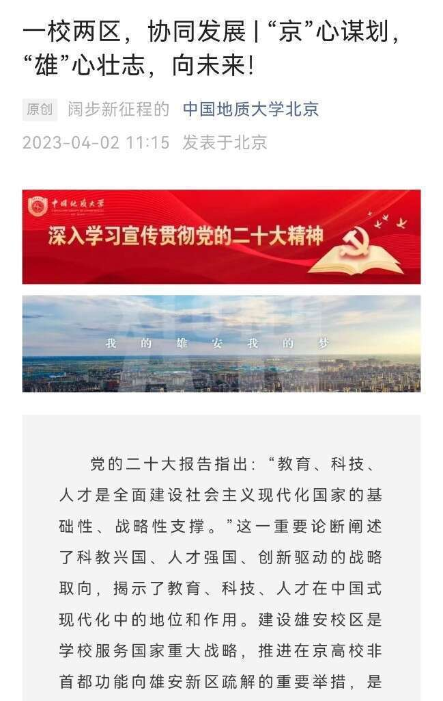
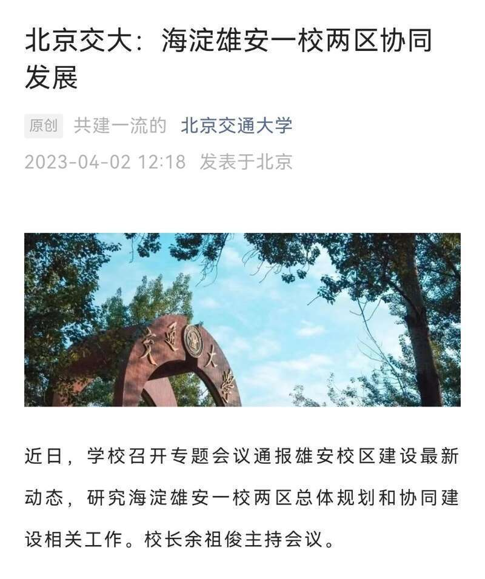

# 北京三所高校同日发声：北京雄安一校两区协同发展

中国青年报客户端北京4月2日电（中青报·中青网记者
叶雨婷）今天，中国地质大学（北京）、北京交通大学、北京科技大学相继在其官方微信公号上发声指出，其北京与雄安校区“一校两区，协同发展”。

_相关内容截屏。_

中国地质大学（北京）表示，将统筹谋划推进大学科融合、大科学计划、大科学装置、大科技项目、大资源平台、大自然文化和大校区建设，立足北京、雄安两校区特色功能定位，为加快实现建设地球科学领域世界一流大学的战略目标谋篇布局，高标准、高起点、高站位推进学校高质量内涵式发展。

中国地质大学（北京）指出，将继续发挥学校传统优势，持续加大北京校区建设力度，全面提升北京校区高层次人才培养、高水平科技创新、高质量社会服务和国际合作交流功能，传承和发扬学校历史发展底蕴，围绕首都“四个中心”功能定位，努力将其打造为地学高层次拔尖创新人才培养基地、国际地学交流合作中心；高标准、高质量推进雄安新校区建设，实现校园面积的实质性扩展，办学品质的整体性提升，打造地球系统科学及新兴交叉学科融合创新研发人才培养基地、国际地学前沿科技中心。

近日，北京交通大学召开专题会议通报雄安校区建设最新动态，研究海淀雄安一校两区总体规划和协同建设相关工作。校长余祖俊主持会议。

会议强调，雄安校区作为新校区，是学校落实中央和教育部关于雄安新区建设、疏解非首都功能等战略部署，解决学校办学空间不足，着眼下一个百年发展的长远布局。北京海淀校区作为北京交通大学这所百廿老校赓续发展的根基，将进一步保持优势，突出特色，调整结构，持续做优做强。雄安校区和海淀校区要优势互补，协同发展，一起成为学校人才培养、科学研究、服务国家重大战略、服务北京国际科技创新中心建设的重要基地，共同为北京交通大学建设特色鲜明世界一流大学提供有力支撑。

_相关内容截屏。_

3月31日，北京科技大学召开“学科建设大讨论—雄安校区建设规划”专题研讨会。据悉，会议重点研讨了“一校两区”总体规划，明确学校以雄安校区建设为重大契机，围绕首都“四个中心”功能定位和高质量建设雄安新区要求，推动北京校区和雄安校区“协同发展”，实现融合互补、同向发力。

其中，北京校区围绕首都“四个中心”功能定位，重点建设高水平人才培养基地、科技创新基地、文化传承创新基地和国际交流基地。雄安校区是未来高层次人才培养和科技创新的重要承载地，服务国家战略和地方发展，推动联合研究生院、重大科技创新平台建设，助力雄安新区建设全球人才和科技创新高地。学校坚持疏解与发展并重，推动北京校区与雄安校区协同布局、协调发展，积极构建“一体两翼、互为支撑”的事业发展新格局，坚定不移向建设世界一流大学目标迈进。

据了解，3月27日，推动首批四所疏解高校协同创新座谈会在雄安新区召开。首批4所到雄安建立新校区的在京高校负责人中国地质大学（北京）校长孙友宏、北京交通大学校长余祖俊、北京科技大学党委书记武贵龙、北京林业大学党委书记王洪元参会并发言。

来源：中国青年报客户端

