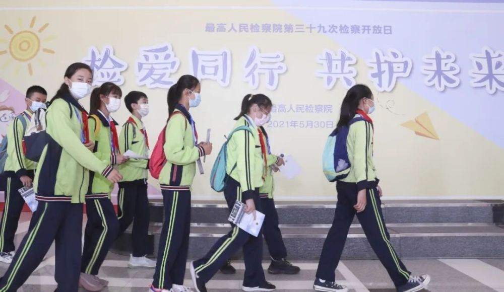

# 媒体：猥亵儿童教师二度犯案，“从业禁止”不是句空话

依法惩处猥亵惯犯，追责问责也不能止步。

_▲2021年5月30日，最高检举办“检爱同行
共护未来”检察开放日活动。图/新华社_

**文| 柳宇霆**

又一起教师性侵未成年人再犯的恶性案件被“曝光”。

据九派新闻报道，近日，湖北咸宁中院在审理一起猥亵儿童案中，发现通山县某小学教师邓某，曾在2014年因猥亵儿童行为被家长反映到学校。当时该县教育行政部门和原学校调查后未作任何处理，又将邓某调至另一所小学继续任教。2020年，邓某利用职务便利再度犯案。

随后，法院向该县教育局发出司法建议书，督促其对辖区教职员工从业限制查询、强制报告制度以及教师资格证监督管理等职责指导落实到位，确保辖区内在校未成年人合法权益。应该说，这一“跟进式”司法举措很有必要。

2021年《未成年人保护法》大修后，在建立强制报告制度的同时，规定“国家建立性侵害、虐待、拐卖、暴力伤害等违法犯罪人员信息查询系统，向密切接触未成年人的单位提供免费查询服务”；教育部也依据《教师法》《教师资格条例》等法规，对加强教师资格证监督管理也作出了明确规范。

平心而论，如果这些规定动作能落实到位，那些有猥亵等性侵未成年人劣迹的不法分子，就能被提前“筛查”并“拒之门外”。但令人遗憾的是，此案中，邓某在犯事后，家长曾告上门来，也经过当时该县教育行政部门和原学校的所谓“调查”，按说就该揪出“大尾巴狼”，以绝后患，结果却是“未作任何处理”，只是将邓某调至另一所小学继续任教。

这种“敷衍”做法的后果是，不仅向学生伸出魔掌的邓某，免去了被绳之以法的“牢狱之灾”，不需要付出任何违法成本，更掩藏了被后续强制报告、入职查询发现的“蛛丝马迹”，也让更多未成年人沦为猥亵惯犯的不幸受害者。

当新的一起猥亵案件“曝光”后，邓某应当为其违法犯罪行为付出应有的代价。有关部门对邓某犯案的查处，不仅是最新的犯罪活动，也包括可能的“余罪”。虽其猥亵违法犯罪已是9年前，但根据刑法规定，这一犯罪“法定最高刑为十年以上有期徒刑”，故而追诉时效为15年。

而且，对于邓某这种死不悔改者，基于有“猥亵儿童多人或者多次猥亵”等恶劣情节，一旦定罪，可能“处五年以上有期徒刑”，这也是邓某践踏法律所应获得的严厉惩罚。

当然，追责问责也不能止步。或许，在当时的该县教育行政部门和原学校方面看来，“家丑不可外扬”，对邓某的猥亵行为“点到为止”，也是为了学校声誉和受害者着想，也能保护一个“犯错误的教师”，但这种包庇行为后果却是灾难性的，也违反了法律和纪律规定。

有关部门在查办邓某案件的同时，也应同步进行“一案双查”，如果有关人员涉及包庇犯罪，以及违反党纪、政务纪律，也应严肃查处，这也是回归正义的应有之义。

亡羊补牢犹未晚矣。尽管我国重视未成年人权益保护，从修缮未成年人保护法，到出台两高司法解释，各部门联合发文规范，编织了一张保护未成年人不受性侵的法网，但从邓某“劣迹”被掩饰，到再度犯事，仍暴露了当前防范未成年人性侵制度的“bug”。

今年全国“两会”时，时任最高检察院检察长张军回顾说，五年来从严追诉性侵、虐待、暴力伤害等侵害未成年人犯罪29万人，表示要对侵害未成年人犯罪 “零容忍”。

保护未成年人，法治永不止步。针对此类案件，有必要在查清犯罪事实、严惩犯罪分子的同时，健全包括“从业禁止”在内的各项法规制度，加大监督落实的力度，让法网更加细密周延，“天衣无缝”，为未成年人打造更安全、更放心的法治屏障。

撰稿 / 柳宇霆（法律学者）

编辑 / 何睿

校对 / 赵琳

