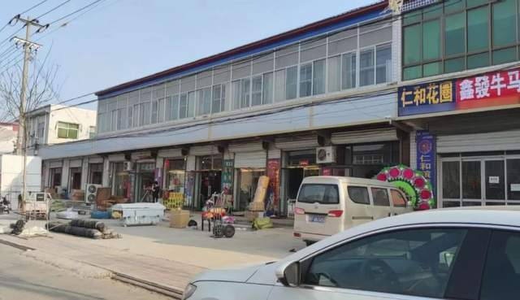
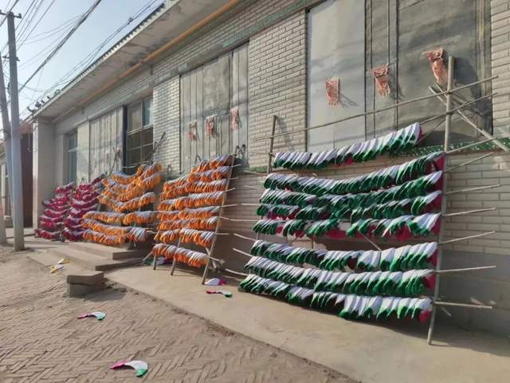
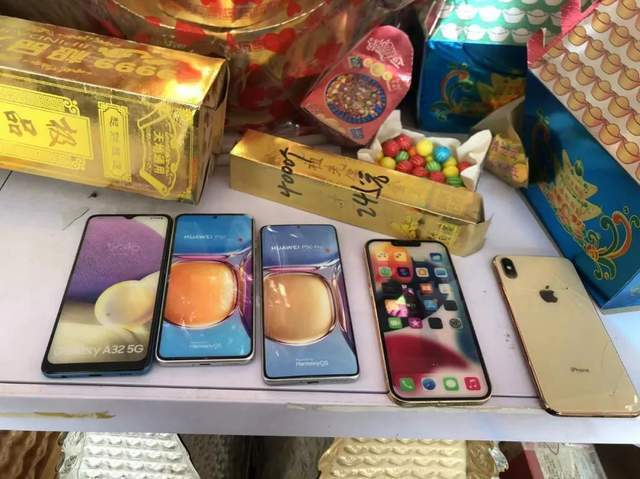

# 徐德痕“死了”，多少钱能够风光

去缅北之前，我先去了趟河北。

本人徐德痕，电子厂打螺丝一周后，本以为会得到读者的鼓励，没想到居然有人在后台留言，想把我送去缅北体验电信诈骗。（年轻人选择进厂打螺丝：底薪基本按最低薪资标准，大量工厂只招女性）

更要命的是，领导仿佛真的动了“邪念”。看着网上的报道，我捂着“腰子”开始思考如何给自己安排后事。

我，徐德痕，必须要风光！

我咨询了单位附近的丧葬用品商店，一套寿衣3800元，一个骨灰盒6200元。

我站在店里犹豫了，我大概率，可能是，“死”不起了。老板看出了我的犹豫，但并不想在价格上让步。

正当我思考单位哪位同事可以支援我筹办风光后事时，网上一则消息吸引了我的注意。

“全中国的丧葬用品，你都可以在这个河北村庄一站式购齐，价格只有城里的十分之一。”

我信了，然后我就去了。

**首先，我需要一个盒**

目的地是一个叫做米北庄村的村庄，地处保定市雄县。北京往南行车1个小时，拐下高速路口，再走个几百米就到了。

到了村里，首先映入眼帘的，是一条约一公里的长街，以及上百家门店上突出的“殡葬”字眼。

路边停着不少小皮卡、小货车，有浙江的、内蒙古的、山东的、陕西的、湖南的……一辆江西车牌的大卡车装得满满当当，来这里上货的人来自天南地北。

看着路边树上挂着的绢花、纸花，地上摆着的花圈、纸马，那感觉像是进入了一个异世界。

_路边各种式样的殡葬用品店。拍摄：徐德痕_

年轻人才做选择题，作为一名成年人，我选择都要。

我清楚记得，本山大叔曾经在春晚上说过：“说人好比盆中鲜花，生活就是一团乱麻，房子修得再好那只是个临时住所，这个小盒才是你永久的家呀。”

首先，我需要一个盒，在其他商家的指引下，我推开了一家据说在村中经营了20年的寿盒店。店内墙上有块十字绣牌匾，上书五个大字——“诚信赢天下”。

在我的想象中，售卖殡葬物品的店家并不会像其他商品那般热情招呼我，但事实截然相反。

老板不是本地人，操着明显的浙江口音，但很热情，也很直接。

“东西都摆在柜子里，你随便选，这些都是几百块钱的货，要的量大可以便宜。”

整柜的盒，让我有点选择困难，很快我发现了一个与我在北京店铺中看到的材质颜色雕刻都接近的盒子，向老板询价。

老板顺着我的手指看了一下，“价格都差不多，都是几百块钱。”当真价格只有北京的十分之一。随后，我又发现了一个长得酷似棺材的寿盒，但是做工明显粗糙了很多，“这个多少钱？”“这个你要的话，一百块钱。”

老板告诉我，自己的店铺是做批发的，和全国很多地方的殡仪馆有合作，量走得最大的都是这些。“你要更贵的，手工雕刻的，也有，但是我们这边销售得并不好。”

寿盒之所以利润高，在老板看来是因为寿盒相比于棺材，价格已经低了不少，并且和其他丧葬物品要“烧掉”不同，寿盒有长久保存的性质和需求，又没有行业的统一标准，所以价格上不封顶。

“大城市，一个寿盒卖到几万元，可能很正常。”

**“穿啥不是烧？”**

按照当地的说法，置办了盒之后，必须置办的还有寿衣。就在市场街的东侧便有不少家经营寿衣的店铺，我又进入了一家寿衣店。

老板娘是位年轻母亲，刚刚结束午休后，送孩子上学回到店中。店中寿衣的样式同样和我在北京见到的大同小异，只是和整套的不同，在这里，每一个元素都可以分别批发购买。

见我什么都不懂，老板娘和我介绍了起来，每个地方讲究不一样，上衣裤子的件数层数，铺盖的布的颜色，层数都不一样。衣服的样式从唐装、西装到中山装都有。

老板娘向我介绍，一些地方，寿衣的要求是大，必须比本人大很多尺寸，这样才显得“家境殷实”，但是另一些地方则不需要这些，单衣即可当做寿衣使用。至于寿衣到底要买什么价位和怎样的套装，要严格遵照当地习俗。

“寿衣材质一般有棉、绸、真丝等，材质越好价格也就越贵，贵的几千块钱一套，便宜的几百块钱可以置办齐。和寿盒不一样，寿衣卖不上价。大家不认可。”老板娘对我说。

我反问她，“北京有些老字号企业销售的寿衣，当地人非常认可，价格也很高。”

老板娘告诉我，“北京是个例外，绝大部分地区尤其是广大农村地区，寿衣是卖不上高价的。因为绝大部分人都认为，这个衣服最后都是要烧掉的，穿啥不是烧呢？”

“如果一件寿衣卖到了一千多，一个月能卖几件？有这个钱还不如去买一件真的，你说是吧？”老板娘问起了我。

虽然寿衣卖不上高价，但是好在工厂是自己的，自己可以严格控制产能和库存，这就可以严格按照订单进行生产和批发销售。

“一般来说啊，冬天比夏天卖得好，最近清明节，不是销售寿衣的旺季，因为大家都忙着祭扫。”

“可不可以穿着自己的衣服烧？”虽然便宜的只需要几百元钱，但是我看着粗糙的面料和怪诞的图样还是有些抗拒。

“老人多大岁数了？你愿意让他穿着自己衣服烧么？他自己愿意么？如果本人愿意，穿什么衣服都能烧，推进去出来都变成灰。”

我看了看身上穿的卫衣和裤子，在心里表示，“徐德痕老人非常乐意穿着自己的衣服烧。”

那么，寿衣钱看来是可以省下的。

**“这个电子花圈也能烧吗？”**

据我了解，米北庄村之所以被称为殡葬村，重要的原因是这里曾经出产手工纸花，并且扎花圈的水平很高，据说毛主席去世时，使用的花圈就是米北庄村手工制作的。

一场白事的排场，除了搭棚和吹鼓班子，花圈就是最直观的体现。

很快，道路两边一些带有LED板，闪闪发光的巨型花圈便吸引了我。老板正在门口向一辆货车上装货，我上前询问，这些东西是送到哪里去的？

“保定、山西，都有，一趟车都发走。”老板扎着箱子头也没抬地回我。

由于刚才在寿衣店中，“能烧”被反复提起，我脱口而出，“这个电子的花圈，也是烧的么？”

老板抬起头笑着说，“这个不能烧，这个可以反复用。”

我仔细看了一下花圈的构造，是用一个不锈钢架子，插满了绢花构成的，中间是一块LED板，后面有条线，可以连接电源。

见我有兴趣，老板和我介绍，这东西叫电子花圈，可以反复使用，独立售卖价格约为400元，还可以配合铝合金桌面变成一个花圈台来陈列。一般用于白事或者殡仪馆或者火葬场的仪式使用。

“里面的文字、颜色都可以改，用手机就能直接改，还可以增加模块配合音乐变化。周围绢花的大小颜色都可以根据要求定制。”

在老板的店中，有工人正在将绢花插入花圈中，工人告诉我，这些花都可以替换，用几年后觉得不好看了，可以再换一拨。

之所以有电子花圈存在，是因为近年来各地流行文明祭扫，很多地方禁止焚烧祭扫，所以这个产品应运而生。

我问老板，一场白事用多少花圈合适？老板说这东西自己看着办，用得越多显得越气派。

和电子花圈相比，市场街上更多的还是纸质花圈，从颜色上来看，这些纸质花圈的颜色更加浮夸，做工显然也更加粗糙。

我拉住一位经营纸质花圈的店家询问价格，他告诉我170元，我正在算170元和400元之间相差多少的时候，店家补了一句，“170元10个，我们走批发，合17元一个。”

可能是听见了我和邻店的对话，店家特意告诉我，“我们这个可以烧，用打火机一点，烧得可快了。”

**别墅、豪车、金元宝，我都要**

离开了“花圈区”再向西，各种各样的纸活就都出现了。

纸人、纸马、纸宫女、这些放古代是皇室专属的，如今都可以“烧”给我。

以纸人为例，纸人比从前有更多的款式，无论是男还是女，丑的漂亮的，老的少的应有尽有。如果不满意纸扎产品的大小，商户可以进行1 :
1还原，给用户一个极好的消费体验。

而现代人喜欢的“悍马”“路虎”“保时捷”同样可以烧，四合院、大别墅甚至冰箱彩电洗衣机，能烧的印刷品应有尽有。

由于是印刷品，批发价很便宜，2-3元钱甚至更低便可以拥有“一套四合院”，甚至还有最新款的手机，手机的还原度很高，甚至可以模拟背板碎掉的样子。

除了简单的印刷品之外，还有一些塑料制品，我询问老板这些手机模型也是可以烧的么，老板给了我确定的答案。

和寿盒寿衣等畅销品相比，在米北庄村，这些纸活属于常销品。

_米北庄村里有人晾晒纸花。拍摄：徐德痕_

一年中有三个祭扫的节点，清明节、上元节、寒衣节，在这三个节日之前，纸活的销量最好，就当我在店中摆放着的“豪宅”前流连忘返的时候，店里来了三四个客户和老板讨论生意。

可能因为我看上去比较可疑，老板并没有当着我的面和客户进行沟通，而是将客户带出了店门外，但是我依稀还是可以听到声音。

“现在买就三块，你拿回去卖二十，卖二十五也能卖掉，过两天你拿就是两块五，没办法，这两天就是这个行情。”

我打开手机记事本，一件一件记下我要的东西的单价，“四合院3元、水果14Promax8元、路虎揽胜4元……”

_店内的“新”款手机。拍摄：徐德痕_

突然抬头看到了货架上的纸做的金元宝和银元宝，我恍然大悟。

谁知道下面流通的是什么？市场又是什么行情？不管什么年代硬通货还是最重要的，元宝是按照某个规格打包好的，包装上面手写着价格。

“一件共16000个，205元。”

我再次记下金元宝的价格后，看向了店门口一辆闪闪发亮的川崎牌摩托车。

刚好结束和客户沟通的老板和我四目相视，猛然张开嘴说，“这个是我买的，不能烧。”

尚未离开的客户帮腔道，“啥不能烧，只要钱到位，都能烧。”

在米北庄村逛了一天后，大部分商户告诉我，这里的东西之所以会便宜，是因为殡葬物品没有统一的定价，而米北庄村的殡葬产业，是非常依靠二级经销商和物流的，但在抵达了销售终端后，商品所产生差价带来的高额利润，这里都无法享受到。

伴随着殡葬改革和风俗的变化，人们对于入土和祭奠的需求也逐步发生了改变。本地村民有不少在村中从事了几代的殡葬买卖，但也都对于未来的前景担忧。

和米北庄村人的担忧相比，更担忧前景的可能是我。在村中，不少热情的商户帮我算了一场“白事”需要花的钱，在行内叫做“一条龙服务”。

“寿衣、寿盒、仪式、相关产品都算上，便宜的话几万块钱就可以搞定。”

但不少商家告诉我，在这一场人生大事中，真正的大头还不是这些，而是墓地，有些城市的墓地价格，已经超过了房价。

各位看官，您看缅北我还去么？

