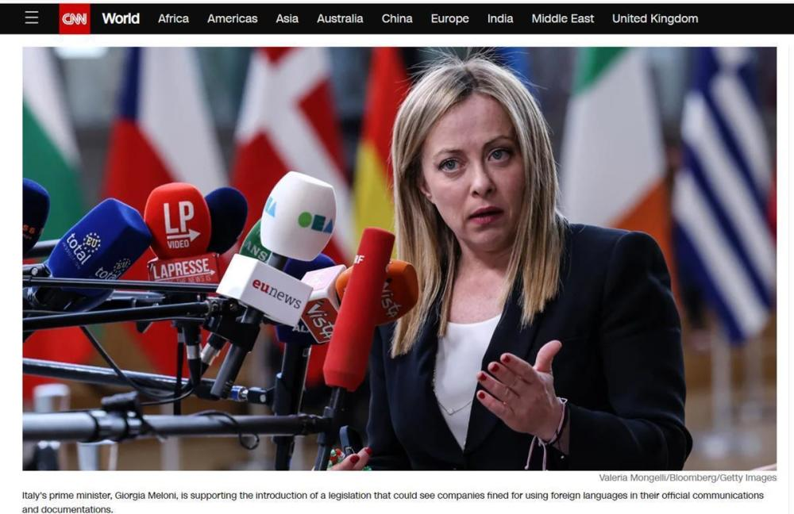

# 意大利政府或将禁止使用英语，违者最高罚款10万欧元

极目新闻记者 李曼英

据CNN4月1日报道，近日，意大利执政党——意大利兄弟党向众议院提议，设立法律禁止使用外语，违反者最高罚款10万欧元（约合74.4万元人民币）。目前，这一立法提议已经得到了意大利总理梅洛尼的支持。

_报道截图 图片来源：CNN_

据报道，虽然该立法草案涵盖了所有外语，但它特别针对的是英语的使用。因为越来越多的英语词汇进入意大利词典，不利于保护意大利本国语言。更何况，英国不再是欧盟的一部分，这让情况变得更糟。因此，该草案明确禁止在官方文件中使用英语。

根据CNN记者看到的立法草案，该草案的第一条要求，即使在与不讲意大利语的外国人打交道的办公室，意大利语也必须是使用的主要语言。

公共行政部门在任何情况下都需要使用意大利语。其次在意大利境内，公共部门和私人机构之间交流必须使用意大利语。在意大利境内的示威、集会、游行等均需使用意大利语。任何意大利的机构、公共行政部门、国营企业、基金会的工作人员，必须具备书写和口头意大利语的能力。不仅如此，在用人单位的劳动合同中也必须是用意大利语签署的。各级学校和意大利公立大学，除非是专门的外语培训课程外，其他课程必须使用意大利语。在意大利的外国公司必须拥有所有内部法规和雇佣合同的意大利语版本。对违反该法规定者，将受到行政处罚，罚款金额为5千欧元至10万欧元不等。

根据立法草案，意大利文化部将设立一个委员会，其职权范围包括在学校、媒体、商业和广告中“正确使用意大利语及其发音”。

目前，该立法草案尚未进入议会辩论阶段。

（来源：极目新闻）

