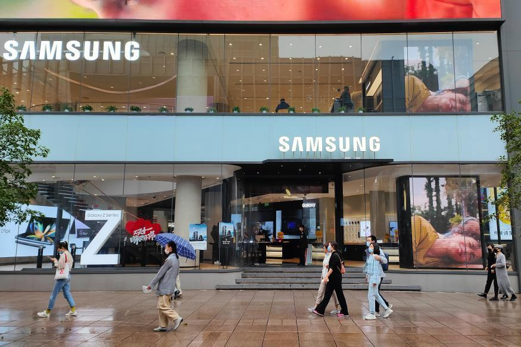
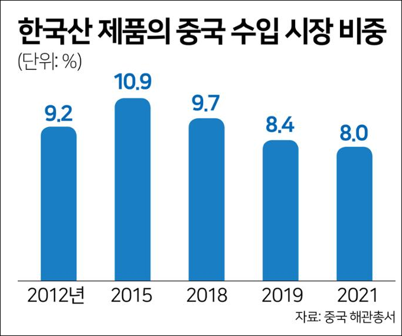
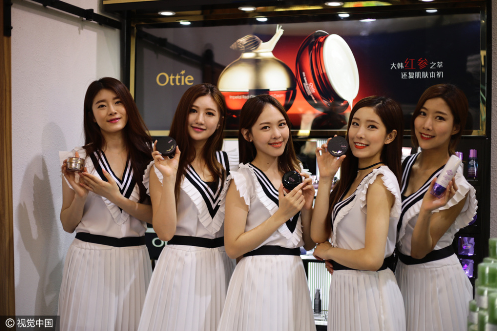
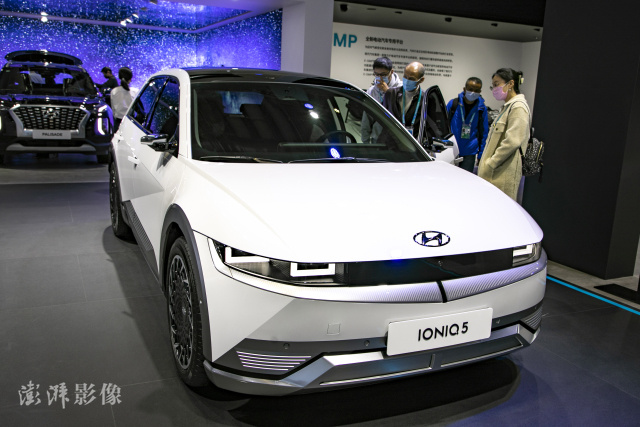
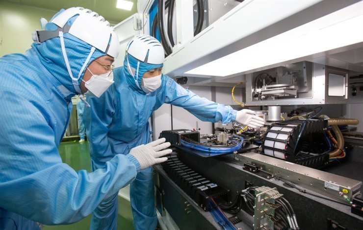
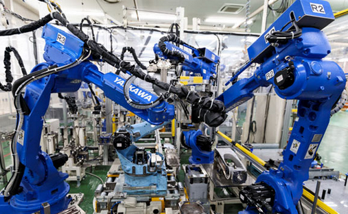
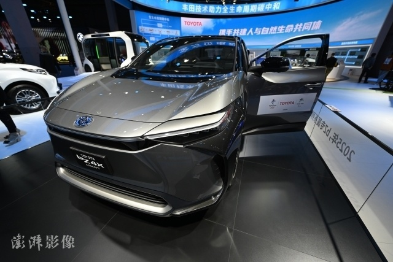
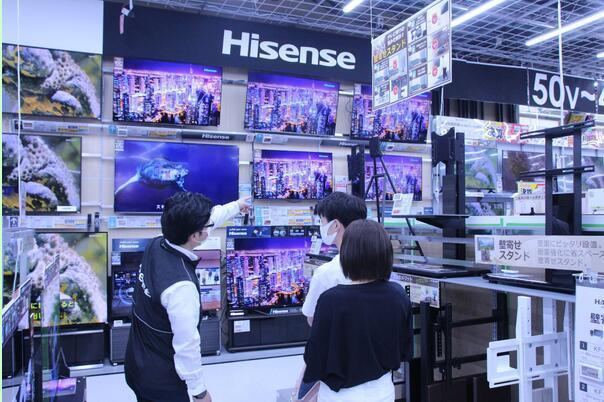

# 手机不行了，化妆品也卖不动，韩国商品为什么在中国不吃香了

【文/观察者网 刘程辉 编辑/冯雪、郭光昊】

“韩国汽车不行了，化妆品也不行了。”

“想起来也就10年前买过三星的相机和电视。”

“随美国起舞，难怪在中国卖不动，真解气！”

近期，“韩国对华贸易或31年来首现逆差”的消息让两国经贸话题再度升温，韩国贸易协会上海代表处3月发布的一则报告也在社交媒体上引发讨论：在对中国市场1000人进行问卷调查后，这份报告得出了一个令很多中国消费者颇有同感的结论——近年来韩国商品在华人气大幅下滑，少有人问津。

从汽车到化妆品，中国市场上“韩潮”向“寒潮”的嬗变，早已引发韩国媒体关注。去年7月，《朝鲜日报》便以《被中国市场抛弃，‘韩国制造成回忆’》为题报道形容，中国企业的飞速壮大“将韩企挤出市场”；《韩国日报》今年1月撰文，直接将韩国商品在华占有率下降归咎于“美国激起中国人的爱国情绪”。

在韩国商品在华降温的同时，日本制造似乎也“不香了”。随着越来越多的本土家电受到青睐，国产汽车在销量榜上攻城略地，中国电商、汽车、家电品牌“登陆”日韩的消息屡有传出，让很多网友感叹“今非昔比”。

在韩国对外经济政策研究院北京代表处首席代表李尚勋看来，影响韩货在华市场表现的因素有很多，但中国品牌的崛起及产品品质的升级，可谓最根本的原因。中国社科院世界经济与政治研究所助理研究员石先进特别提到，未来韩国商品在华是否能走出低谷，既要看两国的政治水温和中国经济走势，也取决于韩国品牌能否在华重塑自身竞争力。

上海对外经贸大学日本经济中心主任陈子雷则提醒，对日韩品牌在华销售遇冷不应盲目乐观，还要从更长远的角度看待。从总体上来看，日韩仍在部分关键制造业技术和工艺领域领先世界，中国企业可在新业态和新消费模式等方面发挥自身优势，彼此的合作前景非常广阔。

_韩国三星位于中国的一处门店（资料图）_

**韩货遇冷，中国品牌崛起是根本**

3月5日，韩联社一篇题为“疫后韩货在华遭冷遇”的报道在社交媒体传播开来。韩国贸易协会上海代表处的这项调查有几项数据值得关注：与疫情初期的2020年相比，中国消费者对韩国商品形象的好评比例下滑5个百分点至54.5%，而差评比例激增6.6个百分点到10%；商品评价不好（35.9%）、国家形象（34.6%）、竞争力不足（33.6%）成为调查对象不买韩货的主要原因。

实际上早在疫情暴发之前，韩国商品在中国市场占有率已连年出现下滑。

去年12月27日，韩国政府下属非营利贸易促进机构大韩贸易投资振兴公社（KOTRA）发布报告显示，尽管2012年至2021年间，中韩两国之间的贸易规模持续增加，总体交易额有所增长，但韩货在华市场表现疲态尽显——2012年，韩国商品在中国进口商品市场的占有率为9.2%，2015年达到峰值10.9%，此后逐渐下降，到了2018年和2019年分别降至9.7%和8.4%。2021年则跌至近10年的最低值8.0%。

_韩国产品在中国进口市场所占份额（《韩国日报》图）_

韩国《亚洲日报》2月援引汽车行业数据，现代汽车2016年在华销量达180万辆，市场份额稳定在10%左右。但此后销量节节下滑，2017年“腰斩”至78.5万辆，到了2021年和2022年仅分别为35.2万辆和25.4万辆，市场份额萎缩至1%。

在化妆品领域，《日经亚洲评论》去年3月报道称，韩妆品牌爱茉莉太平洋正缩减其重要中档品牌悦诗风吟在中国的门店网络规模，另一家韩妆公司LG生活健康试图转向美国市场“突围”。韩国元大证券的数据显示，2021年第三季度，这两家公司美妆产品在华销售额分别下降8%和2%。

_2016年上海美博会，模特展示韩国品牌化妆品（视觉中国）_

回顾起曾经的“韩货热”，石先进说，当时韩流文化受到欢迎，一些地方卫视等电视台积极引进韩国影视剧、音乐和综艺节目以及明星，趁着这股东风，韩国商品以高品质、创新性和时尚为卖点，吸纳了大量中国消费者的关注和信赖。反观当时的中国本土品牌尚处在发育和成长阶段，在价格和质量方面难与韩货竞争。

“但现在，情况变了。”石先进指出，影响韩国产品在中国市场的表现的因素很多，有政治关系、消费者偏好、国内竞争、经济环境以及文化因素等诸多方面。

值得注意的是，韩国媒体对韩货在华遇冷多有剖析，不乏将其归因于中美对立的论调。例如《韩国日报》今年1月5日刊文称，“‘韩国制造’在华市场表现日渐萎靡，都因美国激起中国人的爱国情绪”，这篇报道援引韩国政府下属贸易促进机构的相关报告内容，将近些年韩国商品在中国市场占有率明显下降的原因归咎于美国。

_《韩国日报》：“韩国制造”在中国市场遇冷，因美国激起中国人的爱国情绪_

石先进认为，从一方面看，中国国产品牌的崛起确实对进口品牌造成一定的竞争压力，因为中国制造的部分产品在质量和价格方面毫不逊色国际品牌，拓宽了国内消费者的选择范围。另一方面，中美贸易矛盾的确会影响中国消费者对国外进口产品的购买情绪，作为美国盟友的韩国自然会受到波及。还有不容忽视的一点是，韩国商品在华热度下降还可能与韩流文化降温、韩国货本身的质量、价格、营销等因素有关，如果韩国商品无法满足中国消费者的需求和期望，便很难维持在中国市场的竞争力。

“中国品牌的崛起和中美矛盾加剧是最重要的两点原因。”李尚勋表示，中国品牌力量的增强正在形成替代韩国商品的消费趋势，应该说是最根本的原因。另外像新能源汽车这样的新消费趋势出现，也有一部分原因。

但同时，李尚勋认为，韩媒提到的有关中美矛盾因素确有影响，但只会短期存在。

“在中国市场，美国的特斯拉、苹果手机的人气还是相当高的，毕竟当人们进行合理消费时，会考虑到商品的价格和品质，也就是所说的性价比，有的人还会购买某一特定品牌的产品来满足自身消费需求。”李尚勋说，“按照长期的趋势看，企业的品牌和性价比是最关键的因素。”

**萨德风波、手机自燃……韩货面临信任危机**

从大韩贸易投资振兴公社发布的数据可以看到，2015年可以说是近年来韩国商品在华市场占有率的峰值。

中国社科院亚太与全球战略研究院副研究员李天国认为，韩货遇冷其实是随着中韩两国比较优势的变化产生的现象，无法归因于特定年份。中韩两国之间一直是以中间品贸易为重要特征，而随着国产化进程的提升，大量从韩国进口的中间品被国产中间品替代。

此前，韩国全国经济人联合会亚太合作组组长李在洙曾表示，随着中国技术的快速发展，韩国对中国的中间产品出口正在减少，而中国制成品的进口数量正在增加，现在已很难在对华贸易中赚取巨额利润。

李尚勋则注意到，其实在2005年的时候，中国进口商品市场中的韩国商品的占有率就达到过11.6%的峰值，然后有一段小幅度下降；到了2015年又上升到了10.9%，但后来就逐年下滑，所以说2015年是个很明显的转折点。

_2021年上海第四届进博会，韩国现代起亚展台（澎湃影像）_

对于这一现象，他列举出三方面的因素。首先是中国科学技术和创新能力的提高：中方优化产业和经济结构，实施了以创新驱动为主导的发展战略，推进供给侧结构性改革、互联网+等战略性新兴产业的培育，提高了中国的科学技术和创新能力。这就导致在钢铁、机械、电子电器等领域的韩国产品被中国国产商品替代。

另一方面，这种现象与中国进口商品市场日趋激烈的竞争有关。李尚勋分析，中国经济维持了很长时间的高速发展，进口规模飞速增长，很多国家都在努力增加对华出口。按照整体趋势来看，在2015年以前，韩国商品的占有率逐渐取代了日本，但在2015年之后，韩国被东盟取代的趋势愈发明显。

此外，半导体是韩国对华出口的主力产品，占据了对华出口约30%的比重。但台湾地区对大陆的半导体出口增加较快，也对韩国产品市场占有率的下降起到了一定的影响。

“一边是中国品牌的壮大，另一边韩国也面临着信任危机。”石先进提到，2015年过后不久，韩国政府一意孤行引发萨德风波之际，中韩关系受到严重冲击，中国国内对韩国观感普遍恶化，导致中国民间消费对韩国实体商品及服务类产品的需求大为缩减。也正是在这个时期，在中国优化经济结构和政策红利的驱动下，厚积薄发的中国企业逐渐成长并壮大起来，技术和品质获得了大幅提升，推出了很多新的产品。中国电商发展也促进国产品牌的营销，使高质量国产品牌在中国市场有了立足之地。

_“萨德”反导系统（资料图）_

“除外部环境外，韩国品牌的营销没能很好地跟上中国市场环境变化。”石先进认为，一方面是价格因素，部分韩国品牌在中国市场的定价过高，多数中国消费者对价格还是比较敏感，高价不符合中国消费者的购买习惯和需求。另一方面，部分韩国品牌没能在本地化和差异化方面下功夫，许多韩国品牌在中国市场的定位缺乏差异化，无法凸显其与其他中国品牌的区别，难以吸引消费者的关注和信任。

“中国消费者不再一味追求进口货，消费偏好回归理性，特别是一些韩国产品质量问题引发了公众的担忧和质疑，比如三星手机频发爆炸和自燃事件，也导致中国消费者对韩国品牌信任度下降。”

**日韩商品“不香”了，但部分领域优势仍在**

和韩国商品一起失意中国市场的，还有一些日本品牌。“十年前还感觉日本货自带高端的标签，但不知不觉间，如今添置家电或汽车时很难首先想到日本品牌了。”有网友在社交媒体上这样说道。

1979年，松下电器与中国签订协议，拉开了日本家电企业在中国发展事业的序幕。随着中国改革开放不断深化，日本品牌在华遍地开花。国泰君安证券统计的历史数据显示，1990—2000年这十年间，日系品牌的销量、占有率均达到历史巅峰，松下一度占据近20%的中国彩电市场份额。

_松下在杭州的工业区（松下中国官网）_

“那时候，中国的产业能力无法满足人们日益高涨的物质需求，多数中国人成了日本品牌家电的拥趸。”石先进说。进入21世纪，在国内品牌壮大、民族情绪和价格战带来的市场压力下，许多日本品牌开始黯淡下来，拖累了其在全球市场表现。

根据德国数据公司Statista统计，2020年全球主要家电制造商前五排名为海尔、LG、惠而浦、美的和BSH（博世及西门子）。电视方面，TCL、海信、小米、创维等销量靠前；空调方面，格力、美的、海尔长期占据全球市场的前三。

遭遇“骨感”现实的还有一众日本车企。据日本“东洋经济在线”网站报道，日系车在华乘用车市场的占有率从2020年的23.1%大幅下降到2022年的17.8%，而2022年日本品牌在华新能源汽车市场的占有率仅为1.7%。

“市场竞争是残酷的，随着中国国产品牌的崛起和新消费趋势的出现，日本商品在过去的优势领域受到冲击是必然结果，至于未来如何，还要看外部环境、市场的走向和企业能否把握机遇了。”

石先进认为，对于日韩企业来说，他们在对华贸易的产品和市场策略上不尽相同，有各自优势领域，面临的情况存在差异。

_韩国三星电子半导体生产设备（资料图）_

从产品类型技术实力来看，日本和韩国在某些领域存在重叠和竞争，也各有特色。韩国以消费电子、半导体、汽车等领域的技术实力著称；日本的出口产品涉及多个领域，如汽车、电子产品、机械、化学品等，特别是在一些高端技术领域，如机器人、半导体、太阳能电池等方面，日本技术实力处于领先地位，依然具备很强的竞争优势。

面对韩企在华销量下降的困境，《朝鲜日报》去年7月25日曾刊文称，韩国业界甚至已经产生一种氛围，即“韩国企业在中国市场上赚钱的时代再也不会回来了”。

事实果真如此吗？

“尽管日韩货在华销量有所下滑，但相较于国货而言，日韩企业的确在一些领域仍保有优势。”石先进说，“首先是技术比较优势。日本和韩国的一些企业在一些电子产品、半导体等领域的技术创新方面仍具备领先优势，在精密加工和高品质表面处理方面也比中国企业做得更好。”

_日本安川电机生产的工业机器人（日经中文网）_

陈子雷则提到，过去中国消费者看好日韩商品，尤其是境外消费带动了国内消费，但现在逐渐出现了疲劳感。像汽车、电饭煲还有马桶盖这类商品属于耐用消费品，重复消费的周期较长，其他的一些非耐用消费品，当时还是比较受欢迎的。在国内市场，日韩的日常消费品质量还是比较好的，但是价格竞争力弱一些，尤其是在疫情期间，中国国内消费需求下降明显。几个因素叠加起来，导致了日本和韩国品牌销售的下滑。

陈子雷提及日系车时说，他们的竞争力和市场占有率下降，主要还是因为中国的新能源汽车井喷式爆发，无论是内销还是出口都具备强大的竞争力。随着新能源这种新兴业态的发展，中国的成就却为世界瞩目，日企的竞争优势并不明显。

_2021年进博会，丰田推出的服务北京2022年冬奥会的氢燃料电池车（澎湃影像）_

他表示，日企在中国消费者需求及汽车行业转型方面出现了失误。虽然日本在氢能源汽车的研发和销售上占据比较大的竞争优势，但这种优势并没有转化为在中国市场的竞争优势，包括在中国现地生产销售，因为它涉及加氢站建设、售后等等各方面的因素，日企在这些方面都没有取得很大突破。

至于当下的市场情形是否会演变为长期趋势，陈子雷坦言，“我们更需要从长远角度看待这个问题。”

“我们也不能过早地对日韩一些品牌的销售的下滑太过乐观，这既有消费者消费模式转变的因素，也受到疫情期间收入下降的影响。所以要用一个更长的时间周期来看待这个问题。”陈子雷说，中国市场的变化也能给日韩企业带来商机，但这取决于他们是否能用战略前瞻性的眼光看待中国市场；是否能够在研发制造、工艺和生产方面符合中国消费者的需求；是否能够与中国的国家发展战略对接。这都是日韩产品在华销量能否得到恢复的关键问题。

**中国品牌“登陆”日韩，竞争之外还要看到广阔合作前景**

感受到中国品牌壮大的，其实远不止国内消费者。随着中国企业不断在基础科研及核心技术领域加大投入、厚积薄发，中国制造早已摆脱了“廉价”和“低端”的标签，逐渐成为海外消费者的“心头好”。

目前，中国已成为韩国海淘市场的核心贸易国，韩国消费者通过电商购买中国高性价比电子产品的需求大幅攀升。中新网去年12月报道称，“双十一”和“黑色星期五”等大促期间，韩国人在中国的跨境电商平台速卖通上抢购中国货，甚至让海关物流中心都发生了“爆仓”，还在韩国带火了电竞键盘、筋膜枪、咖啡机、盲盒潮玩等新国货。根据移动数据分析平台App
Annie的统计，2022年“双十一”期间，速卖通成为韩国下载量第一的购物类APP，超过韩国最受欢迎的当地电商平台Coupang。

“近些年，越来越多的中国产品因高性价比受到海外消费者的青睐。”李天国说，“韩国是中国的重要贸易伙伴，在过去中韩贸易之中，中国在更多地进口韩国品牌的制成品，但现在越来越多的中国商品正在走进韩国家庭，受到韩国消费者喜爱，中韩贸易中的中方逆差也在大幅下滑，这也代表了中国产品的国际竞争力的提升。”

李尚勋表达了相同的看法。他表示，在很长一段时间里，中国企业的产品有自身的价格优势，在全球很多国家占据着重要地位。但现在，中国产品不仅仅拥有价格优势，技术和品质也在快速提升。

“从这个角度看，在韩中国产品的人气上升，其实不足为奇。我预计未来会有越来越多的韩国消费者选择中国商品。”他说。

_海信在日本的线下门店（资料图）_

如今，中国品牌正努力抓住新消费趋势的有利时机，在日本市场开疆拓土。目前比亚迪已占据日本电动大巴近七成份额，比亚迪的电动乘用车ATTO 3
已于今年1月31日在日本上市销售。比亚迪还规划，到 2025 年底前，在日本全国开设 100 家门店，以满足日本市场的相关需求。

《日本经济新闻》在去年9月的一篇报道中提到，中国厂商在日本家电市场存在感逐渐增加，例如海信集团在日本设立了研发基地，并开始销售自主规格的产品。报道特别指出，中国家电在日本以前只注重低价格，现在则面向日本厂商关注度较为薄弱的年轻人制造商品，由此在垄断市场上打开了一个口子，其商品开始摆放在日本量贩店的醒目位置。

“我们可以看到中国产品在日本销量的确是有增长的，特别是在新能源汽车方面。”不过陈子雷也提醒，虽然比亚迪已经建立了桥头堡，但不过这只是万里长征的第一步，未来还可能面临很多问题。例如比亚迪要面临日本汽车行业协会制定的苛刻指标，比亚迪是否能够达到环境和安全技术方面的指标，从而顺利地在日本进行销售，还存在一定的不确定性。

_比亚迪在日本市场投放的宣传片截图_

“双方的合作前景非常广阔。”陈子雷认为，从总体上看，日韩仍然在一些关键制造业的技术和工艺方面领先世界，中国企业则可以在消费新业态等方面发挥自身优势，抓住商机进军日本，给当地带去新的消费模式。在发挥优势的同时，也需要同日韩开展供应链方面的合作。

展望未来，石先进说：“当前，三国相互之间都有着较强的市场依赖，中国也在亚洲供应链中发挥着中枢地位。RCEP生效也对中国产品打开日韩市场有一定助力作用，随着中国出口品牌质量和技术含量大幅度提升，为进军日韩做足了准备。未来三国应继续就维护亚洲供应链的稳定、畅通、高效运转保持密切合作。”

李天国也强调，在竞争之外，中韩企业更应看到广阔的合作前景。

“中韩两国在过去的三十多年里，充分发挥两国比较优势，加强贸易与产业投资合作，形成了紧密的产业分工关系。但是随着中国的经济实力的增强与技术的进步，两国的比较优势领域出现较大变化，两国在一些产业领域的竞争性也随之增强，这对中韩产业合作与贸易带来一定的挑战。”

李天国强调，中韩需要根据这种新的变化趋势，及时地调整投资与贸易结构，挖掘像人工智能、新能源、生物制药、智能物流、物联网等新兴产业合作领域，探索新的合作模式。另外，两国也需要加强战略沟通，排除外部因素的干扰，增进相互理解与信任，把握好双边关系的大方向，共同实现区域经济繁荣与发展。

