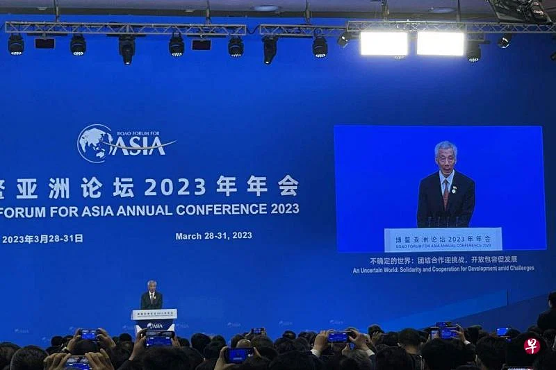
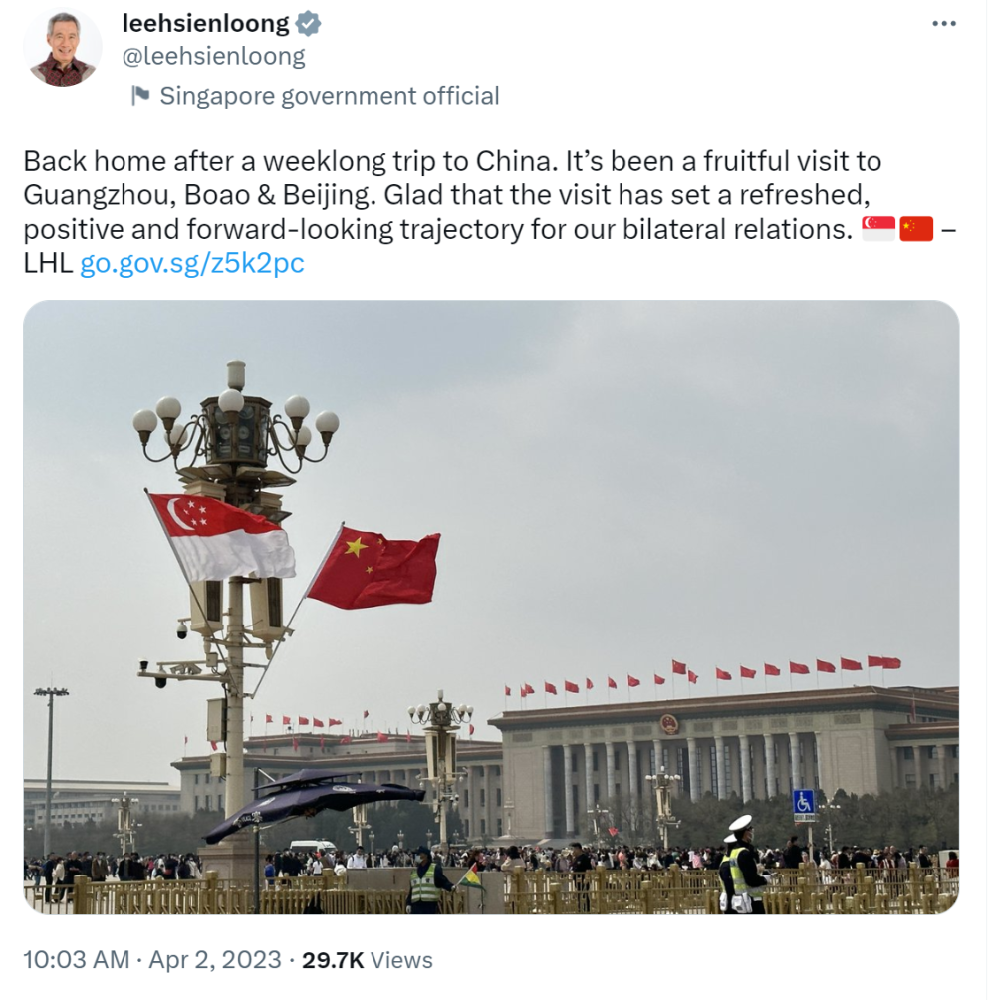

# 新加坡总理李显龙发推：结束了为期一周的中国之行，收获颇丰

【环球网报道记者
李诗睿】新加坡总理李显龙于2023年3月27日至4月1日结合出席博鳌亚洲论坛2023年年会开幕式对中国进行正式访问。当地时间4月2日上午，李显龙在社交媒体推特上发文称，自己已经回到新加坡，此次访华“收获颇丰”。

李显龙在推文中称，“结束了为期一周的中国之行，已经回到家了。此次访问广州、博鳌（博鳌亚洲论坛）和北京，收获颇丰。很高兴这次访问为两国关系开辟了一条崭新的、积极的、具有前瞻性的发展道路。”推文还附上了新加坡和中国国旗标识，以及一张人民大会堂外天安门广场的照片。

据新加坡《联合早报》此前报道，李显龙3月30日在博鳌亚洲论坛2023年年会开幕式上发言时表示，中国作为亚洲非常重要的经济体，扮演着举足轻重的角色，他呼吁亚洲各国应该继续加强与中国的关系，同时也需要深化彼此间的合作。4月1日，中国商务部部长王文涛与新加坡贸工部部长颜金勇共同签署了《中华人民共和国商务部和新加坡贸易与工业部关于宣布实质性完成中国—新加坡自由贸易协定升级后续谈判的谅解备忘录》，确认实质性完成两国自贸协定升级后续谈判。

