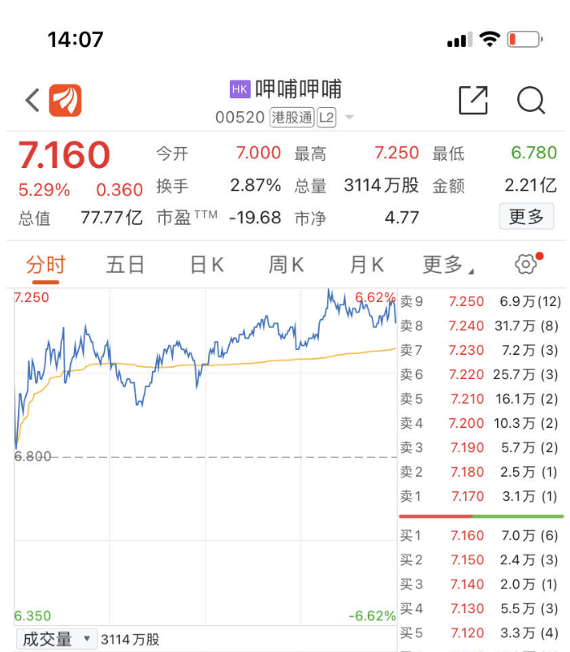
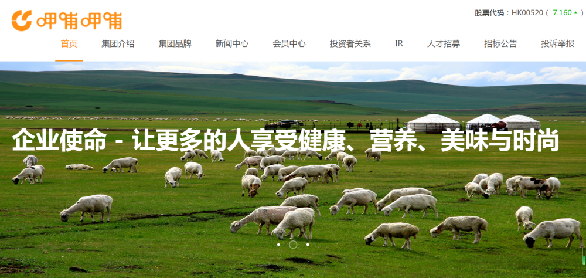

# 曾经大排长龙的知名品牌呷哺呷哺，大举关闭80多家门店

每经编辑：毕陆名

曾经，开遍大街小巷的呷哺呷哺（HK00520）解救了社恐人一个人吃火锅的尴尬，因为价格亲民、服务好，与海底捞一同被称为“火锅双雄”。而刚发布2022年度业绩公告显示，呷哺呷哺2022年关闭了81家呷哺呷哺餐厅。

**不久前，湊湊火锅门店还因菜品缺斤少两，被上海市市场监督管理局通报。** 截至周五收盘，
**呷哺呷哺报收7.16港元，收涨5.29%，总市值77.77亿港元。**

呷哺呷哺、湊湊业绩均下滑

呷哺集团旗下拥有呷哺呷哺、湊湊两大知名火锅品牌，成为集团的核心竞争力。

3月28日晚，呷哺集团发布2022年度业绩公告，数据显示，呷哺集团在2022年实现收入47.25亿元，同比下降23.1%；归属于母公司的净亏损为3.53亿元，亏损同比扩大20.4%。

其中，2022年，呷哺呷哺业务收入22.86亿元，同比下降35.1%；湊湊业务收入22.06亿元，同比下降6.3%。

2022年，呷哺集团旗下营业餐厅总数为1026间。其中，集团新开设41间呷哺呷哺餐厅、44间湊湊餐厅及1间趁烧餐厅。集团还关闭81家呷哺呷哺餐厅、3间湊湊餐厅。

呷哺集团解释，这些餐厅关闭的原因是大多数产生亏损，多数不符合呷哺呷哺推广的“高性价比”模式的地区经营，且其模式不能够恰当反映品牌形象。

财报显示，2023年，呷哺集团将继续施行扩张策略，同时将集中开发华东、华南等南方市场，其中呷哺品牌在2023年开业餐厅不低于100间，主要规划在上海、广深等南方地区一线城市开业餐厅数量不低于整体开业数量的50%。湊湊也将进一步加密在华东和华南地区的布局。

此外，呷哺集团认为调料产品业务具有庞大的潜在市场。集团推出火锅汤底、蘸料、厨用酱料等调料产品，并将继续推出冷冻产品及方便产品。

在公告中，已连续亏损两年的呷哺呷哺还是抛出了较为乐观的态度，其称，随着政策的变化，相信餐饮业将在2023年迎来丰收的一年。

在数字营销方面，
**呷哺集团今年将重点发力会员系统，计划二季度推出188元的“年付费会员卡”。这也是餐饮业率先推出的多品牌付费会员营销模式，目前该产品正在测试中。该产品推出后，呷哺集团将从正常经营的单一营收演变成“正常经营+付费会员”的双重收入。**

“呷哺集团目前的会员达3000万，今年预计突破4000万，假设以20%活跃会员数来算，付费会员的收入或将实现1.5亿元，这部分的收入将成为集团非常亮眼的新业绩增长点。”呷哺集团方面表示，呷哺集团相信付费会员项目还能带来更多的复购和频次提升。

_图片来源：呷哺集团官网截图_

公司重点向东、向南扩张

据中国商报3月31日报道，在施行扩张策略的同时，呷哺集团将目光聚焦于开发华东、华南等南方市场，其中呷哺呷哺在2023年开业餐厅不低于100家，主要规划在上海、广深等南方地区一线城市开设，餐厅数量不低于整体开业数量的50%。湊湊也将进一步加密在华东和华南地区的布局。

在中国商业联合会专家委员会委员、北京国际商贸中心研究基地首席专家赖阳看来，呷哺集团北方市场的开发较为饱和，而南方市场相对有些空白。其次，南方市场的消费力、购买力水平较高，即便一些客单价偏高的餐饮品牌也经常出现爆满、排队的现象。之所以要往南发展，跟呷哺集团多元化品牌运营的战略分不开，随着现在的消费升级，南方很多消费者十分愿意为品质高、环境好的餐饮消费体验买单。

对于南方市场的产品规划，呷哺集团向记者表示，针对南北方市场，呷哺呷哺将采用差异化的打法。以产品为例，呷哺呷哺在北方市场售卖最好的是麻酱和羊肉等产品，而沙茶酱和牛肉等则在南方市场非常热销。围绕着南北方消费市场的差异，呷哺南方市场将推出更具竞争力的“拳头产品”。

“加大开拓南方市场力度，方向是值得肯定的。但要想取得成功，对于呷哺集团的运营管理、供应链建设、成本管控等能力都提出了新的挑战，任何一个环节出现问题，都容易碰到发展的阻力。南方市场应增设符合当地消费者口味的调料、菜品、锅底，主打产品结构也需与北方市场的菜单有所区别，产品结构要做到及时调整，这就对供应链和团队管理提出了新的更高要求。”赖阳表示。

湊湊门店菜品缺斤少两被通报

不久前， **湊湊火锅门店因菜品缺斤少两，被上海市市场监督管理局通报。**

据上海市市场监督管理局，3月14日，市市场监管局执法总队会同市计测院，对位于打浦桥日月光的“湊湊火锅·茶憩”等店铺开展了飞行检查。

执法人员在“湊湊火锅·茶憩”抽取了“湊湊肥牛”“湊湊和牛”“排酸羔羊肉”“排酸肋排肉”“青笋”等五样菜品进行现场称重。

检查发现，“湊湊肥牛”在菜单标注“150克”，实际称重140.43克，偏差-9.57克；“湊湊和牛”在菜单标注“200克”，实际称重177.90克，偏差-22.10克，商品实际重量值与结算重量值之差超过规定负偏差（按照规定，肉类称重范围小于2.5千克的，其负偏差允许值最高为5克），涉嫌违反《零售商品称重计量监督管理办法》。其余菜品：“排酸羔羊肉”称重偏差-2.88克、“排酸肋排肉”称重偏差+0.26克、“青笋”称重偏差+1.51克，符合相关规定。

同时，检查中发现，该门店使用的用于贸易结算的电子计价秤未经强制检定，涉嫌违反《计量法实施细则》。针对上述违法行为，执法人员将对其立案查处。

呷哺集团曾在公司2022年中期报告展望公司前景时指出，将继续扩张湊湊餐厅，“事实证明，湊湊确为本集团成功及有利可图的模式。”

每日经济新闻综合上海电视台新闻综合、中国商报、公司公告

