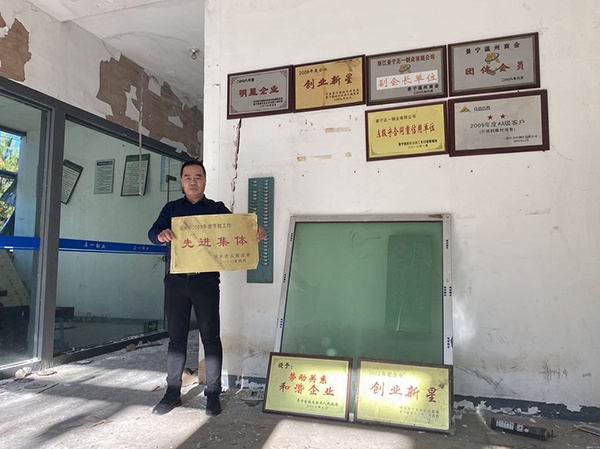

# 浙江景宁招商引资企业投产多年遭强拆后续：一企业申请再审获立案

备受关注的“浙江景宁招商引资企业投产多年遭强拆”一事有了新的进展。

4月1日，澎湃新闻从温州籍企业主方建路处了解到，他对丽水中院终审判决相关方赔偿705万不服，提出再审请求后，浙江省高院决定立案受理。浙江高院的通知书显示，该院受理该案后已组成合议庭对该案进行审查。

_方建路的厂房办公室，至今还挂着此前丽水、景宁县市两级多部门颁发的“明星企业”等铭牌。
受访者供图_

澎湃新闻此前报道，2007年，20余家同样来自温州的钢材企业响应浙江省“山海协作”工程，被招商引资到上百公里外的丽水市景宁县。到了景宁后，当地政府部门将他们分别安置在不同的乡镇，安排“以租代征”的方式用地，并保证尽快解决企业项目用地问题。

他们陆续投入上千万建设厂房，很快投入钢材生产。企业稳步发展，但土地证的问题迟迟没有落实解决，成了一个隐忧。

2015年2月起，当地相关部门突然陆续将这些钢材企业厂房列为“擅自违建”。几个月内，厂房陆续被拆除。8家被拆的钢材企业主相继提起行政诉讼。2016年11月，丽水中院先后认定景宁县政府多个部门强拆8家钢材企业厂房行为均属违法。

除了钢材企业主方建路因个人原因提起行政赔偿比他人晚了些，其余7家企业的行政赔偿案几乎均在2019年5月作出一审判决。2019年10月8日，丽水中院对相关案件作出二审判决，维持原判。7家企业均不服，向浙江省高院提起申诉。

2021年2月，浙江省高院提审该案。2021年12月底，在浙江省高院的积极调解下，7家企业所涉案件调解结案。方建路一案则由丽水中院在2022年3月17日作出了终审判决。

丽水中院在判决书认定，景宁县东坑镇政府、县住建局、自然资源局强拆行为造成涉案房屋损失、机器设备损失，判定三单位共同赔偿方建路所属企业——景宁正一钢业有限公司705万元。驳回其他赔偿请求。

方建路则表示，自己对判决中的损失认定仍存不同意见，之后向省高院提出申诉。

