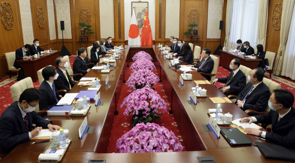

# 秦刚同日本外相林芳正举行会谈

据外交部网站，4月2日，国务委员兼外长秦刚在北京同日本外相林芳正举行会谈。

秦刚表示，当今世界变乱交织，中日关系既存在机遇，也不乏挑战。去年是中日邦交正常化50周年，习近平主席同岸田首相在曼谷举行首次会晤，为两国关系指明了方向。今年我们又迎来中日和平友好条约缔结45周年的重要节点，双方应以领导人重要共识为引领，重温条约精神，加强交流沟通，推动两国关系排除干扰、克难前行。

秦刚表示，和平共处、友好合作是中日关系唯一正确的选择，这是两国关系半个世纪历程给我们的深刻启示。亚洲是当今世界最具发展活力和潜力的地区，维护地区和平、促进共同发展是各国普遍愿望。面对矛盾分歧，拉帮结派、喊话施压无助于解决问题，只会加深彼此隔阂。中日四个政治文件奠定了两国关系政治法律基础，重信守诺、以史为鉴是中日关系行稳致远的重要前提。希望日方树立正确对华认知，拿出政治智慧和担当，同中方共同努力，加强对话沟通、推进务实合作、增进人文交流、妥善管控分歧，为两国关系排障减负，构建契合新时代要求的中日关系。

秦刚指出，福岛核污染水排海是事关人类健康安全的重大问题，日方要负责任地处置。美曾用霸凌手段残酷打压日本半导体产业，如今对华故伎重施。己所不欲，勿施于人。日本切肤之痛犹在，不应为虎作伥。封锁只会进一步激发中国自立自强的决心。日本是七国集团成员，更是亚洲一员，应正确引导会议基调和方向，多做有利于地区和平稳定的事，凝聚国际社会真正共识。

秦刚强调，台湾问题是中国核心利益的核心，事关中日关系的政治基础。中方敦促日方恪守中日四个政治文件的原则和迄今承诺，不得插手台湾问题、不得以任何形式损害中国主权。

林芳正表示，日中关系富有发展潜力。今年是日中和平友好条约缔结45周年，日方愿同中方一道，落实好两国领导人达成的重要共识，恪守日中四个政治文件，加强各层级沟通和务实合作，妥处各自关切，推动构筑具有建设性、稳定的日中关系，共同作为负责任国家为地区和世界繁荣稳定作出积极贡献。

关于一名日本公民在华从事间谍活动案件，秦刚强调，中方将依法处置。

双方还就中日韩合作、朝鲜半岛局势、安理会改革等国际地区问题交换了意见。

