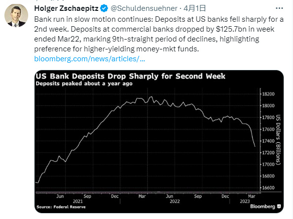
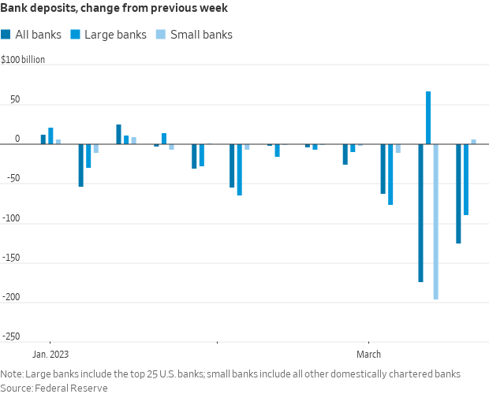
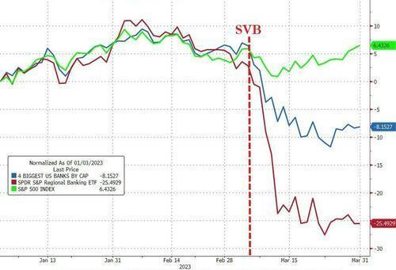

# 美国银行业又现千亿美元存款外流，这回倒霉的是“大银行”？

**划重点：**

  * _1_ 截至3月22日的一周内，美国所有商业银行的存款规模再度减少了1257亿美元，连续第九周下滑。
  * _2_ 前一周还获得明显存款流入的前25大银行，在最新的报告中却成为了存款外流的“大头”。
  * _3_ 有业内人士表示，银行从美联储紧急贷款的需求减少以及小银行存款的增加，可能标志着美国银行业最初的动荡正在平息。

**财联社4月2日讯（编辑 潇湘）** 3月以来，美国硅谷银行和签名银行的突然倒闭，引发了业内对美国银行存款可能大幅外流的担忧。

而根据美联储本周五(3月31日)发布的最新H.8报告，截至3月22日当周，美国商业银行的存款下滑势头仍并未能阻止，尽管人们从小银行中大举出逃的势头已明显放缓，但大银行却开始感受到了更多压力……

**数据显示，截至3月22日的一周内，美国所有商业银行的存款规模再度减少了1257亿美元，为连续第九周下滑。**
不过，这一数字比硅谷银行和签名银行倒闭后第一周创纪录的1745亿美元存款流出幅度，已减少了约500亿美元。

尽管如此，这仍使存款总额比去年4月的创纪录高点低了近8600亿美元，其中三分之一以上——约3000亿美元的存款外流，发生在了3月10日硅谷银行宣布倒闭后的短短两周内。

**小银行开始止血了？**

**与之前一周相比，在美联储最新公布的商业银行存款数据中，有一处变动显然很快受到了业内瞩目——那就是在经历了最初大面积的存款外流之后，小银行的存款情况开始稳定甚至出现存款增加，而前一周还获得明显存款流入的前25大银行，在最新的报告中却成为了存款外流的“大头”。**

数据显示，在截至3月22日的一周内，美国小型银行的存款从上周的5.381万亿美元小幅升至了5.386万亿美元。

与此同时，按资产计算的最大25家银行的存款则从10.74万亿美元降至了10.65万亿美元，总计减少了近900亿美元。在美国有业务的外国银行的存款流出，也导致了当周所有商业银行存款的加速下滑。

**有业内人士表示，银行从美联储紧急贷款的需求减少以及小银行存款的增加，可能标志着美国银行业最初的动荡正在平息。**

对于上述现象，经济学家Stuart Paul认为，“银行系统的大量资金外流可能反映了企业财务部门对 **高收益货币市场基金**
的偏好，而不是对地区银行破产的恐慌。银行系统的脆弱性似乎也得到了遏制：3月22日至29日，对美联储贷款机制的依赖也有所下降。”

根据美联储周四提供的相关资产负债表细节，美国银行业最近一周减少了从美联储两项信贷安排工具获得的借款，表明流动性需求可能正在企稳。

在截至3月29日的一周，美国金融机构的借款余额总计为1526亿美元，低于前一周的1639亿美元。其中，美联储传统信贷安排工具——贴现窗口的借款余额为882亿美元，银行定期融资计划(BTFP)的借款余额则为644亿美元。

**银行业的麻烦仍未解决**

**当然，在小银行“止血”的同时，我们显然也不能忽视的是，大银行存款外流攀升现象背后可能潜藏的风险。**

事实上，上述存款数据的最新变化，和巴克莱高级固定收益策略师Joseph
Abate本周早些时候发布的报告中提出的观点很像——那就是在银行业危机后，有两波明显的资金外流，正给银行的资产负债表带来压力，第一波与储户最初对银行偿付能力的担忧有关，这波浪潮很可能已经“即将结束”。

但眼下，
**真正的麻烦可能是来自第二波的存款外流潮——随着银行客户意识到货币市场基金可以提供更高的利率，更多存款可能流向这一资金池，硅谷银行的破产危机可能已经让公众意识到目前的存款利率很低……**

在美联储周四公布的报告发布后，评级机构标普全球已经将美国银行、摩根大通、PNC金融服务集团和Truist Financial的评级展望从正面下调至稳定。

标普全球认为，“市场波动加剧”对银行业不利。“我们已将对美国四家大型银行的评级展望从正面修订为稳定，因为我们认为，当前的市场和经济状况降低了在当前环境下上调评级的可能性。”

**随着银行存款的持续流出，以及银行存款利率与货币市场基金收益率之间的差距日益凸显，这显然也正引发一个新问题：银行未来会开始争夺存款吗？**

知名财经博客网站zerohedge指出，如果小银行也被迫加入“竞争”，它们的盈利能力将进一步崩溃。这可能解释了为什么区域性银行始终无法出现明显反弹的原因......

**银行贷款也创下近两年最大降幅**

**美联储最新公布的H.8报告还显示，当前的这场银行业危机也正在影响商业贷款。**
截至3月22日当周，美国商业银行的整体贷款下降204亿美元，为2021年6月以来最大降幅。

其中，衡量企业行为活动的商业和工业贷款下跌近300亿美元，降幅最为明显，为2021年6月以来最大跌幅。住宅和商业地产贷款，以及消费者贷款相较前一周则均有所增加，其中消费者贷款增加40亿美元。

分析人士指出，银行贷款规模的整体大幅下降，主要是因为大银行的信贷收紧．美国25家最大的银行发放了全美约六成的贷款，硅谷银行和瑞信的前车之鉴，正令这些银行在放贷上趋向谨慎。

高盛集团此前预测，为了确保流动性，那些规模更小的银行可能也会收紧贷款标准，而消费者和企业贷款难度加大将进一步限制经济增长。

**不少美国中小企业可能第一时间会因此感受到痛苦**
，与通常发行固定利率债务、几乎不受短期利率波动影响的大公司不同，中小企业严重依赖银行进行直接融资，因此它们对于本轮银行业危机的冲击波影响，是能实时感受到的……

（财联社 潇湘）

