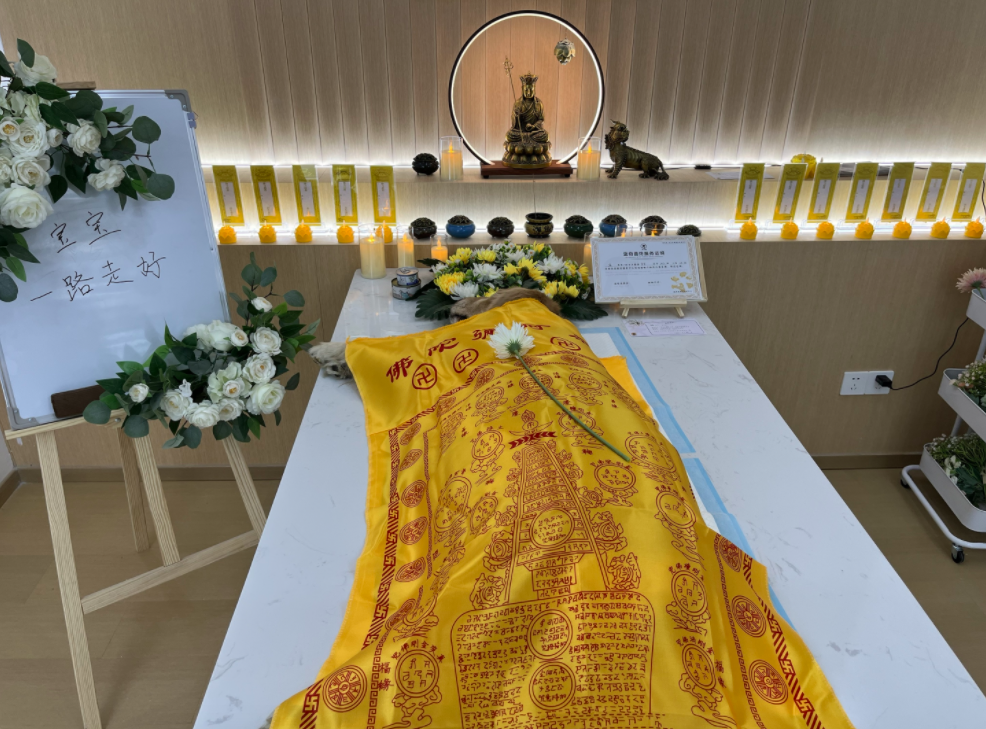
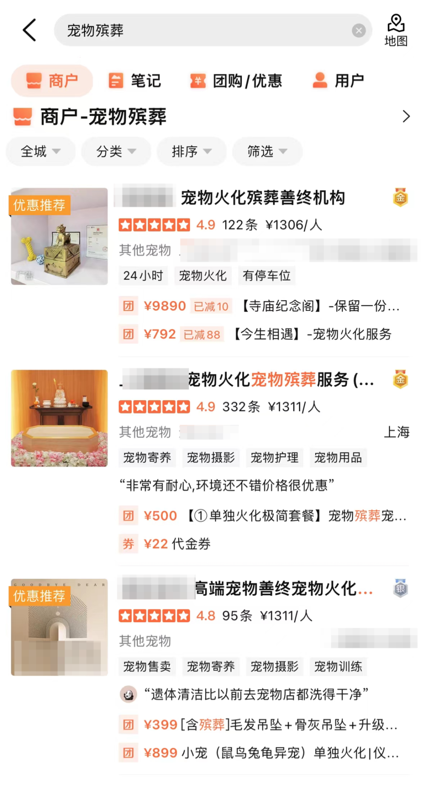

# 花费上千元为宠物办“身后事”，宠物殡葬是门好生意吗？

金毛犬“板栗”躺在告别室里，身旁摆满了鲜花和蜡烛，还有它最爱吃的罐头，背景音乐播放着一段经文，主人正和它做最后的告别。

这场告别仪式，是宠物殡葬的环节之一。几天前，不到1岁的“板栗”因病去世，宠物殡葬店上门将它接走，完成告别仪式后，“板栗”将被送去火化。

红星资本局注意到，随着宠物经济的快速发展，近几年，宠物“身后事”也开始进入大众视野，新兴行业“宠物殡葬”正悄然兴起。

_↑宠物殡葬品牌“宠灵堂”举办的一次宠物葬礼 受访者供图_

**宠物殡葬悄然兴起**

**消费者花费千元为宠物办“身后事”**

板栗去世后，宠物医院向它的主人李先生推荐了宠物殡葬服务。不同于简单的动物无公害化处理，宠物殡葬更重视服务，项目繁多。

李先生购买的宠物殡葬“一条龙”服务里，包括上门接收、宠物遗体消毒和清洁、告别超度仪式、宠物遗体火化、安葬。收费则按宠物的体重计算，从600元-1500元不等。

除了火化服务，宠物殡葬店还提供不少个性化项目。如将宠物的骨灰安葬到盆栽里做成生命树，收费约200元；一个宠物爪印盒收费150元；还可以将宠物的骨灰进行树葬，“一树一宠”收费800元；告别仪式还可以请现场乐队演奏，收费1200元等。

最终，李先生为板栗的“身后事”花费了近千元，但他的感受是“很值”。他觉得，宠物殡葬提供的服务能让板栗更体面地离开，从另一个角度来看，火化的方式也比掩埋更环保。

红星资本局注意到，动物防疫法规定，动物死亡后应当按照规定进行无害化处理，任何单位和个人不得随意处置。

现如今，像李先生这样为宠物购买殡葬服务的消费者越来越多，提供宠物殡葬服务的商家数量也在不断增长。

3月27日，红星资本局以“宠物殡葬”为关键词在大众点评搜索发现，在深圳，提供此类服务的机构有30余家；在成都，有50余家；在北京、上海和杭州，均已超过上百家。除了专业的宠物殡葬机构，也有不少宠物医院和宠物店标明提供殡葬服务。

从价格上来看，集中火化的方式收费较低，一般在200至400元，而“一对一”即单独火化，宠物主人可全程跟随的方式，价格则会翻倍，最高超千元。

**消费者为爱买单**

**曾有宠物主人花近2万做骨灰晶石**

宠物殡葬被视为宠物行业的“终点”。相比宠物食品、用品、美容和医疗，宠物殡葬是个既新兴又小众的行业。

《2021年中国宠物消费趋势白皮书》显示，2020年，中国宠物行业市场规模接近3000亿元，但宠物殡葬的消费渗透率并不高。根据《2020年中国宠物行业白皮书》，在中国城镇宠物（犬猫）消费市场中，宠物殡葬的消费渗透率只有3.6%。

可以说，国内许多城市的宠物殡葬服务尚处于起步阶段。“购买宠物殡葬服务与客户的消费观念有关，北上深等一线城市更成熟一些”，3月26日，位于成都的宠物殡葬服务机构毛球忆馆的负责人对红星资本局说。

毛球忆馆从2020年底开始营业，目前在成都已经开设了2家分店。毛球忆馆负责人介绍，其店内宠物殡葬的价格与选择的服务项目有关，一般的套餐从690元-5000元不等，也曾有主人将宠物的骨灰定制成晶石，花费了18000元。

在从业者看来，宠物殡葬行业就是一个“纯服务”的行业，更看重“殡”的流程。毛球忆馆负责人表示，宠物主人对遗体清洁和告别仪式的反馈更多一点。这两个环节能让他们感受到对宠物的尊重，也是一种情感的寄托。而这也打开了宠物殡葬市场的想象空间。

“陪伴我十多年的狗狗突发肺癌，感谢商家让我没有遗憾地送走了重要家人，在汪星球继续做个快乐的小汪汪吧。”一名消费者在毛球忆馆的大众点评页面上留下评价，他的消费金额超过1500元。

如果没有“殡”的流程，宠物火化的价格并不高。红星资本局注意到，上海一家专业处理动物及动物产品的事业单位——上海市动物无害化处理中心，其提供的动物焚化定价仅30元。3月28日，该中心工作人员告诉红星资本局，中心只提供动物火化服务，没有其他收费项目。

目前宠物殡葬行业正在加速发展。天眼查APP显示，我国现有近9000家公司经营范围覆盖宠物殡葬、宠物丧葬、动物无害化处理等业务。仅在2021年，新增企业的数量就超2000家，年注册增速为101.43%。

**宠物殡葬是门好生意吗？**

**客单价高、前景广阔，面临获客和资质难题**

想象空间巨大的宠物殡葬行业也吸引了不少创业者的进入，宠灵堂创始人何先生就是其中之一。

此前从事保险行业的何先生，因宠物狗可乐的去世，接触到宠物殡葬行业。他在2021年底进入这个赛道，创立了“宠灵堂”品牌，目前在济南、武汉和广州三个城市均开设了线下店。

何先生告诉红星资本局，选择宠物殡葬行业也是看重其发展前景和市场规模。“2020年整个宠物行业市场规模接近3000亿元，宠物殡葬占到3.5%左右，也就是接近100亿元的市场规模。随着宠物行业市场规模的扩大，和养宠人认知的扩展，宠物殡葬的市场也会变得不一样。”

除了市场规模，宠物殡葬行业较高的客单价和可观的利润，也是吸引掘金者的原因之一。红星资本局不完全统计，在北京、上海、杭州和成都等城市，宠物殡葬一单的价格大多在300元-1500元。

据何先生介绍，这个行业大多根据宠物主人每月为宠物消费的金额来定价，“如果每个月为宠物消费500元左右，换算到一年就是6000元，拿出五分之一的价格来处理宠物的身后事，消费者大多都能接受。”他也提到，目前宠灵堂的毛利可以达到70%，净利润在30%-40%左右。

但对于宠物殡葬行业来说，获客引流仍是不小的难点。何先生表示，宠物殡葬其实是低频、触发式的需求，消费者只有在宠物去世后，才会去搜索相关服务，甚至还有消费者并不知道有这样的服务。

毛球忆馆负责人也有同样的观点，宠物殡葬行业不能做实体的广告，比如电梯广告之类的，会面临下架的风险，只能通过一些同城的服务平台或社交平台获客，还有老客户的推荐等等。

红星资本局了解到，毛球忆馆现在的月均订单量在50单左右，“宠灵堂”广州店的日均订单量大约为6单。

除了获客，宠物殡葬行业还面临着资质难题。按规定，宠物殡葬服务企业办理营业执照需先获取《动物防疫条件合格证》并通过环境影响评价，取得“动物无公害化处理资质”。但目前行业内大多数机构都没有资质，只能采取挂靠的形式。

目前，资本市场对宠物殡葬行业的态度较为谨慎。红星资本局注意到，近几年，宠物赛道已发生20余起融资记录，但对宠物殡葬行业的投资并不多。2022年6月，杭州恩宠堂宣布完成1500万A轮融资，由杭州华元宠物战略投资，这也是该赛道第一笔公开投资。

红星新闻记者 强亚铣

编辑 余冬梅

